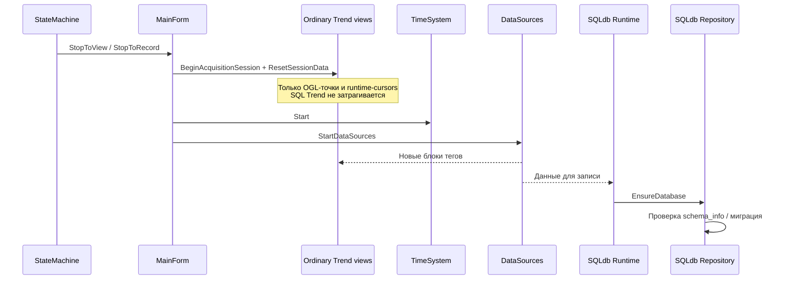

# Жизненный цикл сбора RecorderLnx

## Контракт переходов

`TRecorderStateTransition` переносит событийную модель Delphi Recorder:

- `rstStopToView`, `rstStopToRecord`;
- `rstViewToStop`, `rstViewToRecord`;
- `rstRecordToStop`, `rstRecordToView`.

Промежуточные `PreviewArmed` и `RecordArmed` не являются отдельными рабочими
режимами. Когда условие старта срабатывает, переход вычисляется относительно
режима, из которого было выставлено ожидание.

Для каждого реального перехода шина core последовательно публикует
`rceRunTransitionBefore` и `rceRunTransitionAfter`. В поле
`TRecorderEvent.Transition` передаётся точное значение `rst*`.
Обработчик `Before` синхронный: исключение отменяет переход до изменения
состояния и до запуска/останова источников.

## Основная последовательность запуска

Диаграмма показывает только архитектурно значимые границы. Обычный Trend и
SQLdb — независимые потребители жизненного цикла и не управляют состоянием друг
друга.

Версия SQL-схемы принадлежит `TRecorderSqlDbRepository` и compile-time
константе `CRecorderSqlDbSchemaVersion`. Код `TRecorderTrendView` не подключает
SQLdb units, не открывает соединение и не выполняет миграции. Сообщение
`Database schema 3 is newer than supported 2` означает запуск бинарника,
скомпилированного с поддержкой схемы 2, а не изменение базы обычным Trend.

## Подготовка до сбора

После загрузки или подтверждённого изменения конфигурации, только в `Stop`,
главная форма вызывает `PrepareRuntimeForConfiguration`. Он выполняет
`TRecorderSpectrumRuntimeManager.PrepareConfiguration` и публикует
`rceConfigurationPrepared`.

`PrepareConfiguration`:

1. создаёт все FFT-планы и проводит выбор/бенчмарк SIMD backend;
2. создаёт `TRecorderSpectrumChannel`, evaluator и его рабочие буферы;
3. помечает runtime готовым к запуску.

Переходы `StopToView` и `StopToRecord` проверяют `IsPrepared`. Если
конфигурация не была подготовлена, старт отменяется; в этой точке ничего
тяжёлого не создаётся и не бенчмаркается.

При останове `ResetForNextRun` очищает накопленные входы, состояние каналов и
кэш кадров, но не освобождает FFT-планы, каналы и выделенные буферы. Поэтому
следующий запуск использует тот же уже подготовленный runtime.

## Размещение обязанностей

| Фаза | Допустимая работа |
| --- | --- |
| Инициализация Recorder | Создание постоянных сервисов и worker-потоков |
| Загрузка/изменение конфигурации в `Stop` | Планы FFT, бенчмарк, каналы, буферы, подготовка графических моделей |
| `Before StopToView/StopToRecord` | Только проверка готовности и лёгкая активация |
| Сбор данных | Приём, копирование в bounded очередь, вычисление; без инициализации конфигурации |
| `View/Record → Stop` | Останов источников и сброс данных без деаллокации подготовленного runtime |
