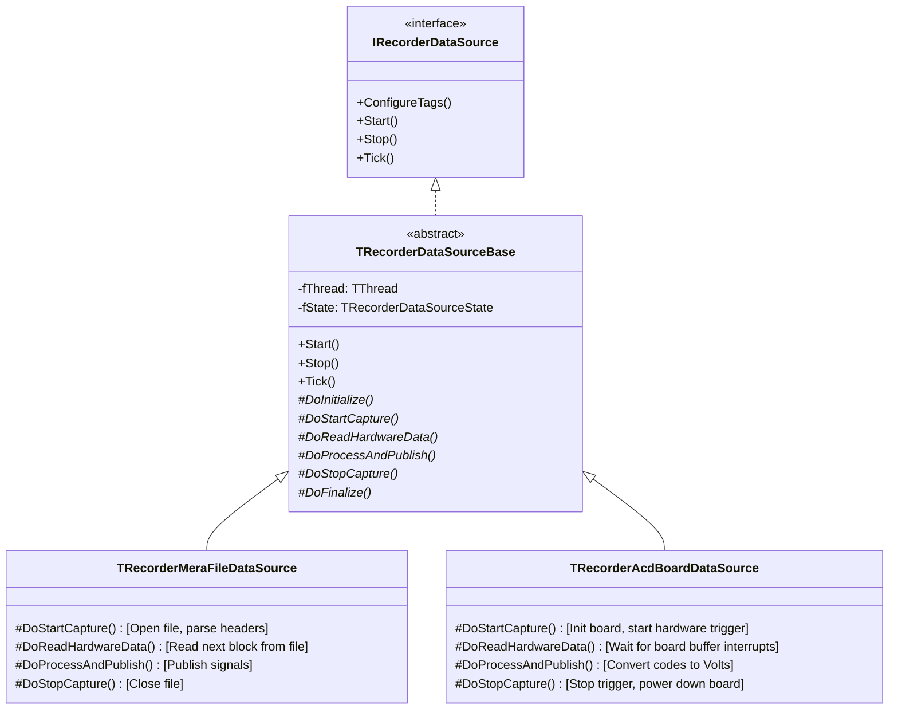

# Архитектура и Оптимизация Источников Данных

В данном документе представлены предложения по оптимизации рендеринга/расчетов при наличии дублирующихся графиков, оптимизации виртуального источника данных MERA, а также проект унифицированной архитектуры потоков данных.

---

## 1. Оптимизация при наличии 2+ графиков с одинаковым тегом

Когда на экране отображаются два графика одного и того же тега (например, `MemTag` на разных панелях осциллограмм), возникает избыточность:
1. Повторный опрос и копирование среза данных из буфера сигнала.
2. Повторный расчет математических параметров (минимальное, максимальное, среднее значения, RMS и т.д.) для одного и того же временного интервала.
3. Повторная передача одинаковых массивов точек на графическую карту (заполнение VBO).

### Предложения по оптимизации:
* **Кэширование расчетов (Memoization) в буфере тега**:
  На уровне `TRecorderTag` или `TRecorderSignalSnapshot` реализовать кэш последнего запроса оценки:
  ```pascal
  TTagEstimateCache = record
    StartTime, EndTime: Double;
    Kind: TRecorderTagEstimateKind;
    Value: Double;
    Valid: Boolean;
    CalculatedAtTick: QWord; // Время расчета (GetTickCount64)
  end;
  ```
  При вызове `EstimateSlice` сначала проверять кэш. Если параметры интервала и типа оценки совпадают, а разница во времени `GetTickCount64 - CalculatedAtTick` меньше времени обновления (например, 20 мс), возвращать готовый результат без пересчета.

* **Разделяемый графический буфер (Shared GPU Buffer)**:
  Если несколько осциллограмм отображают один тег в одном и том же окне времени, формировать массив вершин для отрисовки (VBO) единожды, связывая его с тегом. Осциллограммы должны лишь вызывать отрисовку готового буфера с нужными трансформациями матриц.

---

## 2. Оптимизация виртуального источника данных MERA

Длительность одного тика (`DoTick`) для `TRecorderMeraFileDataSource` составляет ~153 мс, что создает высокую нагрузку.

### Предложения по оптимизации:
* **Использование Memory-Mapped Files (MMF) для воспроизведения**:
  Вместо постоянного чтения с диска через `TFileStream` отображать файлы MERA в виртуальную память процесса с помощью `CreateFileMapping` / `MapViewOfFile` (в Windows) или `fpMmap` (в Linux). Это позволит считывать отсчеты простым копированием памяти (`Move`), исключая накладные расходы на системные вызовы ввода-вывода.
* **Исключение аллокаций памяти в цикле `Tick`**:
  Убедиться, что все временные буферы для чтения блоков преаллоцированы при запуске (`Start`). В методе `DoTick` не должно вызываться `SetLength`, `GetMem` или выделения динамических объектов.
* **Асинхронная предвыборка данных (Prefetching)**:
  Чтение файла MERA перенести в отдельный фоновый дисковый поток, который будет считывать данные опережающими блоками в кольцевой буфер в ОЗУ. Поток источника данных (`TRecorderDataSourceThread`) в методе `DoTick` будет просто забирать готовый блок из ОЗУ.

---

## 3. Унифицированная архитектура потоков для всех источников

Цель — сделать механизм работы потока одинаковым для всех физических и виртуальных устройств, вынеся управление потоком в базовый класс, а логику чтения конкретного источника — в защищенные виртуальные методы.

### Предлагаемая иерархия классов:



### Паттерн базового класса потока:

```pascal
type
  TRecorderDataSourceBase = class(TInterfacedObject, IRecorderDataSource)
  private
    fThread: TThread;
    fState: TRecorderDataSourceState;
    fUpdateTimeMs: Cardinal;
  protected
    // Шаги жизненного цикла устройства (выполняются в главном потоке)
    procedure DoInitialize; virtual; // Инициализация интерфейсов, проверка связи
    procedure DoFinalize; virtual;   // Деинициализация
    
    // Выполняются в контексте рабочего потока
    procedure DoStartCapture; virtual; abstract; // Запуск захвата/воспроизведения
    procedure DoStopCapture; virtual; abstract;  // Остановка захвата
    
    // Выполняется циклически в рабочем потоке
    // Возвращает True, если данные успешно считаны
    function DoReadHardwareData(ABuffer: Pointer; AMaxSize: Integer; out ABytesRead: Integer): Boolean; virtual; abstract;
    // Разбор сырых данных и публикация в TRecorderTagRegistry
    procedure DoProcessAndPublish(ABuffer: Pointer; ABytesRead: Integer); virtual; abstract;
  public
    procedure Start; virtual;
    procedure Stop; virtual;
    procedure Tick; virtual; // Для совместимости с текущим менеджером
  end;
```

### Преимущества:
1. **Безопасность потоков**: Вся логика создания, запуска, приостановки и корректного завершения потока (`TThread.Terminate` + `WaitFor`) пишется и тестируется один раз в `TRecorderDataSourceBase`. У дочерних классов нет шансов допустить deadlock или утечку потока.
2. **Изоляция железа**: Разработчик нового драйвера/источника реализует только чистые функции взаимодействия с оборудованием (чтение регистров/API драйвера) в `DoReadHardwareData`, не задумываясь о многопоточности LCL/Delphi.
3. **Единая диагностика**: Метрики производительности (время опроса, ошибки связи, пропуски кадров) собираются на уровне базового класса унифицированно для всех устройств.
