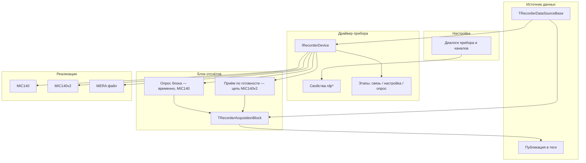

# Слой устройств захвата данных

Целевая организация общего слоя устройств в RecorderLnx. Реализация вводится поэтапно;
каталог `Device/MIC140` остаётся рабочим до переключения на `MIC140v2`.

---

## 1. Ориентир — оригинальный Recorder

В Windows Recorder нет одного «блока отсчётов со встроенной температурой». Разделение такое:

| Уровень | Оригинал | Смысл для Lazarus |
|---------|----------|-------------------|
| Параметры | `GetDeviceProperty` / `SetDeviceProperty` | Настройки задаются **до** программирования, без длинных списков аргументов у каждого шага |
| Этапы работы | Connect → Program → Start → Stop | Явная последовательность: связь → загрузка циклограммы → опрос → останов |
| Подробное состояние | `DEVICE_STATE` | Детали для диагностики — через свойство `rdpStateWord` |
| Данные | `LinkOutputStream` | Прибор отдаёт блоки в очередь; UI не опрашивает сокет напрямую |
| Каналы | `GetChannels` | Список логических каналов; TIn — каналы прибора, не отдельное поле в общем блоке |
| Hub | `GetProperty` / `Apply` / `Start` / `Stop` | Тот же принцип: свойства + фазы |

**Общий слой устройства** = этапы работы + свойства + список каналов + приём блоков отсчётов.
Особенности MIC-140 (TIn, CJC, legacy scan) — только в `Device/MIC140` и `Device/MIC140v2`.

---

## 2. Разделение задач



| Компонент | Файл | Назначение |
|-----------|------|------------|
| `IRecorderDevice` | `uRecorderDeviceInterfaces` | Связь, программирование, старт/стоп, свойства |
| `TRecorderAcquisitionBlock` | `uRecorderAcquisitionTypes` | Блок отсчётов (каналы + время, без TIn в Core) |
| Источник данных | `Core` | Потоки, период обновления, публикация в теги |
| Разбор MIC-140 | `MIC140` / `MIC140v2` | Сырой кадр → каналы; TIn/CJC внутри драйвера |

`TRecorderAcquisitionBlock` описывает **формат передачи отсчётов** от драйвера к источнику данных,
а не конфигурацию прибора.

---

## 3. Этапы работы прибора

### 3.1. Упрощённые состояния (видимые источнику данных)

```
Отключён → Подключён → Запрограммирован → Идёт опрос
     ↑______________|___________________|
              Стоп / отключение
```

| Состояние в коде | Смысл |
|------------------|--------|
| `rdsDisconnected` | Нет связи / файл не открыт |
| `rdsConnected` | Связь есть, циклограмма не загружена |
| `rdsProgrammed` | Параметры скана записаны в прибор |
| `rdsStarted` | Идёт выдача блоков измерений |

Переходы выполняет **поток источника данных**, не GUI:

- `Connect` → подключён
- `ProgramDevice` → запрограммирован
- `Start` → идёт опрос
- `Stop` → откат к запрограммирован / подключён
- `Disconnect` → отключён

### 3.2. Внутренние подсостояния (MIC140v2)

Драйвер может вести детали («идёт запись DM», «ожидание ответа»). Наружу — `GetState`;
детали — `rdpStateWord`, `rdpErrorCode`, `rdpErrorText`.

---

## 4. Настройка без аргументов у Connect/Start

В оригинале host, частота и число каналов **не** передаются в каждый вызов `Start` — они
хранятся как свойства устройства.

### Свойства `GetDeviceProperty` / `TrySetDeviceProperty`

| Свойство | Тип | Назначение |
|----------|-----|------------|
| `rdpName` | string | Имя в списке |
| `rdpHost` | string | IP |
| `rdpPort` | integer | TCP-порт |
| `rdpPollFrequencyHz` | double | Частота опроса |
| `rdpUpdateTimeMs` | cardinal | Период накопления блока для UI |
| `rdpChannelCount` | integer | Число каналов |
| `rdpDeviceSerial` | integer | Заводской номер |
| `rdpStateWord` | integer | Подсостояние драйвера |
| `rdpErrorCode` / `rdpErrorText` | int / string | Ошибка последней операции |

Порядок перед первым опросом:

1. Задать свойства (из JSON/диалога источника)
2. `Connect`
3. `ProgramDevice`
4. `Start`

Параметры MIC-140 (CJC, диапазон АЦП, смещение TIn) — в конфиге источника и тегах каналов,
не в общем слое устройства.

---

## 5. Потоки выполнения

| Действие | Где выполняется |
|----------|-----------------|
| Диалоги, правка настроек | Поток GUI |
| Connect / Program / Start / Stop | Поток источника данных |
| Чтение TCP / MDP | Отдельный поток чтения (MIC-140) |
| Запись в теги | Поток публикации или `DoTick` |

GUI **не** вызывает блокирующий `ReadBlock` с большим таймаутом.

Правила приёма MIC-140 (resync по байту, кольцо слотов, один pacing в опросе):
[mic140/acquisition_rules.md](mic140/acquisition_rules.md). Код этапов:
`uRecorderAcquirePhase.pas`, `uRecorderMic140AcquireTiming.pas`.

### Опрос блока и приём по готовности

| Способ | Где | Статус |
|--------|-----|--------|
| Опрос `ReadBlock` | MIC-140 legacy | Сохраняем до готовности v2 |
| Приём готового блока | MIC140v2 (аналог `LinkOutputStream`) | Целевой вариант |

План MIC140v2: поток чтения декодирует кадр и передаёт блок источнику; источник пишет в теги.

`ReadBlock` остаётся в интерфейсе с пометкой «временно» до стабилизации v2.

---

## 6. Блок отсчётов `TRecorderAcquisitionBlock`

```pascal
TRecorderAcquisitionBlock = record
  ChannelCount: Integer;
  SampleCount: Integer;
  FirstTimeSec: Double;
  SampleRateHz: Double;
  Values: array of array of Double;  // [канал][отсчёт]
end;
```

Каналы TIn — внутри драйвера MIC-140 (`TMic140AuxTemperatureBlock`), не в общем типе Core.

Копирование блока между потоками — `CopyRecorderAcquisitionBlock` (см. комментарий в
`uRecorderAcquisitionTypes.pas`).

---

## 7. Этапы внедрения

1. Документация — этот каталог и [mic140/protocol.md](mic140/protocol.md)
2. Интерфейс — `uRecorderDeviceInterfaces`, `uRecorderAcquisitionTypes`
3. MIC140v2 — новый драйвер, логи, проверки
4. Подключение — переключение источника данных
5. Упрощение — убрать дубли legacy после стабилизации v2

---

## 8. Вопросы на реализацию v2

1. Передавать блоки через отдельный интерфейс приёмника или через метод источника данных?
2. Нужны ли асинхронные Program/Stop с ожиданием на первом этапе?
3. Один `rdpStateWord` для legacy и Mebius или разные диапазоны?

До решения — синхронные переходы, как в текущем MIC-140.

