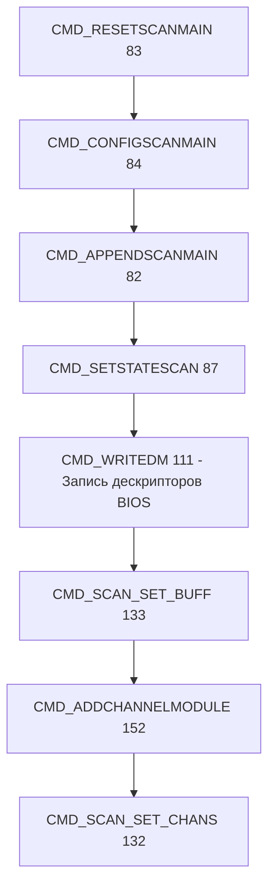

# Протокол обмена прибора MIC-140 (Legacy MC031 / mdpEthernet81)

> **Актуальная документация:** [protocol/README.md](protocol/README.md) — полное описание
> (MDP, коммутируемый АЦП, BIOS, дескрипторы, приёмка).

Ниже — краткий монолитный обзор (сохранён для совместимости ссылок).

Обмен с прибором ведётся по протоколу MDP (Mebius Data Protocol) поверх TCP на порту **4000**. Все числовые поля передаются в формате **little-endian**.

---

## 1. Схема MDP-кадра

Каждый пакет (команда или данные) обёрнут в транспортный заголовок MDP:

| Поле            | Тип        | Размер          | Описание                                                                     |
| --------------- | ---------- | --------------- | ---------------------------------------------------------------------------- |
| **MDP-SYNC**    | `uint16`   | 2 байта         | Маркер синхронизации. Всегда `0x12B8`                                        |
| **MDP-PORT**    | `uint16`   | 2 байта         | `0` — поток данных (измерения), `1` — поток команд/ответов                   |
| **MDP-SIZE**    | `uint16`   | 2 байта         | Длина полезной нагрузки (Payload) в словах (`WORD`)                          |
| **MDP-HCS**     | `uint16`   | 2 байта         | Контрольная сумма заголовка: `(SYNC + PORT + SIZE) mod 65536`                |
| **MDP-PAYLOAD** | `uint16[]` | `SIZE * 2` байт | Полезная нагрузка пакета                                                     |
| **MDP-DCS**     | `uint16`   | 2 байта         | Контрольная сумма полезной нагрузки: сумма всех слов Payload по модулю 65536 |

---

## 2. Работа коммутатора и фазы опроса канала

Для правильной работы АЦП и коммутатора прибора период опроса каждого канала делится на фазы. 

### Расчет времени слота канала
Время опроса одного канала ($T_{\text{slot}}$) определяется как период опроса кадра (зависит от частоты $1/F_s$) делёный на количество последовательно опрашиваемых каналов на один АЦП:
$$T_{\text{slot}} = \frac{1}{F_s \cdot N_{\text{ch\_per\_adc}}}$$
Аппаратно каналы MIC-140 разделены на группы, опрашиваемые параллельными АЦП (например, группы по 16 каналов). Соответственно, при 48 включенных каналах $N_{\text{ch\_per\_adc}} = 16$.

### Фазы опроса внутри одного слота ($T_{\text{slot}}$):
1. **Время заземления (Grounding Phase)**:
   Подключение входа АЦП к схемной «земле» для сброса остаточного заряда коммутатора. Предотвращает перегрузку и влияние соседних каналов друг на друга. Может быть аппаратно отключено в настройках (`flag_ground = 0`).
2. **Время успокоения (Settling / Decay Phase)**:
   Время после переключения коммутатора на измерительный канал, в течение которого результаты оцифровки АЦП еще не участвуют в усреднении. Это необходимо для затухания переходных процессов в коммутаторе. При этом сам АЦП непрерывно опрашивает сигнал на высокой внутренней частоте (0.5 или 1 МГц).
   > [!IMPORTANT]
   > Время успокоения рекомендуется устанавливать **не менее 30 мкс** для обеспечения точности измерений.
3. **Время измерения (Averaging / Measurement Phase)**:
   Интервал, в течение которого АЦП оцифровывает сигнал на высокой частоте. Все собранные за эту фазу отсчеты усредняются арифметически, и полученное среднее значение записывается как одна точка измерения канала в выходной буфер.

---

## 3. Порядок программирования прибора (Инициализация)

Для перевода прибора в рабочий режим сбора данных управляющее ПО отправляет строго определенную последовательность команд в поток `PORT=1`:

### Шаги и назначение команд:
1. **`CMD_RESETSCANMAIN` (83)**: Сброс текущей конфигурации сканирования в BIOS прибора.
2. **`CMD_CONFIGSCANMAIN` (84)**: Передача базовых параметров сканирования (частота, размер блока, режим синхронизации).
3. **`CMD_APPENDSCANMAIN` (82)**: Настройка параметров SPORT-интерфейса и делителей таймера АЦП.
4. **`CMD_SETSTATESCAN` (87)**: Перевод службы сканирования BIOS в состояние готовности к конфигурации каналов.
5. **`CMD_WRITEDM` (111)**: Запись структуры дескрипторов каналов (таблицы BIOS) в DM-память ADSP (адреса `0x0522`–`0x07FF`).
6. **`CMD_SCAN_SET_BUFF` (133)**: Выделение кольцевого буфера для накопления отсчетов АЦП.
7. **`CMD_ADDCHANNELMODULE` (152)**: Привязка аппаратного модуля (MIC-140) к настроенной структуре каналов сканирования.
8. **`CMD_SCAN_SET_CHANS` (132)**: Подтверждение списка опрашиваемых каналов и подготовка к запуску АЦП.

---

## 4. Параметры настройки, зависящие от частоты

При изменении частоты опроса $F_s$ необходимо пересчитывать следующие параметры и передавать их в командах настройки:

### Таблица 1. Параметры команды `CMD_CONFIGSCANMAIN` (84)

| Параметр | Описание | Формула / Правило расчета |
|---|---|---|
| **TimerScale** | Масштаб аппаратного таймера ADSP | Задает предделитель частоты таймера (обычно `1` или `2`) |
| **TimerPeriod** | Период таймера в тиках шкалы | Рассчитывается как: $\text{Period} = \frac{F_{\text{clk\_timer}}}{\text{TimerScale} \cdot F_s \cdot N_{\text{ch\_per\_adc}}}$ (где $F_{\text{clk\_timer}} = 16$ МГц) |

### Таблица 2. Параметры команды `CMD_APPENDSCANMAIN` (82)

| Параметр | Описание | Формула / Правило расчета |
|---|---|---|
| **scanDivider** | Делитель частоты сканирования | Выбирается из аппаратной сетки (например, `1, 2, 5, 10, 20, 25, 50, 100` для соответствующих частот) |

### Таблица 3. Параметры дескрипторов каналов (`CMD_WRITEDM` 111)

Каждый дескриптор в DM-памяти содержит слово задержки, которое рассчитывается динамически:

| Параметр дескриптора | Назначение | Расчет значения |
|---|---|---|
| **LegacyChannelDelaySport** | Длительность фазы успокоения канала в тиках SPORT (`16 МГц`) | $\text{DelaySport} = \text{Trunc}(T_{\text{decay}} \cdot 16\text{e}6) - 1$. Зажимается в пределах $[\text{MinGroundPeriod}, \text{InitPeriodDecay}]$. При $T_{\text{decay}} = 30$ мкс $\to \text{DelaySport} \approx 479$. |
| **AverageSampleCount** | Количество точек усреднения АЦП | Рассчитывается исходя из оставшегося времени слота: $\text{AverageSampleCount} = \text{Trunc}\left( \frac{T_{\text{slot}} - (T_{\text{decay}} + T_{\text{gnd}} + T_{\text{proc}})}{T_{\text{avg}}} \right)$. Должен быть $\ge 1$. |

---

## 5. Организация чтения и структура буфера данных (Тело пакета)

Сбор данных запускается командой `CMD_STARTSCANMAIN` (80). Данные измерений поступают непрерывным потоком в кадрах MDP `PORT=0`.

### Структура пакета данных (Stream 0)

Тело пакета (Payload) состоит из двух основных частей:
1. **Заголовок BIOS (`THeaderMessage`)** — ровно **10 слов (20 байт)**:
   * Содержит служебную информацию (время BIOS, порядковый номер блока `BIOS-NUM_BUFF` для контроля пропусков, флаги ошибок `BIOS-STATE`).
2. **Буфер отсчетов (Тело данных)**:
   * Представляет собой двумерный массив кодов АЦП типа `SmallInt` (16-битное знаковое целое).
   * Расположение данных: **построчное** (кадр за кадром). Каждая строка содержит отсчеты всех каналов в один момент времени.
   * **Размер тела данных**: $\text{SampleCount} \cdot \text{ChannelCount}$ слов. 

### Пример буфера для 48 каналов на частоте 10 Гц
При периоде выдачи блоков `DataUpdateMs = 200 мс` (5 блоков в секунду) каждый пакет содержит по 2 отсчета на канал:
* **BIOS-SIZE** (размер Payload) = $10 + (2 \text{ отсчета} \cdot 48 \text{ каналов}) = 106$ слов.
* **Структура Payload**:
  * `[Слово 0..9]`: Заголовок BIOS (10 слов).
  * `[Слово 10..57]`: Отсчеты каналов 1..48 (Первый срез времени).
  * `[Слово 58..105]`: Отсчеты каналов 1..48 (Второй срез времени).

> [!NOTE]
> В версии опроса 48 каналов внутренние температурные датчики холодного спая (TIn) исключены из циклического буфера сканирования по сети, поэтому буфер содержит ровно 48 измерительных каналов на строку, обеспечивая максимальную стабильность обмена.
