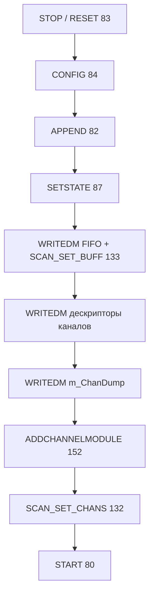

# 3. Программирование скана BIOS

Полная последовательность — `TMic140v2ScanProgrammer.ProgramScan` (`uRecorderMic140v2Scan.pas`),
оригинал: `mic140_96scn.cpp`, `Modscn.cpp`.



## 3.1. CONFIGSCANMAIN (84)

| Аргумент | Описание |
|----------|----------|
| Scale−1 | Предделитель: `0` → Scale=1 (частоты ≥2 Гц), `1` → Scale=2 (1 Гц) |
| Period−1 | Период таймера: по умолч. **639** (`TIMER_PERIOD=640`) |

Связь с частотой: таймер задаёт сетку кадра вместе с `scanDivider` (APPEND).

> Физический смысл **640**, **50 kHz**, поправка ISR и расчёт `count_aver` —
> [08_timing_and_count_aver.md](08_timing_and_count_aver.md).

## 3.2. APPENDSCANMAIN (82)

| Word | Значение |
|------|----------|
| 0 | Тип модуля MIC-140 = **12** |
| 1 | ScanId = 0 |
| 2 | ScanDivider (см. таблицу) |
| 3 | Адрес контекста скана в DM |
| 4 | Страница = 0 |

**ScanDivider** при `F_clk=16 MHz`, `TIMER_PERIOD=640`:

| Fs | Divider |
|----|---------|
| 1 Гц | 25000 |
| 2 Гц | 25000 |
| 5 Гц | 10000 |
| 10 Гц | 5000 |
| 20 Гц | 2500 |
| 25 Гц | 2000 |
| 50 Гц | 1000 |
| 100 Гц | 500 |

Для этой legacy-сетки строки 10/20/25/50/100 Гц дают ровные частоты
`10.000000`, `20.000000`, `25.000000`, `50.000000`, `100.000000` Гц при
`GetFreqClk() = 16 MHz`. В диалоге «Дополнительно» `count_aver` сходится с
Recorder при `Fs=10.000000 Гц`; отличие даёт не частота канала, а эффективная
поправка обработчика таймера в `CalcCountAver`.
Подробная таблица влияния этой поправки на `count_aver` — в
[08_timing_and_count_aver.md §8.9.1](08_timing_and_count_aver.md#891-почему-на-скриншоте-recorder-получается-327--298).

## 3.3. FIFO (WRITEDM + SCAN_SET_BUFF)

Дескриптор FIFO — 10 слов: Head/Tail/Begin, размер `2×FifoReadyWords`,
порог готовности `FifoReadyWords`.

```
FifoReadyWords = (DataUpdateMs / 1000) × Fs × PayloadStride
```

**PayloadStride** зависит от режима:

| Режим | PayloadStride | msgWords @10Hz/200ms | TIn |
|-------|---------------|----------------------|-----|
| Стабильный стенд (по умолчанию) | **48** | **106** | READMEMDM 114 |
| `--recorder-wire` / дамп Recorder | **51** | **163** (3×51 data) | слова 48..50 |

Пример stride=48: `FifoReadyWords = 0.2 × 10 × 48 = 96` → **106** слов MDP-payload.

Пример Recorder wire (дамп 2026-07-01): **153** dataWords + 10 header = **163**; `m_ChanDump[2]=51`.

**Правило ptr (MIC140_48mod):** AIn — `var_addr+n` без `0x8000`; TIn — `0x8000|(var_addr+48+n)`.

CLI: `Mic140ProtocolDebugCli.exe --recorder-wire` или `MIC140_DEBUG_RECORDER_PROFILE=1`.

### Descriptor base nuance (2026-07-06)

There are two descriptor layouts that must not be mixed:

| Profile | Descriptor 0 | First AIn pointer | Purpose |
|---|---|---|---|
| acceptance/default `fifo=48` | reserved ground descriptor | `descAddr + 5` | stable live test stream, TIn read from DM |
| `--recorder-wire` | AIn1 descriptor | `descAddr` | reproduces the Recorder MDP dump layout (`msgWords=163`, `stride=51`) |

The default test profile keeps `reserveGroundDesc=True` even when
`flag_chan_ground`/ground pointer pairs are disabled. This preserves the stable
48-word payload alignment observed on the stand. The Recorder-wire profile uses
the dense descriptor list from the captured Recorder `WRITE_DM`: no leading
ground descriptor, `ptrHead[3] == descAddr`.

## 3.4. Завершение

- **ADDCHANNELMODULE (152)** — цепочка `m_ChanDump`, число каналов, тайминги усреднения.
- **SCAN_SET_CHANS (132)** — активация списка опроса.
- **STARTSCANMAIN (80)** — поток PORT=0.

Перед повторным ProgramScan — **STOP** и **RESETSCANMAIN**.
