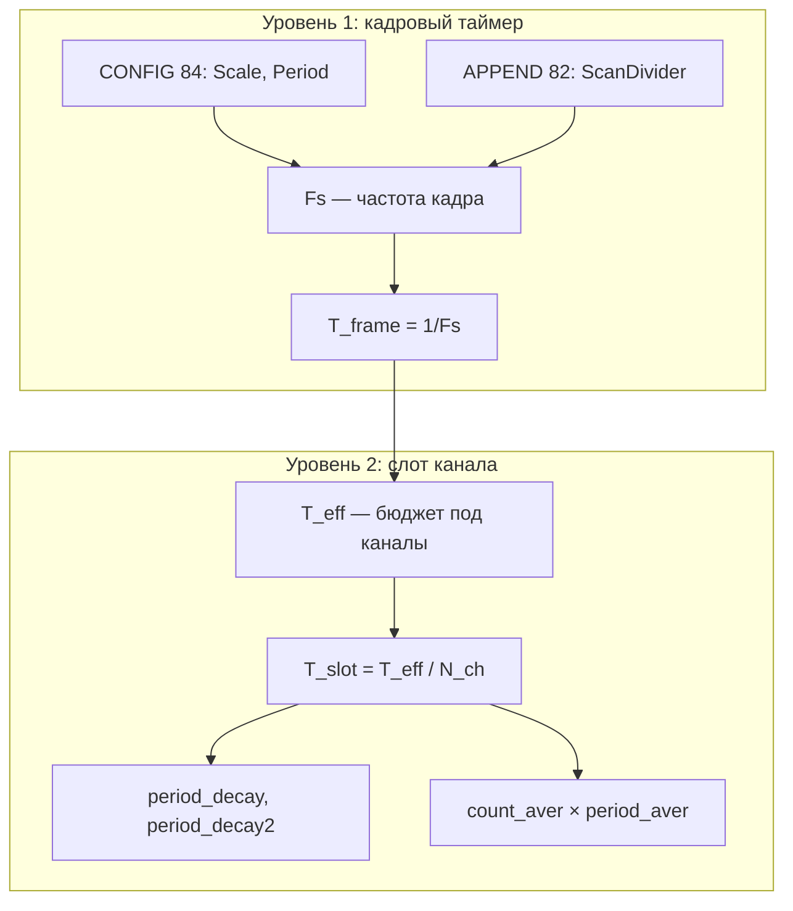
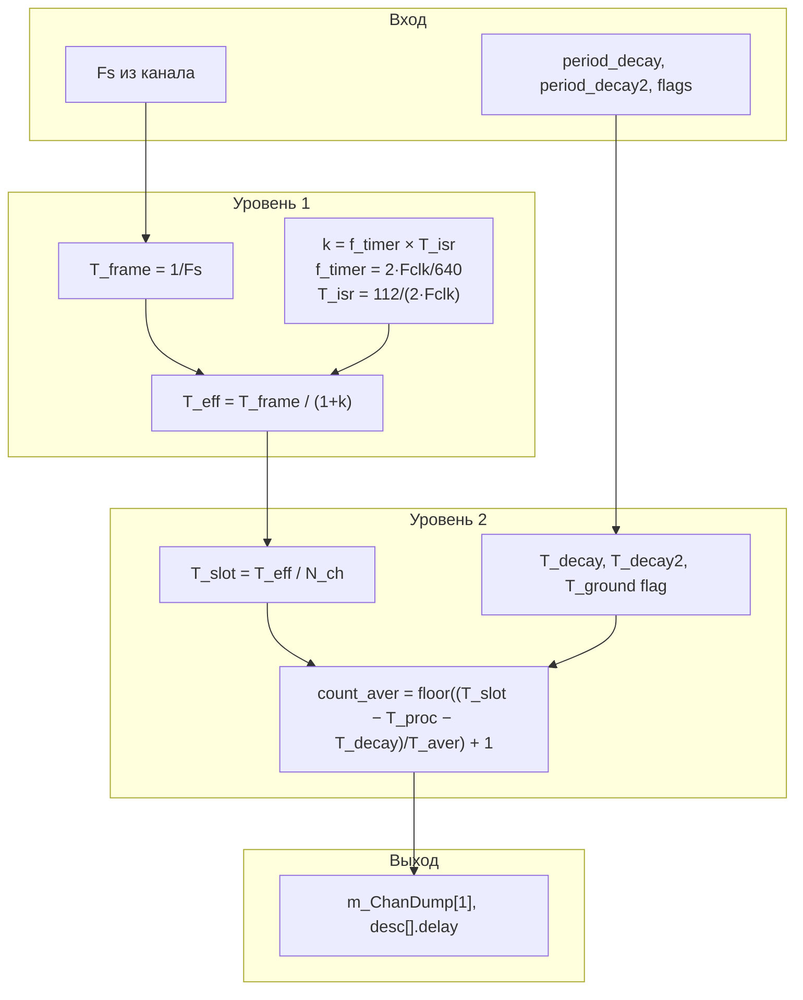

# 8. Алгоритм таймингов и расчёта `count_aver`

Подробное описание того, как оригинальный Recorder (`MIC140pp` / `ModuleMIC140_96`)
рассчитывает частоту кадра, время успокоения, заземление и **число точек усреднения**
(`count_aver`). Документ дополняет [02_commutated_adc.md](02_commutated_adc.md) и
[03_scan_programming.md](03_scan_programming.md).

**Источники в windev-v3.9:**

| Файл | Функции / данные |
|------|------------------|
| `MIC140_96_rce/mic140_96mod.cpp` | `CalcPeriodS`, `CalcPeriodDecay`, `CalcCountAver`, `PeriodDecayToSport` |
| `mtc/Mc114mod.cpp` | `CheckPeriodDelay`, `CheckPeriodDecay`, `CheckCountAver`, `GetCountChansFor`, `scale_period_16000` |
| `MIC140pp_rce/mic140ppext.cpp` | UI «Дополнительно», `period_decay`, `period_decay2`, режимы авторасчёта |
| `mtc/Ccdevice.cpp` | `ConfigScanMain` (CMD 84) |
| `mtc/Modscn.cpp` | `CreateInternalScan` (CMD 82), `GetDeviceTimerPeriodSec` |

**Порт в RecorderLnx:** `Device/MIC140v2/utils/uRecorderMic140v2Timing.pas`,
`Device/MIC140/uRecorderMic140LegacyTiming.pas`.

---

## 8.1. Два уровня времени

В MIC-140 одновременно работают **два «часовых механизма»**:

| Уровень | Что задаёт | Параметры | Результат |
|---------|------------|-----------|-----------|
| **1. Кадровый таймер MC114** | Как часто начинается новый кадр (Fs) | `TimerScale`, `TimerPeriod`, `ScanDivider` | Период кадра `T_frame = 1/Fs` |
| **2. Циклограмма канала (BIOS/SPORT)** | Что происходит **внутри** одного слота | `period_decay`, `period_decay2`, `count_aver`, `period_aver` | Длительность фаз MUX и число отсчётов АЦП |



Параметры уровня 1 программируются командами BIOS; параметры уровня 2 — в DM-дескрипторах
каналов и в `m_ChanDump`.

---

## 8.2. Кадровый таймер: `TimerScale`, `TimerPeriod`, `ScanDivider`

### 8.2.1. Куда уходят в BIOS

```text
ProgramScan:
  RESET 83
  CONFIG 84   → arg0 = Scale−1,  arg1 = Period−1
  APPEND 82   → word2 = ScanDivider
  …
```

Оригинал:

```cpp
// ModuleMIC140_96::WriteConfig
cc->ConfigScanMain(cc->iface->GetTimerScale(), cc->iface->GetTimerPeriod());

// ScanModule::Programming → CreateInternalScan
scan_divider = GetScanDivider();  // → ModuleMIC140_96::GetMainScanDivider()
```

Значения берутся из таблицы `scale_period_16000[]` в `Mc114mod.cpp` по частоте канала.

### 8.2.2. Формула частоты кадра

```cpp
// ModuleMC114::IndexToFreq
freq = 2 * freq_clk / (scale * period * count);
```

При `F_clk = 16 MHz`:

$$
F_s = \frac{32\,000\,000}{Scale \cdot Period \cdot ScanDivider}
$$

Тройка `(Scale, Period, ScanDivider)` подбирается из **дискретной сетки**, произвольную
частоту задать нельзя.

### 8.2.3. Таблица для UI (Period = 640)
У MR-114 циклограмма работает в часах привязанных к 50 кГц, одимн импульс часов 20мкС при частоте Clk 16Mhz=640 импульсов

| Fs        | Scale | Period  | ScanDivider |
| --------- | ----- | ------- | ----------- |
| 1 Гц      | 2     | 640     | 25000       |
| 2 Гц      | 1     | 640     | 25000       |
| 5 Гц      | 1     | 640     | 10000       |
| **10 Гц** | **1** | **640** | **5000**    |
| 20 Гц     | 1     | 640     | 2500        |
| 25 Гц     | 1     | 640     | 2000        |
| 50 Гц     | 1     | 640     | 1000        |
| 100 Гц    | 1     | 640     | 500         |
|           |       |         |             |

**Scale = 2** только для 1 Гц: при Scale=1 и Divider=25000 минимум был бы 2 Гц.

### 8.2.4. Смысл полей

| Поле в Codex / UI | BIOS | Смысл |
|-------------------|------|-------|
| `TimerScaleMinus1` | CONFIG arg0 | Предделитель таймера: 0→Scale=1, 1→Scale=2 |
| `TimerPeriodMinus1` | CONFIG arg1 | Длина одного **базового тика** супервизора в единицах `1/(2·F_clk)`; по умолчанию **639→640** |
| `ScanDivider` | APPEND word2 | Сколько базовых тиков между **стартами кадров** |

**CONFIG** задаёт глобальный таймер контроллера MC114; **ScanDivider** — делитель
конкретного скана MIC-140 в его контексте (DM).

---

## 8.3. Что такое 640 и откуда 50 000 Гц

### 8.3.1. `TIMER_PERIOD = 640`

Константа в `mic140_96mod.cpp`:

```cpp
const WORD TIMER_PERIOD = 640;  // делитель системного таймера (20 мкс)
```

То же значение передаётся в `ConfigScanMain` как `Period−1 = 639`.

**640 — не частота и не Fs.** Это число тактов **внутренней шкалы ADSP**, которые
супервизор скана считает между своими «тиками».

В MIC-140 микрооперации (SPORT, RegLatch, прерывания) измеряются периодами:

$$
T_{code}(N) = \frac{N}{2 \cdot F_{clk}}, \quad F_{clk} = 16\,\text{MHz}
$$

Один базовый тик системного таймера:

$$
T_{tick} = \frac{640}{2 \cdot F_{clk}} = \frac{640}{32\,\text{MHz}} = 20\,\mu\text{s}
$$

Комментарий «20 мкс» в исходнике — это **640 / (2·F_clk)**, а не 640/F_clk.

### 8.3.2. `TimerFreq = 50 000 Гц`

В `CalcCountAver` / `CalcPeriodS`:

```cpp
double TimerFreq = (2 * GetFreqClk()) / TIMER_PERIOD;
```

$$
f_{timer} = \frac{2 \cdot 16\,000\,000}{640} = 50\,000\,\text{Hz}
$$

| Величина | Значение | Что это |
|----------|----------|---------|
| **50 000 Гц** | 1 / 20 µs | Частота **базовых тиков супервизора** MC114 |
| **10 Гц** | 1 / 100 ms | **Частота кадра** Fs (опрос всех каналов) |
| **200 kHz** | 1 / 5 µs | Частота отсчётов ΣΔ при усреднении (`period_aver`) |

**50 kHz — не Fs.** Это «метроном» прошивки: каждые 20 µs срабатывает служебный
таймер, на котором крутится FSM скана.

Связь с кадром: при 10 Гц `ScanDivider = 5000`, то есть **5000 тиков × 20 µs = 100 ms**
на один кадр.

---

---

## 8.4. `PERIOD_TIMER_WORK` и поправка на прерывания

### 8.4.1. Константа

```cpp
const WORD PERIOD_TIMER_WORK = 80 + 32;  // обработка таймера; +32 для DIn, UTS
```

**112** — оценка длительности **одного обслуживания прерывания** системного таймера.
Единица та же, что у констант циклограммы слота (§8.3.3), но это **не шаг MUX/АЦП**,
а время обработчика прерывания кадрового супервизора.

В секундах:

$$
T_{isr} = \frac{112}{2 \cdot F_{clk}} = 3.5\,\mu\text{s}
$$

| Состав | Тиков | Назначение (по комментарию) |
|--------|-------|----------------------------|
| 80 | базовая | Обработчик таймера скана |
| +32 | доп. | Задачи DIn, UTS |

### 8.4.2. Формула поправки

В `CalcPeriodS` (сколько **реально** занимают все каналы, включая ISR):
```cpp
periods *= (1 + TimerFreq * (PERIOD_TIMER_WORK / (2 * GetFreqClk())));
```
В `CalcCountAver` / `CalcPeriodDecay` (сколько **полезного** времени в кадре):
```cpp
periods /= (1 + TimerFreq * (PERIOD_TIMER_WORK / (2 * GetFreqClk())));
```
Обозначим:

$$
k = f_{timer} \cdot T_{isr} = 50\,000 \cdot 3.5\,\mu\text{s} = 0.175
$$
**Физический смысл:** пока идёт кадр, супервизор регулярно отвлекает процессор на ~3.5 µs.
В модели это «налог» **17.5%** на полезное время каналов.
$$
T_{eff} = \frac{T_{frame}}{1 + k}
$$
При `T_frame = 100 ms` (10 Гц):
$$
T_{eff} = \frac{100\,\text{ms}}{1.175} = 85.106\,\text{ms}
$$
```text
Кадр 100 ms (номинал Fs = 10 Гц)
│
├── ~14.9 ms  — «налог» ISR супервизора (~17.5%)
│
└── ~85.1 ms  — T_eff, бюджет под опрос каналов
      │
      ├── слот CH1: T_proc + T_decay + (count_aver−1)×T_aver
      ├── слот CH2: …
      └── …
```
Почему не «5000 × 3.5 µs» явно: в legacy-коде заложена **линейная аппроксимация**
с коэффициентом `k = 0.175`, а не пошаговый подсчёт каждого ISR.

---
## 8.5. `period_decay` и `period_decay2`

### 8.5.1. Различие

| UI (диалог «Дополнительно»)         | Переменная        | Фаза                                       | Куда в BIOS                         |
| ----------------------------------- | ----------------- | ------------------------------------------ | ----------------------------------- |
| **Время успокоения до усред., мкс** | `period_decay`    | Успокоение MUX **на измерительном канале** | `desc[i].delay` для AIn/TIn         |
| **Время успокоения земли, мкс**     | `m_period_decay2` | Слот **GND** (разряд ёмкости)              | `desc[0].delay` для GND-дескриптора |

Внутри слота при `flag_chan_ground = 1`:

```text
GND (decay2) → переключение MUX → decay → усреднение (count_aver × 5 µs)
```

### 8.5.2. Дефолты в конструкторе `ModuleMIC140_96`

```cpp
m_period_decay2 = CalcMinPeriodDecay();   // ≈ 19.688 µs — не 57!
period_decay    = INIT_PERIOD_DECAY;      // 57e-6 s = 57 µs
```

**57 µs** и **19.688 µs** — **разные** параметры. В UI оба видны, но при **выключенном
заземлении** `period_decay2` **не участвует** в `CalcCountAver`.

### 8.5.3. Запись в дескрипторы

```cpp
desc_chan_bios[i].delay = PeriodDecayToSport(period_decay) - 1;      // канал
desc_chan_bios[0].delay = PeriodDecayToSport(m_period_decay2) - 1;     // GND
```

Оба переводятся функцией `PeriodDecayToSport()` (вычитаются фиксированные накладные
циклограммы), но пишутся в **разные** дескрипторы.

`m_ChanDump[0]` — это **не** decay, а задержка **усреднения** (`PeriodAverageToSport(period_aver)−1`).

---

## 8.6. Число каналов для формул (`count_chans`)

```cpp
// ModuleMC114::GetCountChansFor
if (flag_allch_sampl)
    count_chans = GetMaxChanCount();
else
    count_chans = GetCountUsedChannels();
if (flag_ground)
    count_chans = 2 * count_chans;
```

| Условие | MIC-140-48 |
|---------|------------|
| Опрос всех каналов, земля **выкл.** | 48 AIn + 3 TIn = **51** |
| Опрос всех каналов, земля **вкл.** | (48 + 3) × 2 = **102** BIOS-слота |
| Не все каналы | `channels.Size()` в проекте |

UI: «Режим максимального быстродействия» **выкл.** → `flag_allch_sampl = 1`.

---

## 8.7. Режимы авторасчёта (`CheckPeriodDelay`)

Диалог «Дополнительно» → `CMic140ppext::OnKillfocus…` → `ModuleMC114::CheckPeriodDelay`.

| Режим UI | Константа | Поведение |
|----------|-----------|-----------|
| Ручной decay и aver | `OFF_AUTO_CALC_PERIOD_DELAY` | Оба поля редактируемы; decay и aver зажимаются в допустимые пределы |
| Авто decay | `AUTO_CALC_PERIOD_DECAY` | Decay = минимум; aver подбирается |
| **Авто aver** | **`AUTO_CALC_COUNT_AVER`** | **Decay фиксируется (57 µs); aver максимизируется** |

Типичный режим по умолчанию для MIC-140:

```cpp
const WORD INIT_MODE_AUTO_CALC_PERIOD_DELAY = ModuleMC114::AUTO_CALC_COUNT_AVER;
```

### 8.7.1. Алгоритм `AUTO_CALC_COUNT_AVER`

```cpp
count_aver   = 1;
period_decay = CheckPeriodDecay(1/freq, period_decay, period_aver, count_aver, ...);
count_aver   = MAX_COUNT_AVER;
count_aver   = CheckCountAver(1/freq, period_decay, period_aver, count_aver, ...);
```

1. Временно `count_aver = 1`, проверить что `period_decay` (57 µs) **влезает** в кадр.
2. Запросить максимум (`32767`), **обрезать** до реального `CalcCountAver`.

---

## 8.8. Формула `count_aver`

### 8.8.1. Земля выключена (`flag_chan_ground = 0`)

```cpp
// ModuleMIC140_96::CalcCountAver
periods /= (1 + TimerFreq * (PERIOD_TIMER_WORK / (2 * GetFreqClk())));
period_decay = SportToPeriodDecay(PeriodDecayToSport(period_decay));
period_aver  = SportToPeriodAverage(PeriodAverageToSport(period_aver));
period_proc  = GetPeriod2ChanCode() / (2.0 * GetFreqClk());  // PERIOD_2_CHAN_CODE = 27, см. §8.3.3

count_aver = (periods / count_chans - (period_proc + period_decay)) / period_aver + 1;
```

В математической записи:

$$
count\_aver = \left\lfloor \frac{T_{eff}/N_{ch} - (T_{proc} + T_{decay})}{T_{aver}} \right\rfloor + 1
$$

где:

- $T_{eff} = T_{frame} / (1 + k)$
- $T_{proc} = \text{PERIOD\_2\_CHAN\_CODE} / (2 \cdot F_{clk}) \approx 0.844\,\mu\text{s}$ — накладные «старт АЦП → RegLatch» в **каждом** слоте (§8.3.3)
- $T_{decay}$ — UI «57 µs» **после** вычитания PERIOD_1/3/DELTA_SPORT и SPORT-квантования
- $T_{aver} = 5\,\mu\text{s}$ — после квантования (`PeriodAverageToSport`)

**«+1»** в коде: первый отсчёт учитывается явно; в `CalcPeriodS` используется
`(count_aver − 1) × period_aver`.

### 8.8.2. Земля включена (`flag_chan_ground = 1`)

```cpp
count_aver = ((periods - (count_chans/2) * period_decay2) / (count_chans/2)
              - (period_proc + period_decay)) / period_aver + 1;
```

Здесь `count_chans` уже **удвоен** (`GetCountChansFor`), `period_decay2` берётся из
`GetPeriodDecay2()` (UI «время успокoения земли»).

---

## 8.9. Пример расчёта (типичный стенд)

**Условия** (как в диалоге Recorder):

| Параметр                       | Значение                                  |
| ------------------------------ | ----------------------------------------- |
| Fs                             | 10 Гц                                     |
| MIC-140-48, опрос всех каналов | N_ch = 51                                 |
| Заземление                     | **выкл.**                                 |
| `period_decay`                 | 57.000 µs                                 |
| `period_decay2`                | 19.688 µs (в расчёте **не используется**) |
| Авторасчёт                     | AUTO_CALC_COUNT_AVER                      |
| `period_aver`                  | 5 µs (200kHz частота АЦП)                 |

### Шаг 1. Бюджет кадра

$$
T_{frame} = 100\,\text{ms},\quad k = 0.175,\quad T_{eff} = 85.106\,\text{ms}
$$

### Шаг 2. Слот канала

$$
T_{slot} = 85.106\,\text{ms} / 51 = 1668.75\,\mu\text{s}
$$

### Шаг 3. Накладные слота

$$
T_{proc} = 0.844\,\mu\text{s},\quad T_{decay} = 57.0\,\mu\text{s},\quad T_{aver} = 5.0\,\mu\text{s}
$$
$$
T_{proc}  время старта АЦП, Tdec - время ожидания, Taver - период АЦП
$$
Если нет заземления
### Шаг 4. Остаток под усреднение

$$
T_{avail} = 1668.75 - 0.844 - 57.0 = 1610.9\,\mu\text{s}
$$

### Шаг 5. Результат

$$
count\_aver = \lfloor 1610.9 / 5.0 \rfloor + 1 = 322 + 1 = \mathbf{323}
$$

При **строго 10 Гц** и **51 слоте** оригинал даёт **323**, не 327.

### 8.9.1. Откуда может взяться 327 в UI

Разница +4 точки ≈ +20 µs бюджета на слот. Возможные причины:

| Вариант | count_aver @ ~10 Гц |
|---------|---------------------|
| 51 слот, Fs = 10.0 Гц | **323** |
| 50 слотов, Fs = 10.0 Гц | **329** |
| 51 слот, Fs ≈ 9.89 Гц (кадр ~101.1 ms) | **327** |
| 50 слотов, Fs ≈ 10.05 Гц | **328** |

Для точного совпадения с UI проверьте **реальную Fs первого AIn-канала** в проекте
(`GetFreqSFor`) и **тип модуля** (число TIn-слотов в `GetMaxChanCount`).

---

## 8.10. Сводная схема алгоритма



---

## 8.11. Словарь символов

| Символ / константа     | Значение         | Где в коде                                                                         |
| ---------------------- | ---------------- | ---------------------------------------------------------------------------------- |
| `F_clk`                | 16 MHz           | `FREQ_CLK`, `GetFreqClk()`                                                         |
| `TIMER_PERIOD`         | 640              | `mic140_96mod.cpp`, CONFIG arg1                                                    |
| `T_tick`               | 20 µs            | 640 / (2·F_clk)                                                                    |
| `f_timer`              | 50 kHz           | `(2·F_clk) / TIMER_PERIOD`                                                         |
| `PERIOD_TIMER_WORK`    | 112              | накладные ISR                                                                      |
| `T_isr`                | 3.5 µs           | 112 / (2·F_clk)                                                                    |
| `k`                    | 0.175            | f_timer × T_isr                                                                    |
| `ScanDivider`          | см. табл. §8.2.3 | APPEND word2, `GetTimerCount()`                                                    |
| `PERIOD_1_CHAN_CODE`   | 30 тиков         | прерывание → старт АЦП; вычитается в `PeriodDecayToSport` / `PeriodAverageToSport` |
| `PERIOD_2_CHAN_CODE`   | 27 тиков         | старт АЦП → RegLatch; **`T_proc`** в `CalcCountAver`                               |
| `PERIOD_3_CHAN_CODE`   | 59 тиков         | RegLatch → SPORT; вычитается только для **decay**                                  |
| `PERIOD_21_CHAN_CODE`  | 21 тиков         | старт АЦП → SPORT; вычитается только для **averaging**                             |
| `PERIOD_4_CHAN_CODE`   | 120 тиков        | минимум GND-слота (`CalcMinPeriodDecay`)                                           |
| `DELTA_SPORT`          | 11 тиков         | поправка SPORT                                                                     |
| `PERIOD_AD_MKS`        | 5 µs             | T_aver в UI                                                                        |
| `INIT_PERIOD_DECAY`    | 57 µs            | дефолт period_decay                                                                |
| `CalcMinPeriodDecay()` | ≈ 19.688 µs      | дефолт period_decay2                                                               |
| `count_aver`           | 1…32767          | `m_ChanDump[1]`                                                                    |

---

## 8.12. Связанные документы

- [02_commutated_adc.md](02_commutated_adc.md) — фазы слота, краткие формулы
- [03_scan_programming.md](03_scan_programming.md) — CONFIG/APPEND, таблица ScanDivider
- [06_ui_parameters.md](06_ui_parameters.md) — поля диалога «Дополнительно»
- [../mic140_configuration_details.md](../mic140_configuration_details.md) — WRITEDM, `m_ChanDump`
