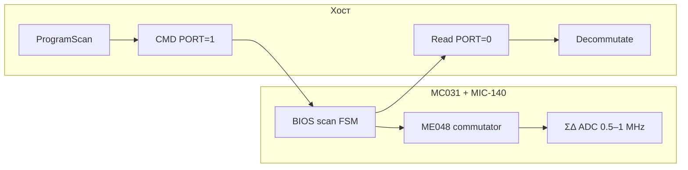

# Протокол MIC-140 (CC BIOS Legacy / MDP Ethernet)

Лаконичное описание обмена с модулем MIC-140 через контроллер MC031 по TCP **:4000**.
Источники: `MIC140_96_rce`, `MIC140pp_rce`, `MIC140_48mod.cpp` / `MIC140_48v2mod.cpp`,
`mdpEthernet81`, реализация `Device/MIC140v2` в RecorderLnx.

## Разделы

| Документ | Содержание |
|----------|------------|
| [01_mdp_transport.md](01_mdp_transport.md) | Кадр MDP, потоки PORT=0/1, resync |
| [02_commutated_adc.md](02_commutated_adc.md) | **Коммутируемый АЦП**: слот канала, заземление, decay, усреднение, формулы |
| [03_scan_programming.md](03_scan_programming.md) | Последовательность команд BIOS, таймер 16 МГц |
| [04_channel_descriptors.md](04_channel_descriptors.md) | ME048, MUX, дескрипторы DM, циклограмма |
| [05_data_stream.md](05_data_stream.md) | FIFO, заголовок BIOS, stride 48 AIn |
| [06_ui_parameters.md](06_ui_parameters.md) | Диалог «Расширенные» → переменные → BIOS |
| [07_acceptance.md](07_acceptance.md) | Критерии приёмки стенда (кратко) |
| [08_timing_and_count_aver.md](08_timing_and_count_aver.md) | **Подробно:** кадровый таймер (640, 50 kHz), ISR-поправка, `period_decay`/`period_decay2`, расчёт `count_aver` |

## Связанные материалы

- [../acquisition_rules.md](../acquisition_rules.md) — правила приёма в RecorderLnx
- [../mic140_configuration_details.md](../mic140_configuration_details.md) — длинные таблицы WRITEDM
- [../../../../Tests/mic140/Mic140ProtocolDebug_Codex/](../../../../Tests/mic140/Mic140ProtocolDebug_Codex/) — автономный стенд `Mic140Example`

## Краткая схема

