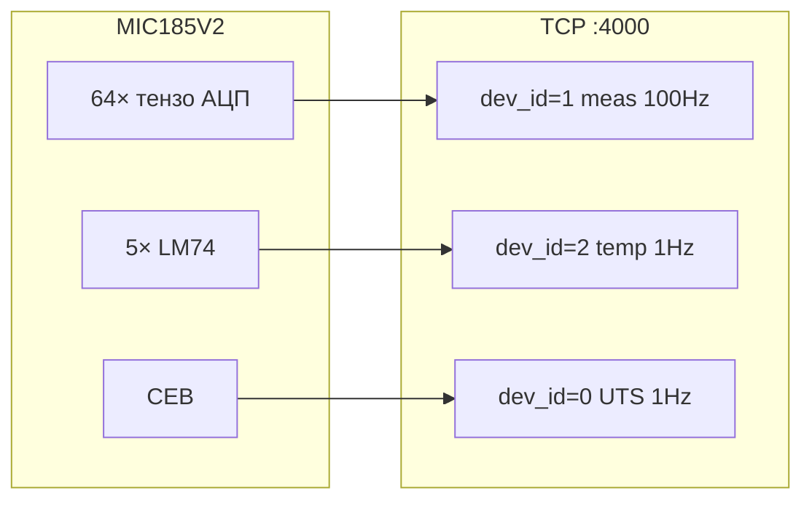
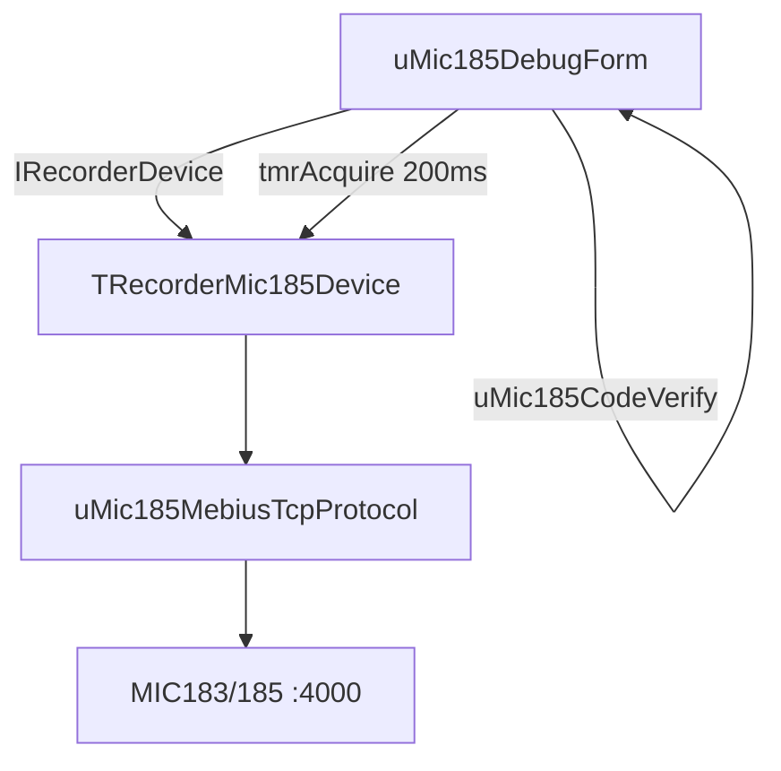

# Архитектура MIC185V2

## Аппаратный состав

Комплекс (из комментариев `mic185v2.cpp`):

- **MS046** — контроллер (OMAP)
- **MBP183** — блок питания
- **MI001** — Ethernet-выноска
- **BRO183** — плата индикации
- **MI0185** — модуль термокомпенсации (1 шт.)
- **MI0183** — модули тензоканалов (до 4 шт. × 16 каналов = 64 логических канала)

В конфигураторе Recorder отображается как **MIC183/185**, тип `MIC185V2_DEVICE_TYPE = 0x442A`.

## Каналы

| Группа | Макс. | Fs | Единицы в UI | Примечание |
|--------|-------|-----|--------------|------------|
| Измерительные | 64 | 100 Гц | Код / мВ | Режим «коды»: сырые int16 как float; см. [defaults.md](defaults.md) |
| Температурные | 5 | 1 Гц | °C | LM74, `dev_id=2`; см. [temperature_channels.md](temperature_channels.md) |
| СЕВ (UTS) | 1 | 1 Гц | сек. | `dev_id=0`, `TASKSEV_EN_FLAG` |

На типичной конфигурации активно **20 тензоканалов** (один модуль MI183 + часть второго). Драйвер программирует каналы с `Connected = true`; стенд Lazarus подключает все 64.

### Именование в Recorder

| Тип | Virtual | MemTag (пример) |
|-----|---------|-----------------|
| Тензо | `3-1` … `3-64` | `MIC183_185-{3-N}` |
| Темп. | `3-t1` … `3-t5` | `MIC183_185-{3-tN}` |
| UTS | `3-uts` | `MIC183_185-{3-uts}` |

Mebius-адрес temp: `{ip}\t1` … `\t5`. Трансляция: `MebDaqWrapAPI.cpp` → `TranslateMebiusAddressToDevapi`.

### Таблица коммутации

Физический адрес разъёма ≠ номер канала в ПО. Таблица `CHN_COMMUT_TABLE[64]` в `mic185v2base.h`.

### Диапазоны напряжения

```cpp
CHN_500_mV = 0
CHN_50_mV  = 1
CHN_5_mV   = 2   // ±5.000 мВ в UI (дефолт)
```

### Коммутация

```cpp
CHN_COMMUT_IN     = 0  // «Вход»
CHN_COMMUT_GND    = 1  // «Земля»
CHN_COMMUT_39_2mV = 2  // калибровочный
```

## Потоки данных TCP

Три независимых `UNIVERSAL_DATA_SAMPLE<float>` в одном сокете:



Recorder: `CMIC185V2Scan::Decommutate` — `switch(device_id)`.

Стенд: `ReadMeasDataBlock` с batch-drain; meas в `ReadBlock`, temp/UTS в кеше. См. [protocol.md](protocol.md), [test_stand.md](test_stand.md).

## Состояния устройства

```
DISCONNECTED → CONNECTED → PROGRAMMING → PROGRAMMED → STARTED
```

`ClearProgram()` сбрасывает программу при изменении свойств (частота, коммутация, балансировка и т.д.).

Абстракция стенда: `TRecorderDeviceState` — `rdsDisconnected` … `rdsStarted`.

## Скан и буфер Nios

- Макс. буфер Nios: `MAX_NIOS_BUFFER_SIZE = 1016`.
- `CMIC185V2Scan::Program()` вычисляет `m_SamplesInBlock` из `MEPROPCH_BLOCK_SIZE` первого подключённого канала.
- В живых пакетах часто **1 сэмпл** на meas-блок при `BlockSize=1`.

## Метрология и ГХ

Файл метрологии (`MIC185V2_METROLOGY_FILE`): КХ по диапазонам U, току, TKC.

| Объект | ГХ / калибровка |
|--------|-----------------|
| Тензоканалы (мВ) | `LoadCalibrCoefficients`, `EvalU`, IOCTL `GET_CALIBR_KOEF` |
| Темп. каналы (°C) | **Нет ГХ** — `ConvLM74CodeToC` (LM74) |
| ТКС тензо | `READ_CLB_MOD_TEMP`, `SetModuleTemp` — вспомогательные temp для компенсации |

Blob `ProgramDeviceBin` передаёт настройки скана, **не** файл метрологии. Стенд работает в режиме **кодов** без `LoadCalibrCoefficients`.

## Архитектура стенда Lazarus



## Отличие от MIC-140

| | MIC-140 | MIC185V2 |
|---|---------|----------|
| Протокол | Часто legacy MDP | Mebius TCP |
| Контроллер | MC031 + MC114 | MS046 (OMAP) |
| Каналы | 48 AIn + TIn | 64 тензо + 5 temp + UTS |
| Settings blob | `TMic140BaseSettings` | `CMIC185V2_BASESETTINGS` (3976 B) |
| Тип devapi | `MIC140_*` | `0x442A` |

## Отличие от legacy MIC0185

| | MIC0185 | MIC185V2 |
|---|---------|----------|
| Тип | `0x4129` | `0x442A` |
| Шина | MC114 / MC031 | Прямой Mebius TCP |
| Модуль | `MIC0185mod.cpp` | `mic185v2_pc/` |
