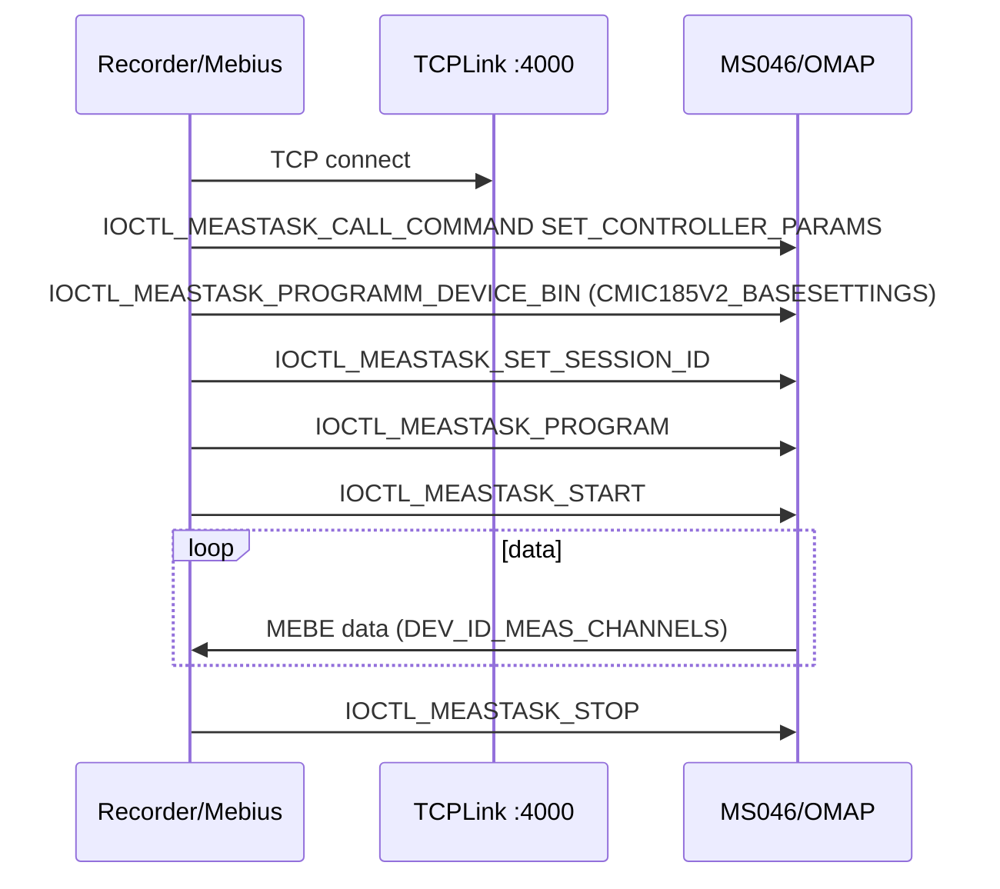

# Карта исходников MIC183/185 (windev-v3.9)

Базовый каталог оригинала: `d:\works\windev-v3.9`.

**Прибор из примера определился именно как 183/185 - как v2 не работает!!! `192.168.9.142:4000`**
## MIC185V2 — современный комплекс (прошивка 19–20)

Основной путь для тензокомплекса с контроллером **MS046**, модулями **MI183** (до 4×16 каналов) и **MI185** (термокомпенсация).

### Драйвер и протокол

| Файл | Роль |
|------|------|
| `Mebius\MebiusDAQDevices\mic185v2\mic185v2_pc\mic185v2.cpp` | Класс `CMIC185V2`: Init, OnProgram, CallCommand, TCP port 4000 |
| `Mebius\MebiusDAQDevices\mic185v2\mic185v2_pc\mic185v2scan.cpp` | Скан: `Program()`, `Start()`, `Decommutate()` — пакеты `DEV_ID_*` |
| `Mebius\MebiusDAQDevices\mic185v2\mic185v2_pc\mic185v2chan.cpp` | Канал измерения: Eval (код→мВ), свойства UI |
| `Mebius\MebiusDAQDevices\mic185v2\mic185v2_pc\mic185v2drv.cpp` | Регистрация драйвера `MEDEVICETYPE_MIC185V2` |
| `Mebius\MebiusDAQDevices\mic185v2\mic185v2base\mic185v2base.h` | `CMIC185V2_BASESETTINGS`, `DEV_ID_UTS/MEAS/TEMP`, `CHN_COMMUT_TABLE` |
| `Mebius\MebiusDAQDevices\mic185v2\mic185v2base\mic185v2const.h` | `MIC185V2_CHANS_COUNT = 64`, `MIC185V2_MODULE_COUNT = 4` |
| `Mebius\MebiusDAQDevices\mic185v2\mic185v2base\computephysical.h` | Диапазоны U, коммутация, `MIC185V2_DEFAULT`, калибровка |
| `Mebius\MebiusDAQDevices\mic185v2\mic185v2base\mic185v2chanbase.cpp` | Дефолты канала: `CHN_5_mV`, `CHN_COMMUT_IN`, Fs=100 Гц |

### Транспорт Mebius

| Файл | Роль |
|------|------|
| `Mebius\MebiusDAQ\DAQ\TCPLink\TCPLink.cpp` | `CTCPLink::IoControlEx` — MEBE-пакет + `MEB_IOCTL_COMMAND` |
| `Mebius\MebiusDAQ\DAQ\TCPLink\EthernetPacket.h` | `MEBE_PACKET_SIGNATURE = 0xA0A0CAFE` |
| `Mebius\MebiusDAQ\DAQ\TCPLink\PacketDispatch.cpp` | Разбор потока: command vs data |
| `Mebius\Include\IoControlIds.h` | `IOCTL_MEASTASK_*`, `IOCTL_CMD_*`, структуры IOCTL |

### Обёртка Recorder / UI

| Файл | Роль |
|------|------|
| `MebDaqWrap\mic185v2\mic185v2.cpp` | `CMIC185V2CC` — обёртка для конфигуратора, default IP |
| `MebDaqWrap\MebDaqWrap.cpp` | Маппинг `MIC185V2_DEVICE_TYPE` → `MEDEVICETYPE_MIC185V2` |
| `mic185v2pp\mic185v2pp_app.cpp` | Property page `MIC185V2_DEVICE_TYPE` |
| `mic183pp\` | UI для линейки MIC183 (смежный прибор) |
| `devapi\Const.h` | `MIC185V2_DEVICE_TYPE = 0x442A` |
| `devctrl\Devctrl.cpp` | Таблица трансляции типов устройств |

### Константы и версии

```cpp
// mic185v2.cpp
MIC185V2_OMAP_VERSION_COMP[] = {19, 20};
MIC185V2_NIOS_VERSION_COMP[] = {6, 7};
MIC185V2_FPGA_VERSION_COMP[] = {6};
```

Версия `20.6.6` в UI: OMAP=20, NIOS=6, FPGA=6 (`SOFT_VERSION_SHIFT_OMAP=20`, `NIOS=10`).

## MIC0185 — legacy (MC114 + MC031)

Старый модуль на шине MC114; в новых комплексах не используется, но код остаётся в репозитории.

| Файл | Роль |
|------|------|
| `MIC0185_rce\MIC0185mod.cpp` | Модуль MC114: каналы ME048, скан |
| `MIC0185_rce\MIC0185app.cpp` | Регистрация `MIC0185_TYPE = 0x4129` |
| `MIC0185pp_rce\` | Страницы свойств legacy |
| `devapi\Const.h` | `MIC0185_TYPE = 0x4129` |

## Поток измерения (MIC185V2)



## Связь с RecorderLnx

| Оригинал | Порт RecorderLnx |
|----------|------------------|
| `CTCPLink` + IOCTL | `uMic185MebiusTcpProtocol.pas` (копия в `Tests/mic185/`) |
| `CMIC185V2_BASESETTINGS` | `uMic185MebiusTypes.pas` |
| `CMIC185V2::OnProgram` | `TRecorderMic185Device.ProgramDevice` |
| `CMIC185V2Scan::Decommutate` | `ReadBlock` + `RecorderMebiusParseFloatBlock` |
