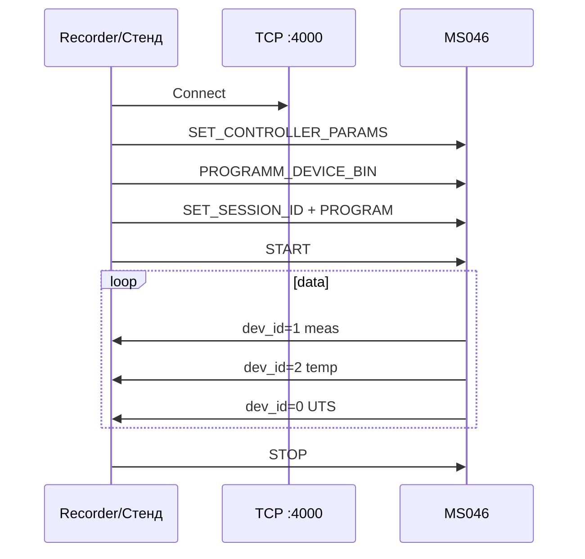

# Карта исходников MIC183/185 (windev-v3.9)

Базовый каталог оригинала: `d:\works\windev-v3.9`.

**Эталонный прибор:** MIC183/185, `192.168.9.142:4000`, прошивка 20.x, тип `0x442A` (не legacy MIC0185 `0x4129`).

## MIC185V2 — современный комплекс (прошивка 19–20)

### Драйвер и протокол

| Файл                                                                 | Роль                                                     |
| -------------------------------------------------------------------- | -------------------------------------------------------- |
| `Mebius\MebiusDAQDevices\mic185v2\mic185v2_pc\mic185v2.cpp`          | `CMIC185V2`: Init, OnProgram, CallCommand, TCP 4000      |
| `Mebius\MebiusDAQDevices\mic185v2\mic185v2_pc\mic185v2scan.cpp`      | Decommutate, `CheckTemperature`, meas/temp/UTS           |
| `Mebius\MebiusDAQDevices\mic185v2\mic185v2_pc\mic185v2chan.cpp`      | Канал: Eval (код→мВ), свойства UI                        |
| `Mebius\MebiusDAQDevices\mic185v2\mic185v2base\mic185v2base.cpp`     | `ConvLM74CodeToC`, `CalcMaxRate`, Init                   |
| `Mebius\MebiusDAQDevices\mic185v2\mic185v2base\mic185v2base.h`       | `CMIC185V2_BASESETTINGS`, `DEV_ID_*`, `CHN_COMMUT_TABLE` |
| `Mebius\MebiusDAQDevices\mic185v2\mic185v2base\mic185v2chanbase.cpp` | Дефолты канала и temp (Fs 100/1 Гц)                      |
| `Mebius\MebiusDAQDevices\mic185v2\mic185v2base\computephysical.h`    | `MIC185V2_DEFAULT`, диапазоны, коммутация                |
| `Mebius\MebiusDAQ\Base\UniversalDataSample.h`                        | `INTERNAL_PACKET_HEADER`, padding MSVC                   |

### Транспорт Mebius

| Файл                                              | Роль                           |
| ------------------------------------------------- | ------------------------------ |
| `Mebius\MebiusDAQ\DAQ\TCPLink\TCPLink.cpp`        | `IoControlEx`, MEBE + IOCTL    |
| `Mebius\MebiusDAQ\DAQ\TCPLink\EthernetPacket.h`   | `MEBE_PACKET_SIGNATURE`        |
| `Mebius\MebiusDAQ\DAQ\TCPLink\PacketDispatch.cpp` | command vs data (`0x3E904000`) |
| `Mebius\Include\IoControlIds.h`                   | `IOCTL_MEASTASK_*`             |

### Обёртка Recorder / UI

| Файл | Роль |
|------|------|
| `MebDaqWrap\MebDaqWrapAPI.cpp` | `TranslateMebiusAddressToDevapi` → `3-t1` |
| `MebDaqWrap\mic185v2\mic185v2.cpp` | `CMIC185V2CC`, default IP |
| `devapi\Const.h` | `MIC185V2_DEVICE_TYPE = 0x442A` |

### GTest-стенд

| Файл | Роль |
|------|------|
| `examples\mebius.daq\tests\mic185_test\` | Эталон программирования; см. [windev_mic185_test.md](windev_mic185_test.md) |
| `examples\mebius.daq\mebius_daq_devices\ms\mic185\` | Portable `CMIC185` |

## MIC0185 — legacy (MC114)

| Файл | Роль |
|------|------|
| `MIC0185_rce\MIC0185mod.cpp` | Модуль MC114 |
| `devapi\Const.h` | `MIC0185_TYPE = 0x4129` |

## Поток измерения (MIC185V2)



## Порт RecorderLnx (Tests/mic185)

| Оригинал (windev) | Lazarus (стенд) |
|-------------------|-----------------|
| `CTCPLink` + IOCTL | `device/uMic185MebiusTcpProtocol.pas` |
| `CMIC185V2_BASESETTINGS` | `device/MIC185/uMic185MebiusTypes.pas` (3976 B, `_Pad*`) |
| `CMIC185V2::OnProgram` | `device/MIC185/uMic185Device.pas` → `ProgramDevice` |
| `Decommutate` meas | `RecorderMebiusParseFloatBlock`, offset **12** |
| `CheckTemperature` | `Mic185ConvLM74CodeToC`, `Mic185ParseTempValues` |
| `ConvLM74CodeToC` | `uMic185Constants.pas` + `uMic185MebiusTcpProtocol.pas` |
| GTest mic185_test | `mic185_acquire_test.lpr`, `mic185_acquire_gui` |
| — | `uMic185CodeVerify.pas` (эталон кодов) |
| — | `uMic185DebugForm.pas` (GUI, stress, verify) |

Документация стенда: [test_stand.md](test_stand.md).

## Версии прошивки

```cpp
MIC185V2_OMAP_VERSION_COMP[] = {19, 20};
MIC185V2_NIOS_VERSION_COMP[] = {6, 7};
```

UI `20.6.6`: OMAP=20, NIOS=6 (`SOFT_VERSION_SHIFT_OMAP=20`, NIOS=10).
