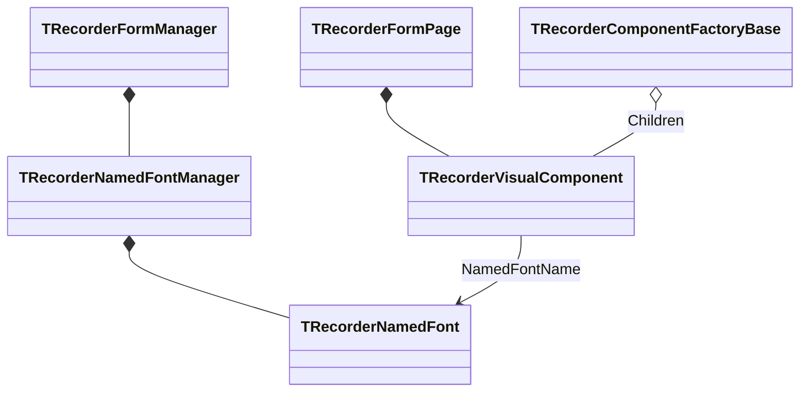

# Именованные шрифты мнемосхем

`TRecorderFormManager.NamedFonts` хранит определения шрифтов уровня GUI-проекта.
Определение содержит имя, гарнитуру, размер, цвет, полужирное и курсивное
начертание. Визуальный компонент хранит `NamedFontName` и локальные параметры
как fallback.

Если `NamedFontName` существует в менеджере, эффективные свойства шрифта
читаются из общего определения. Поэтому изменение определения применяется ко
всем связанным компонентам без копирования параметров. Если имя пустое или
определение отсутствует, используются локальные поля — это обеспечивает
совместимость со старыми GUI-конфигурациями.

Менеджер увеличивает `Revision` только при фактическом изменении определения.
Компонент повторно ищет definition по имени лишь после смены revision, а view
получает один effective snapshot и записывает свойства LCL `Font` только если
сигнатура snapshot изменилась. Периодический UI refresh не выполняет повторные
поиски и присваивания неизменного шрифта.

В `.gui.ini` определения записываются в `[NamedFonts]` и секции
`[NamedFont.N]`; связь компонента хранится ключом `NamedFont`. Локальные
параметры также сохраняются как безопасный fallback.

В настройках DigitalIndicator поле имени допускает выбор существующего или
ввод нового определения. Кнопка «Назначить всем» при подтверждении диалога
назначает выбранное имя всем живым `TRecorderTagValueComponent`, зарегистрированным
их фабрикой. Отмена диалога не изменяет модель.

Выбор существующего имени загружает его параметры в preview. Последующий
`FontDialog` и `OK` изменяют это же определение, поэтому все ранее связанные с
ним компоненты обновляются. Ввод отсутствующего имени создаёт новое определение.
