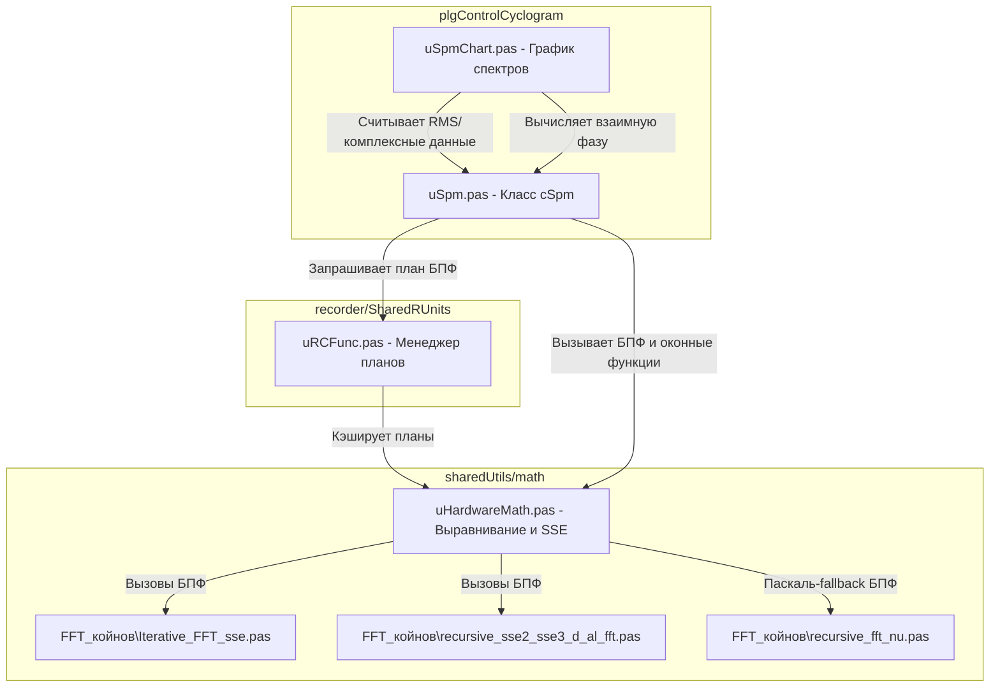

# Архитектура и перенос спектрального анализа в Lazarus

Этот документ содержит подробный анализ реализации спектрального анализа в Delphi-плагине `plgControlCyclogram` и библиотеке `sharedUtils`, а также руководство по его интеграции в Lazarus-проект с архитектурными улучшениями.
c:\Oburec\OburecGH\recorder\plgControlCyclogram\.. 
c:\Oburec\OburecGH\sharedUtils\math\.. 

---

## 1. Текущая структура и взаимосвязи в Delphi

В Delphi-проекте расчет и отображение спектров распределены между несколькими модулями, находящимися в плагине и общей библиотеке `sharedUtils`.



### Ключевые компоненты:
1. **`cSpm` (модуль `uSpm.pas`)**: 
   Класс-наследник алгоритма источника (`cSrcAlg`). Накапливает историю во внутреннем выровненном буфере `m_EvalBlock` до размера, кратного размеру БПФ (`fOutSize`). Вызывает оконную функцию, выполняет БПФ, производит усреднение комплексных спектров во времени и вычисляет итоговый амплитудный спектр `m_rms` (RMS). Дополнительно считает интегрированные спектры (`m_magI1`, `m_magI2`).
2. **`uHardwareMath.pas`**:
   Предоставляет низкоуровневые математические структуры:
   - `TAlignDarray` / `TAlignDCmpx` — записи для хранения выровненных по границе 16 байт массивов double и комплексных чисел.
   - `TFFTProp` — структура плана БПФ (экспоненциальные множители и массив индексов переупорядочивания).
   - `fft_al_d_sse` / `ifft_al_d_sse` — процедуры прямого и обратного БПФ с поддержкой векторизации и оконного сглаживания.
   - `EvalSpmMag` — процедура расчета амплитуды спектра из комплексных чисел на ассемблере SSE.
3. **`GetFFTPlan` (модуль `uRCFunc.pas`)**:
   Глобальный менеджер планов БПФ. Хранит список уже построенных планов в динамическом массиве `g_FFTPlanList`. Если план для заданного размера `fftCount` отсутствует, менеджер выделяет выровненную память для таблицы экспонент, рассчитывает индексы переупорядочивания `GetArrayIndex` и кэширует план.
4. **`TSpmChart` (модуль `uSpmChart.pas`)**:
   Визуальный компонент отображения спектров. Напрямую обращается к внутренним массивам `cSpm` для извлечения амплитудного спектра. Также содержит код расчета взаимной фазы между исследуемым каналом и опорным тахо-каналом (`m_tahoSpm`).

---

## 2. Проблемы переноса в Lazarus (FPC) и пути их решения

При переносе данного кода в Lazarus-проект (Free Pascal) под 32-битную и 64-битную платформы (Windows/Linux) возникают критические проблемы совместимости.

### Проблема 1: Ассемблерные вставки x86 (SSE)
Модули `uHardwareMath.pas`, `Iterative_FFT_sse.pas` и `recursive_sse2_sse3_d_al_fft.pas` активно используют ассемблер x86 (команды `pushad`, `popad`, работу с 32-битными регистрами общего назначения). При компиляции проекта под x86_64 в Lazarus этот код вызовет ошибки компиляции, так как соглашение вызовов и доступные регистры в 64-битной архитектуре принципиально отличаются.

> [!WARNING]
> Использование старого x86 ассемблера в 64-битном Lazarus недопустимо и приведет к падениям компилятора или Access Violation.

**Решение**:
1. **Использование кроссплатформенного Pascal-кода**: 
   В проекте уже есть чистые паскалевские реализации БПФ: `recursive_fft_nu.pas` и `Iterative_fft_nu.pas`. Их необходимо вынести во главу угла и использовать по умолчанию. FPC при сборке с оптимизацией `-O3` / `-O4` и флагами векторизации (`-CfAVX2` или `-CfSSE3`) генерирует высокопроизводительный машинный код, сопоставимый с ручным ассемблером.
2. **Условная компиляция**:
   Разделить низкоуровневые процедуры через директивы компилятора:
   ```pascal
   {$IFDEF CPUX86}
     // Исходный SSE-ассемблер для 32-битных систем
   {$ELSE}
     // Оптимизированный чистый Pascal-код для 64-битных систем
   {$ENDIF}
   ```

### Проблема 2: Эмуляция динамических массивов Delphi через смещения указателей
В `uHardwareMath.pas` функции выделения памяти `GetMemAlignedArray_d` при отсутствии FastMM принудительно эмулируют внутренний заголовок динамического массива Delphi:
```pascal
I := integer(DstAligned) - 4;
pint := pinteger(I);
pint^ := round(SrcSize / sizeof(double)); // Установка длины
```
В 64-битном FPC (Free Pascal) внутреннее представление динамического массива имеет другой заголовок (размер 16 байт на x64: счетчик ссылок и длина занимают по 8 байт). Запись по жесткому смещению `-4` приведет к повреждению памяти кучи.

> [!CAUTION]
> Ручная эмуляция заголовков динамических массивов Delphi в FPC x64 является опасным хаком и гарантирует разрушение кучи!

**Решение**:
Отказаться от эмуляции динамических массивов. Для выровненных вычислений использовать строго типизированные указатели (`PDouble` / `PComplex`) или безопасные обертки объектов, хранящие два указателя: исходный (для вызова `FreeMem`) и выровненный (для расчетов).
Пример безопасного выравнивания в Lazarus:
```pascal
type
  TAlignedDoubleBuffer = class
  private
    FOriginPtr: Pointer;
    FAlignedPtr: PDouble;
    FSize: Integer;
  public
    constructor Create(ASize: Integer; AAlignment: Integer = 32);
    destructor Destroy; override;
    property AlignedPtr: PDouble read FAlignedPtr;
    property Size: Integer read FSize;
  end;
```

---

## 3. Предлагаемые архитектурные улучшения

Вместо механического переноса старой схемы предлагается объединить расчеты спектральных характеристик на уровне ядра алгоритмов ("единым фронтом"), что позволит улучшить инкапсуляцию и повысить производительность.

### Новая концепция: Объединенный расчет спектра

Текущая реализация разделяет расчет амплитуды (внутри `cSpm`), интегрированных спектров (в цикле после БПФ) и фазового спектра / взаимных фаз (на уровне GUI графика). 
Предлагается создать единую структуру результатов и выполнять расчет за один проход в классе алгоритма:

```pascal
type
  // Полный набор спектральных характеристик канала
  TSpectrumResult = record
    FFTSize: Integer;
    dx: Double;
    ReIm: array of TComplex_d;         // Комплексный спектр (Re/Im)
    AmpRMS: array of Double;           // Амплитудный спектр (RMS)
    Phase: array of Double;            // Спектр фаз (в градусах)
    Integrated1: array of Double;      // Интегрированный спектр 1-го порядка (скорость)
    Integrated2: array of Double;      // Интегрированный спектр 2-го порядка (перемещение)
    OverallRMS: Double;                // Общая среднеквадратичная оценка
    TahoFreq: Double;                  // Оценка частоты вращения по спектру
  end;
```

### Преимущества нового подхода:
1. **Инкапсуляция математики**: Компонент отображения (`TSpmChart`) больше не считает взаимные фазы и не обращается к приватным буферам. Он получает готовую структуру `TSpectrumResult` и просто отправляет её в OpenGL-буфер тренда.
2. **Расчет взаимных фаз на уровне ядра**:
   Взаимный спектр (Cross-Spectrum) рассчитывается в специализированном классе алгоритма:
   ```pascal
   procedure CalculateCrossSpectrum(const ChanA, ChanB: TSpectrumResult; var CrossPhase, Coherence: array of Double);
   ```
3. **Эффективность памяти**: Исключаются лишние циклы копирования и выделения памяти. Все характеристики формируются за один проход по результатам комплексного БПФ.

---

## 4. План реализации в Lazarus-проекте

Перенос и модернизацию кода предлагается разделить на 4 контролируемых этапа:

### Этап 1: Подготовка кроссплатформенной математики
- [ ] Скопировать модули БПФ `recursive_fft_nu.pas` и `Iterative_fft_nu.pas` в общий каталог `sharedUtils/math`.
- [ ] Очистить `uHardwareMath.pas` от хаков с заголовками динамических массивов Delphi (`SetLength` эмуляция). Внедрить кроссплатформенный класс `TAlignedDoubleBuffer`.
- [ ] Добавить условную компиляцию для ассемблерных функций SSE, заменив их на чистый Pascal в x64 сборках.

### Этап 2: Создание нового ядра расчетов (`uSpectrumCalculator.pas`)
- [ ] Реализовать структуру `TSpectrumResult`.
- [ ] Создать класс `TSpectrumCalculator`, объединяющий:
  - Применение оконной функции (Hann, Hamming, Blackman, Flattop).
  - Вызов БПФ (`recursive_fft_nu`).
  - Расчет амплитуды (RMS), фазы и Re/Im.
  - Интегрирование спектров (деление на $2\pi f$ и $(2\pi f)^2$).
  - Вычисление общей RMS-оценки в полосе частот.
  - Поиск тахо-частоты по доминирующему пику.
- [ ] Написать юнит-тесты в проекте тестов (`tests/TestAlgLib`), проверяющие корректность расчетов (амплитуд, фаз и интегралов) относительно эталонных данных.

### Этап 3: Рефакторинг алгоритмов плагина (`uSpm.pas`)
- [ ] Переписать класс `cSpm` в плагине под использование нового `TSpectrumCalculator`.
- [ ] Внедрить расчет взаимных спектров и фаз непосредственно в ядро алгоритмов (класс `cCrossSpmAlg` или аналогичный), исключив расчеты из GUI.

### Этап 4: Разработка визуальной части в Lazarus LCL
- [ ] Перевести визуальную форму графика `uSpmChart.pas` на Lazarus LCL с использованием формы `.lfm`.
- [ ] Подключить отрисовку спектральных трендов через оптимизированный класс графика OpenGL (`TOglChart`), используя подготовленные массивы из `TSpectrumResult`.

---

## 5. Требование: максимальная производительность спектральной математики

Цель переноса не только в совместимости с Lazarus/FPC, но и в получении максимально быстрой реализации для расчета спектров на доступном железе. Реализацию нужно строить как набор специализированных ядер, между которыми код выбирает лучшего кандидата по условным директивам сборки и/или по runtime-детекту CPU.

Принцип: корректность у всех реализаций одна, производительность выбирается тестами. "Чемпион" для конкретной платформы определяется юнит-тестами/бенчмарками, которые пишут результат и в консоль, и в лог-файл.

### 5.1. Уровни реализации

Нужно предусмотреть несколько уровней спектральной математики:

1. **Portable Pascal baseline**  
   Обязательная эталонная реализация без ассемблера и без зависимости от SIMD. Она используется:
   - как fallback на любой платформе;
   - как источник эталонных значений для тестов;
   - как безопасная реализация для отладки и диагностики.

2. **FPC auto-vectorized Pascal**  
   Оптимизированный Pascal-код с плотными указательными циклами, без лишних проверок границ, без аллокаций внутри горячего пути и с выровненными буферами. Для него проверять сборки с флагами FPC:
   - `-O3` или `-O4`;
   - `-CfSSE2`, `-CfSSE3`, `-CfAVX`, `-CfAVX2`, если поддерживаются текущей версией FPC/Lazarus;
   - отдельные профили Windows x64 и Linux x64.

3. **32-bit legacy SSE**  
   Старый Delphi/x86 SSE-ассемблер допускается только под `CPUI386`/`CPUX86`, если он реально компилируется и проходит тесты. Он не должен попадать в x64-сборку.

4. **x64 SIMD kernels**  
   Для x64 нужно рассмотреть отдельные аппаратно-ускоренные реализации под SSE2/SSE3/AVX/AVX2. Если inline assembler FPC для нужных AVX-инструкций окажется ограничен, допустимые варианты:
   - отдельные Pascal-ядра, которые хорошо векторизуются компилятором;
   - внешняя C/C++/object-библиотека с экспортом C ABI и подключением через `external`;
   - разные реализации для Windows/Linux, подключаемые условными директивами.

5. **AVX-512 как экспериментальный профиль**  
   Поддержку AVX-512 не закладывать как обязательную. Ее стоит оформлять только как экспериментальный backend, если текущая версия FPC/Lazarus и целевое железо позволяют стабильно собрать и протестировать код. На многих процессорах AVX-512 может снижать частоту CPU, поэтому победитель определяется только бенчмарком.

### 5.2. Условная компиляция и выбор backend

Рекомендуемая схема модулей:

```pascal
unit uSpectrumMath;

interface

type
  TSpectrumMathBackend = (
    smbPascal,
    smbFpcVector,
    smbSse2,
    smbSse3,
    smbAvx,
    smbAvx2,
    smbAvx512
  );

procedure SpectrumMathInit;
function SpectrumMathBackendName: string;

implementation

uses
  uSpectrumMathPascal
  {$IFDEF CPUX86}, uSpectrumMathX86Sse {$ENDIF}
  {$IFDEF CPUX64}
    {$IFDEF WINDOWS}, uSpectrumMathWin64 {$ENDIF}
    {$IFDEF UNIX}, uSpectrumMathLinux64 {$ENDIF}
  {$ENDIF};
```

Выбор реализации:

- compile-time директивы определяют, какие backend вообще доступны в этой сборке;
- runtime-детект CPU выбирает самый быстрый разрешенный backend;
- тестовый проект должен уметь принудительно запускать каждый backend отдельно, чтобы сравнить корректность и скорость;
- в релизной сборке должен быть понятный способ вывести текущий backend в диагностический лог.

Важно: не привязывать весь расчет спектра к одному монолитному ассемблерному модулю. Лучше иметь маленькие специализированные функции над выровненными массивами, чтобы их можно было независимо тестировать, заменять и сравнивать.

### 5.3. Функции, которые нужно вынести в аппаратно-ускоряемую библиотеку

Минимальный набор операций для `uSpectrumMath`/`uHardwareMathLaz`:

#### Буферы и копирование

- `AlignedAlloc`, `AlignedFree` для 16/32/64-byte alignment.
- `CopyFloat64(Dst, Src: PDouble; Count: SizeInt)`.
- `CopyComplex64(Dst, Src: PComplex; Count: SizeInt)`.
- `ZeroFloat64`, `ZeroComplex64`.
- `FillFloat64`.

#### Вещественные массивы

- `MulFloat64Inplace(Dst: PDouble; Factor: Double; Count: SizeInt)`.
- `AddFloat64Inplace(Dst, Src: PDouble; Count: SizeInt)`.
- `AddScaledFloat64Inplace(Dst, Src: PDouble; Scale: Double; Count: SizeInt)`.
- `SubFloat64Inplace`.
- `NormalizeFloat64Inplace`: нормировка массива по коэффициенту, максимуму, RMS или энергии.
- `SquareFloat64`: поэлементные квадраты.
- `SqrtFloat64`: корень для амплитуд, если будет нужен отдельный проход.
- `SumFloat64`, `SumSquaresFloat64`, `MinMaxFloat64`.

#### Комплексные массивы

- `ComplexCopy`.
- `ComplexAddInplace`.
- `ComplexSubInplace`.
- `ComplexScaleInplace`.
- `ComplexConjugateInplace`.
- `ComplexConjugateTo`.
- `ComplexMulTo`: `(a + ib) * (c + id)`.
- `ComplexMulConjTo`: `A * Conj(B)` для cross-spectrum.
- `ComplexMagnitudeSquaredTo`: `Re^2 + Im^2`.
- `ComplexMagnitudeTo`: `sqrt(Re^2 + Im^2)`.
- `ComplexPhaseTo`: `atan2(Im, Re)`, желательно отдельным менее горячим backend, потому что `atan2` обычно хуже векторизуется.
- `ComplexNormalizeInplace`.

#### Спектральные операции

- `ApplyWindowFloat64`: Hann/Hamming/Blackman/Flattop с заранее рассчитанным окном.
- `ApplyWindowAndCopyToComplex`: один проход `input * window -> complex.re`, `complex.im := 0`.
- `BitReverseCopy` или перестановка по заранее рассчитанному плану.
- `FFTForwardComplex`, `FFTInverseComplex`.
- `SpectrumAmplitudeRmsTo`: расчет RMS-амплитуд из комплексного спектра с учетом нормировки FFT и окна.
- `SpectrumPowerTo`: квадраты амплитуд/мощность.
- `SpectrumNormalizeInplace`: нормировка амплитудного спектра.
- `IntegrateSpectrum1To`, `IntegrateSpectrum2To`: деление на `2*pi*f` и `(2*pi*f)^2`, с безопасной обработкой нулевого бина.
- `CrossSpectrumTo`: `A * Conj(B)`.
- `CrossPhaseTo`.
- `CoherenceTo`, если потребуются оценки когерентности.

Все функции должны принимать указатели и `Count`, не выделять память внутри и быть безопасны для повторного вызова в реальном времени.

### 5.4. Правила горячего пути

- Вся память выделяется заранее: входные блоки, окна, FFT-планы, рабочие complex-буферы, выходные амплитуды, фазы, интегралы.
- Размеры FFT должны быть степенью двойки или явно поддержанным набором размеров. Неподдержанный размер должен падать в понятную ошибку до старта расчета, а не внутри горячего цикла.
- FFT-планы кэшируются по размеру, типу окна и backend. План строится один раз.
- Внутри расчета одного блока не должно быть `SetLength`, `Create`, `Free`, строкового логирования или работы с UI.
- Данные должны лежать последовательно в памяти. Для SIMD предпочтительно SoA-представление там, где это дает выигрыш, но внешний API может оставаться AoS (`Re/Im`) ради совместимости.
- Для малых размеров FFT "самый SIMD" backend не всегда самый быстрый. Бенчмарк должен проверять несколько типовых размеров: 256, 512, 1024, 2048, 4096, 8192, 16384.

### 5.5. Тесты корректности

Перед бенчмарком каждая реализация должна пройти одинаковые проверки:

- импульс: FFT дает равномерный спектр;
- константа: энергия только в DC-бине;
- чистый синус в точном бине: пик в ожидаемой частоте, фаза ожидаемая;
- синус не в точном бине: проверка поведения окна и отсутствия NaN/Inf;
- обратное FFT: `IFFT(FFT(x))` возвращает исходный сигнал в пределах допуска;
- амплитуды RMS: сравнение с аналитическим значением для синуса;
- квадраты амплитуд/мощность: сравнение с portable baseline;
- нормировка спектра: максимум/RMS/энергия после нормировки соответствует заданному режиму;
- комплексное сопряжение и `A * Conj(B)`: проверка на ручных малых массивах;
- cross-phase: известный фазовый сдвиг между двумя синусами;
- интегрированные спектры: нулевой бин не приводит к делению на ноль, остальные бины совпадают с формулой.

Допуски фиксировать отдельно:

- strict для простых операций копирования/сложения/сопряжения;
- relative/absolute tolerance для FFT и RMS;
- отдельный допуск для разных backend, потому что порядок операций и SIMD могут давать малые расхождения.

### 5.6. Тесты производительности и лог

Нужен отдельный тестовый проект, например:

```text
Lazarus/RecorderLnx/Tests/TestSpectrumMath/
  TestSpectrumMath.lpi
  TestSpectrumMath.lpr
  uTestSpectrumMath.pas
  logs/
```

Тесты должны:

- запускать корректность для всех доступных backend;
- запускать benchmark для каждого backend, размера FFT и набора операций;
- прогревать код перед измерением;
- выполнять достаточно повторов, чтобы результат был устойчивым;
- считать `min`, `avg`, `median` или хотя бы `best`/`avg`;
- выводить результат в консоль;
- писать тот же результат в файл лога.

Формат имени лога:

```text
logs/spectrum_math_YYYYMMDD_HHMMSS_<os>_<cpu>.log
```

Минимальное содержимое лога:

```text
RecorderLnx SpectrumMath benchmark
DateTime:
OS:
CPU:
PointerSize:
FPCVersion:
LazarusVersion:
BuildMode:
CompilerOptions:
DetectedCPUFeatures:
SelectedBackend:

Correctness:
  Backend Pascal: PASS
  Backend AVX2: PASS

Benchmark:
  Operation FFTForwardComplex, Size 1024, Backend Pascal, Iterations 10000, BestUs ..., AvgUs ...
  Operation FFTForwardComplex, Size 1024, Backend AVX2, Iterations 10000, BestUs ..., AvgUs ...

Winner:
  Size 1024 FFTForwardComplex: AVX2
  Size 4096 FullSpectrumPipeline: AVX2
```

Для консоли использовать тот же набор строк, но можно короче. Для сравнения между сборками лог должен быть достаточно подробным, чтобы понять, какими флагами компилятора был получен результат.

### 5.7. Критерии выбора "чемпиона"

Backend считается кандидатом на релиз только если:

- проходит весь набор correctness-тестов;
- не имеет NaN/Inf на типовых входных данных;
- не пишет за пределы буферов;
- не выделяет память внутри горячих функций;
- быстрее portable baseline на целевых размерах или дает другой измеримый выигрыш;
- стабильно работает на Windows и Linux в своей целевой конфигурации.

Если backend быстрее только на одном размере FFT, dispatcher может выбирать его только для этого диапазона. Например:

```text
FFT 256..512       -> FPC vector/Pascal
FFT 1024..16384    -> AVX2
Fallback           -> Pascal
```

Это решение должно быть зафиксировано в логе тестов и в документации после реальных измерений.

### 5.8. Риски и ограничения Lazarus/FPC

- Не предполагать заранее, что FPC поддерживает все AVX/AVX2/AVX-512 инструкции в inline assembler так же удобно, как Delphi или C/C++.
- Проверять реальные флаги `-Cf...` на установленной версии компилятора.
- AVX-инструкции требуют правильного выравнивания и аккуратного обращения с хвостом массива, если `Count` не кратен ширине вектора.
- На Linux и Windows могут отличаться calling convention, имена внешних символов и правила линковки, поэтому внешние SIMD-библиотеки лучше подключать через маленький стабильный C ABI.
- Ручной x86 SSE-ассемблер из Delphi нельзя автоматически считать пригодным для x64.

---

## 6. Обновленный план работ по производительности

1. [ ] Создать `uSpectrumMath.pas` как фасад и dispatcher backend.
2. [ ] Реализовать portable Pascal backend как эталон.
3. [ ] Реализовать набор операций над `Double` и complex-буферами без аллокаций.
4. [ ] Реализовать/подключить FFT backend и общий `FullSpectrumPipeline`.
5. [ ] Добавить compile-time профили для Windows/Linux и CPU x86/x64.
6. [ ] Добавить runtime-детект доступных CPU features.
7. [ ] Создать `TestSpectrumMath` с correctness-тестами.
8. [ ] Добавить benchmark-тесты с выводом в консоль и лог-файл.
9. [ ] Прогнать сравнение backend на целевых размерах FFT.
10. [ ] Зафиксировать победителей по операциям/размерам и использовать dispatcher в релизном расчете спектров.

---

## 7. Начало реализации runtime FFT-движка RecorderLnx

Дата: 2026-06-06.

Добавлен первый core-модуль:

```text
Core/uRecorderSpectrumEngine.pas
```

Он закрывает базовую runtime-задачу, которой не было в тестовом benchmark-проекте: входные блоки драйвера могут быть некратны размеру спектра, а за один tick может накопиться сразу несколько FFT-окон.

Основные классы:

- `TRecorderSpectrumConfigNode` - родительский узел настройки FFT.
- `TRecorderSpectrumTagBinding` - дочерняя привязка тега к родительскому FFT-конфигу.
- `TRecorderSpectrumChannel` - runtime-накопитель одного тега.
- `TRecorderSpectrumEvaluator` - один проход: окно, bit-reverse, FFT, RMS, фаза, нормировка.

Поведение overlap:

- `FFTSize=8192`, `Overlap=0`, вход `16384` отсчетов -> 2 спектра.
- `FFTSize=8192`, `Overlap=4096`, вход `16384` отсчетов -> 3 спектра.

Тесты добавлены в:

```text
Tests/TestSpectrumMath/uRecorderSpectrumEngineTests.pas
```

Результат проверки:

```text
Recorder spectrum engine tests: PASS
```

Подробное описание вынесено в отдельный документ:

```text
Docs/spectrum_runtime_engine.md
```

---

## 8. Черновой UI настройки алгоритмов на вкладке каналов

Дата: 2026-06-06.

Добавлена первая версия настройки алгоритмов прямо в диалоге настроек RecorderLnx:

```text
UI/uRecorderSettingsDialog.pas
UI/uRecorderSettingsDialog.lfm
```

Важно: интерфейс сделан через `.lfm`, чтобы его можно было открыть и править в Lazarus IDE.

На вкладке "Каналы" появилась правая панель "Алгоритмы":

- список типов алгоритмов, пока доступен только `Спектр`;
- кнопка добавления алгоритма для выбранных каналов;
- кнопка удаления выбранного узла;
- дерево алгоритмов с родительскими FFT-конфигами и дочерними привязками каналов;
- редактирование базовых параметров FFT: размер FFT, перекрытие, оконная функция, нормировка.

Логика повторяет подход `ControlCyclogram`: каналы можно выбирать в списке выбранных каналов и перетаскивать в дерево алгоритмов. За одну операцию добавления создается один родительский узел спектра, а выбранные каналы становятся дочерними привязками этого узла. Если выбран уже существующий FFT-конфиг, новые каналы добавляются в него без дублей.

В core-модель добавлены методы удаления:

```text
TRecorderSpectrumConfigNode.DeleteBinding
TRecorderSpectrumConfigTree.DeleteNode
```

Текущий статус: UI-модель пока живет внутри диалога как черновой `TRecorderSpectrumConfigTree`. Следующий шаг - связать дерево алгоритмов с постоянным конфигом RecorderLnx и передавать эти узлы в runtime FFT-движок при запуске записи.
