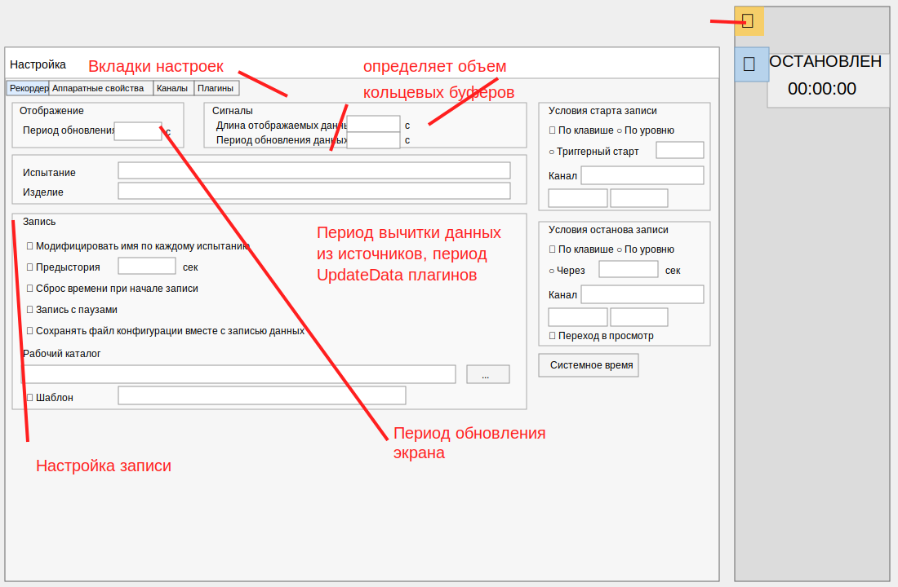
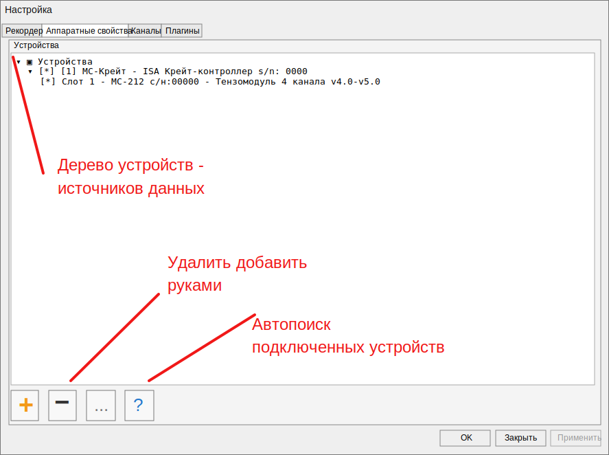

# Диалог настройки RecorderLnx

## Ориентир

Первая версия диалога настройки повторяет рабочую структуру окна Recorder: вкладки настроек сверху и активную вкладку `Рекордер` с параметрами отображения, сигналов, записи, условий старта и останова записи.



Красные подписи на ориентире фиксируют смысл основных зон:

- вкладки настроек разделяют разделы `Рекордер`, `Аппаратные свойства`, `Каналы`, `Плагины`;
- длина отображаемых данных задает объем будущих кольцевых буферов отображения;
- период обновления данных описывает период вычитки из источников и будущий период `UpdateData` плагинов;
- период обновления экрана отделен от периода поступления данных;
- блок `Запись` группирует настройки кадра записи, рабочего каталога и поведения при старте.

## Реализация в RecorderLnx

Код диалога находится в `D:\works\OburecGH\Lazarus\RecorderLnx\UI\uRecorderSettingsDialog.pas`.

На текущем шаге реализована первая вкладка `Рекордер`. Она читает и записывает уже существующую модель `TRecorderRunControlSettings`:

- `StartCondition`;
- `StartChannelName`;
- `StartEdge`;
- `StartLevel`;
- `StopCondition`;
- `StopChannelName`;
- `StopEdge`;
- `StopLevel`;
- `StopDelayMs`.

Остальные поля вкладки пока являются UI-заготовками под будущие модели конфигурации: период обновления экрана, длина буфера отображения, период вычитки данных, имя испытания, изделие, рабочий каталог и шаблон записи.

## Вкладка аппаратных свойств

Вторая вкладка `Аппаратные свойства` заведена как место для дерева устройств и источников данных. Текущая версия повторяет компоновку Recorder: дерево занимает основную область вкладки, а снизу расположены команды ручного добавления, удаления, настройки выбранного устройства и автопоиска подключенных устройств.



Кнопка `+` на этой вкладке открывает выбор типа добавляемого источника. В текущей версии доступен первый тип `Mera file`: после выбора типа открывается `TOpenDialog` для файла `*.mera`. Разбор MERA вынесен из формы в модуль `RecorderLnx/Core/uMeraFile.pas`.. Модуль читает INI-секции: каждая секция, кроме `[MERA]`, считается именем сигнала; если рядом с описателем есть одноименный `*.dat`, сигнал добавляется в список. Файлы MERA из Recorder могут быть в CP1251, поэтому имена секций и строковые параметры переводятся в UTF-8 через `CP1251ToUTF8`.

Сигналы в дереве отображаются как `[ ] имя` / `[x] имя`. Двойной щелчок по сигналу включает или выключает его для использования. Если сигнал выключается, он одновременно убирается из выбранных каналов.

## Вкладка каналов

Вкладка `Каналы` сейчас связана с источником `Mera file`. В таблице `Доступные каналы` появляются все MERA-сигналы загруженного источника. Между доступными и выбранными каналами добавлен `TSplitter`, чтобы можно было расширять левую таблицу. Перенос в выбранные выполняется двойным щелчком, drag-and-drop или кнопкой `>`; обратное удаление из выбранных - кнопкой `<`.

При нажатии `OK` диалог создает в `TRecorderTagRegistry` недостающие теги для выбранных MERA-каналов. Логика повторяет общий подход оригинального Recorder: тег создается через центральный реестр (`CreateTag`/`AddTag`), а не напрямую внутри списка UI. Имя тега формируется локально в диалоге как `Mera.<имя_сигнала>`, где пробелы и дефисы заменяются на `_`. Адрес канала берется строго из ключа `Address=` внутри соответствующей секции `.mera`; единицы, источник и описание переносятся в метаданные `TRecorderTag`.

## Режим конфигурирования

Кнопка настройки на правом пульте главной формы открывает диалог. Если RecorderLnx в этот момент не в состоянии `Stop`, UI сначала переводит state machine в `Stop`, затем открывает окно настройки. Это соответствует принятому правилу: конфигурация меняется только в остановленном режиме.

При `OK` настройки применяются к `TRecorderRunControlSettings` и сохраняются в текущий dev-файл:

```text
D:\works\OburecGH\Lazarus\RecorderLnx\config\projects\default\run-control.ini
```

`Применить` обновляет модель в памяти без закрытия окна. `Закрыть` закрывает окно без сохранения `OK`.

## Дальнейшее развитие

- Подключить поля периода обновления экрана к `TRecorderTimeSystem.DisplayUpdateMs`.
- Вынести длину отображаемых данных в модель буферов отображения.
- Описать и сохранить настройки рабочего каталога записи в проектной конфигурации.
- Подключить вкладку `Аппаратные свойства` к модели устройств и автопоиску.
- Заполнить вкладки `Каналы`, `Плагины` после появления соответствующих core-моделей.

## Relationships

- [Архитектурные решения](../../../../AGrav/20_Проекты/Разработка_Delphi/Lazarus/RecorderLnx/Docs/05_Архитектурные_Решения.md)
- [UI-ориентир Recorder](../../../../AGrav/20_Проекты/Разработка_Delphi/Lazarus/RecorderLnx/Docs/07_UI_Ориентир_Recorder.md)
