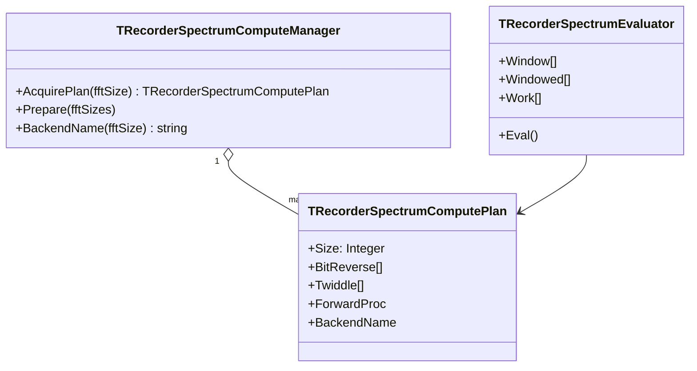

# Менеджер вычислений спектра

## Назначение

`TRecorderSpectrumComputeManager` является единственной точкой владения
FFT-планами RecorderLnx. Он подготавливает всё, что зависит от размера FFT и
платформы, до поступления первого рабочего кадра. Расчёт спектров в UI и в
потоках источников данных использует уже подготовленные план и выбранные
функции, не строя таблицы и не принимая решений о процессоре в горячем пути.

## Предыдущие исследования

Эксперименты и исходники находятся в:

- `Tests/TestSpectrumMath/uSpectrumMathBench.pas` — сравнение Pascal, SSE2,
  AVX scalar и AVX vector2.
- `Tests/TestSpectrumMath/uBestSpectrumPipeline.pas` — образец runtime-пайплайна
  без аллокаций и с подготовленными планами.
- `Docs/notes_spectrum_math_benchmarks.md` — результаты измерений 06.06.2026.
- `Docs/spectrum_best_pipeline.md` — выводы и ограничения.

Подтверждённые результаты:

1. Наибольший выигрыш даёт исключение `SinCos` из FFT: bit-reverse и
   `exp(-i*2*pi*k/N)` должны быть рассчитаны один раз в плане.
2. Хорошо заинлайненный Pascal butterfly является лучшим универсальным
   вариантом на малых и средних FFT.
3. AVX vector2 обрабатывает две комплексные бабочки за инструкцию и может
   выигрывать на крупных FFT (в измерении — `8192`). Scalar SSE2 и scalar AVX
   не выбираются заранее: они участвуют в измерении только если реализованы
   для целевой платформы.
4. AVX нельзя вызывать только по факту компиляции: требуются одновременно
   аппаратная поддержка AVX и разрешение XMM/YMM со стороны ОС (`OSXSAVE`,
   `XGETBV`). На любой другой архитектуре остаётся корректный Pascal backend.

## Объекты и владение

- Менеджер кэширует план по `FFTSize`. Несколько спектров с одним размером FFT
  разделяют таблицы индексов и twiddle-множителей.
- `TRecorderSpectrumEvaluator` владеет только зависящими от канала буферами:
  окном, оконным входом и комплексной рабочей памятью. Буферы выровнены на
  64 байта для SIMD и создаются в конструкторе.
- План не содержит изменяемого рабочего состояния, поэтому один план безопасно
  используют разные evaluator'ы. Каждый evaluator имеет собственный `Work`.

## Подготовка и выбор backend

При первом `AcquirePlan(N)` менеджер:

1. проверяет, что `N` — степень двойки;
2. строит `BitReverse[0..N-1]`;
3. строит `Twiddle[0..N/2-1]`;
4. определяет доступные backends на данной ОС и CPU;
5. прогревает кандидаты и измеряет их на одинаковом выровненном буфере;
6. проверяет результат кандидата относительно Pascal reference;
7. сохраняет самый быстрый корректный `ForwardProc` прямо в плане.

Измерение выполняется только при подготовке. Результат имеет диагностическое
имя (`Pascal inline`, `AVX vector2`) и пишется в отладочный лог. Повторный
запрос того же размера возвращает существующий план без повторного benchmark.

## Горячий путь

Для одного кадра порядок строго такой:

1. умножить вход на заранее рассчитанное окно;
2. разложить real input в собственный `Work` evaluator'а в bit-reversed порядке;
3. вызвать `Plan.ForwardProc(Work, Plan)`;
4. вычислить RMS/фазу, нормировку и максимум.

В пунктах 1–4 запрещены: выделение памяти, создание потоков, запись лога,
`SinCos`, поиск плана и ветвление по CPU.

## Портируемость

Pascal inline backend — обязательный и работает на Windows/Linux и на любой
архитектуре, поддерживаемой FPC. SSE/AVX код компилируется только для x86-64 и
никогда не вызывается без runtime-проверки. Таким образом Linux без AVX и ARM
получают тот же численно корректный расчёт, а не эмуляцию или Windows-зависимый
путь.

## Проверка

Тесты должны подтверждать:

- один и тот же `FFTSize` возвращает общий объект плана;
- таблицы `BitReverse` и `Twiddle` инициализированы;
- выбранный backend совпадает с Pascal reference с допуском `1e-8`;
- повторный расчёт не создаёт новые планы и не меняет выбранный backend;
- максимум спектра не учитывает DC-bin (`index 0`).

Тестовый проект: `Tests/TestSpectrumMath/TestSpectrumMath.lpi`.
