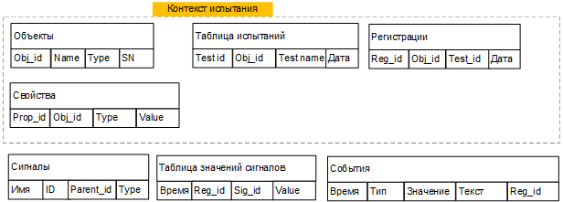
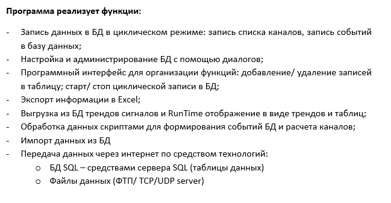
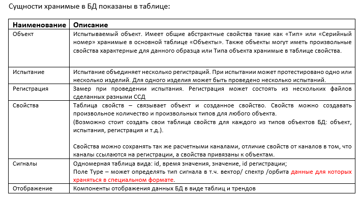

# Техническое задание: модуль SQL-записи RecorderLnx

Устройство временной шкалы и правило привязки SQL-точек к астрономическому времени описаны в [системе времени RecorderLnx](../architecture/time-system.md).

**Статус:** концепция / требования для согласования  
**Версия:** 0.1  
**Дата:** 31.07.2026

## 1. Назначение

Модуль SQL-записи предназначен для долговременного хранения данных мониторинга: структуры объектов, их свойств, измеряемых сигналов, периодических значений, событий и связанных файлов данных. Модуль входит в RecorderLnx, работает в Windows и Linux и не зависит на уровне предметной логики от конкретной СУБД.

Первая очередь включает настройку базы и runtime-запись. Просмотр, тренды, обработка файлов и экспорт не входят в первую очередь, но схема и интерфейсы должны обеспечить их последующую реализацию.

## 2. Термины

- **Объект мониторинга** — изделие, агрегат, узел или иной наблюдаемый объект.
- **Свойство** — типизированная характеристика объекта (серийный номер, тип, место установки и т. п.).
- **Сигнал** — измеряемый или расчётный параметр, связанный с тегом RecorderLnx.
- **Регистрация** — непрерывный или логически единый интервал записи.
- **Испытание** — пользовательский контекст, объединяющий одну или несколько регистраций.
- **Медленная запись** — периодические скалярные значения сигналов.
- **Файл данных** — спектр, осциллограмма, орбита или иной массив/документ, хранимый вне основной таблицы значений.

## 3. Границы первой очереди

### 3.1. Входит

1. Выбор пользователем каталога локального хранилища.
2. Создание и автоматическая конфигурация базы через интерфейс серверного адаптера.
3. Создание/редактирование объектов, свойств, сигналов и привязок к тегам RecorderLnx.
4. Настройка периодической, ручной и условной записи.
5. Runtime-запись значений, событий и метаданных файлов.
6. Сохранение файлов данных, их чтение, связь с медленными значениями и подготовка к архивированию.
7. Работа с удалённой БД через защищённую сеть/Интернет.
8. Диагностика, восстановление соединения и управляемое поведение при ошибках.

### 3.2. Не входит

- построение трендов и таблиц по сохранённым данным;
- отображение спектров, осциллограмм и орбит;
- импорт старых баз и экспорт в Excel;
- пользовательский конструктор схемы SQL;
- окончательный выбор единственной СУБД.

## 4. Основной сценарий

1. Пользователь создаёт или выбирает профиль SQL-хранилища.
2. Для локального варианта указывает каталог; для удалённого — адрес сервера, порт, имя базы и параметры защищённого соединения.
3. Модуль проверяет доступность, права, свободное место и совместимость схемы.
4. Если база отсутствует, серверный адаптер создаёт файлы/базу, таблицы, индексы и служебную запись версии схемы.
5. Пользователь создаёт объект мониторинга и задаёт его свойства.
6. Пользователь создаёт список сигналов и привязывает каждый сигнал к тегу/расчётному каналу RecorderLnx.
7. Пользователь задаёт политику записи: период, агрегацию, ручное управление, триггеры и условия.
8. При старте регистрации создаётся контекст регистрации; значения и события поступают в очередь записи.
9. Файлы данных сохраняются атомарно, после чего их метаданные и связи фиксируются транзакцией в SQL.
10. При остановке регистрации очередь сбрасывается, результаты фиксируются, статус регистрации закрывается.

### Независимое управление SQL-записью

SQL-запись имеет собственное состояние и не зависит от режимов `Stop`, `View` и
`Record` основного Recorder. Главная галочка «Запись» рядом с кнопкой `SQL DB`
открывает отдельную SQL-регистрацию; снятие галочки закрывает её. Переходы между
режимами Recorder не открывают и не закрывают SQL-регистрацию.

В настройках можно выбрать управляющий тег. Каждое его скалярное обновление
непосредственно задаёт состояние SQL-записи: значение строго больше `0,5`
включает её, значение меньше `0,5` выключает, а ровно `0,5` не меняет состояние.
Галочка на главной
форме показывает фактическое состояние. Ручное переключение сохраняется в
`sql-db.ini`; переключения от тега действуют во время текущего запуска и не
перезаписывают конфигурационный файл.

## 5. Архитектура

Модуль должен состоять из следующих уровней:

- **предметная модель** — объекты, свойства, сигналы, испытания, регистрации и политики записи;
- **runtime-координатор** — принимает явные снимки данных от реестра тегов и событий, применяет расписание/условия;
- **буфер и writer-поток** — пакетирует операции и выполняет ввод-вывод вне GUI-потока;
- **интерфейс SQL-сервера** — создание, миграция, транзакции, подготовленные запросы, health check;
- **файловое хранилище** — атомарная запись, чтение, контроль целостности и архивирование;
- **UI настройки** — профили подключения, объекты, свойства, сигналы, привязки и политики записи.

Предметная модель и runtime не должны зависеть от LCL и конкретной библиотеки БД. Жизненный цикл записи и доставка входов выполняются явными вызовами; EventBus допускается для уведомлений и динамических наблюдателей, но не как единственный канал критичных данных записи.

## 6. Требования к созданию и версии базы

1. Схема таблиц, полей, ограничений и индексов задаётся кодом модуля и имеет номер версии.
2. Пользователь не редактирует физическую схему.
3. Операция `EnsureDatabase` должна быть идемпотентной: повторный вызов не повреждает существующую базу.
4. Создание и миграция выполняются транзакционно, насколько это поддерживает СУБД.
5. Более новая неизвестная версия схемы открывается только для диагностики/чтения либо отклоняется с понятным сообщением; автоматическое понижение запрещено.
6. Миграция не удаляет пользовательские данные без отдельной явно подтверждённой процедуры.
7. Локальный каталог содержит SQL-файлы/служебные файлы и подкаталог файлов данных. Конкретные имена задаёт адаптер.
8. Каталог должен поддерживать относительное перемещение целиком; абсолютные пути к файлам данных в SQL не сохраняются.

## 7. Логическая модель данных

Обязательные сущности первой версии:

- `schema_info` — версия и история миграций;
- `objects` — объекты мониторинга;
- `property_definitions` — определения свойств;
- `object_property_values` — типизированные значения свойств;
- `signals` — древовидный справочник сигналов;
- `signal_bindings` — привязки сигналов к тегам/выходам алгоритмов RecorderLnx;
- `tests` — испытания;
- `registrations` — интервалы записи;
- `recording_policies` — период, режим, агрегация и условия;
- `signal_values` — временные скалярные значения;
- `events` — события и срабатывания уставок;
- `data_files` — метаданные файлов;
- `data_file_links` — связь файла с объектом, регистрацией, сигналом, событием и временным диапазоном.

Все основные идентификаторы должны быть устойчивыми и уникальными (UUID либо эквивалент), чтобы поддержать перенос/слияние. Временные метки хранятся в UTC с достаточной точностью; локальный часовой пояс используется только для отображения. Для значений должны храниться как минимум качество/валидность и, при необходимости, единица измерения либо ссылка на версию описания сигнала.

### 7.1. Ориентировочные поля

| Сущность | Минимальные поля |
| --- | --- |
| objects | id, name, type, serial_number, parent_id, created_at, updated_at |
| property_definitions | id, name, value_type, unit, constraints_json |
| object_property_values | object_id, property_id, value_*, valid_from, valid_to |
| signals | id, object_id, parent_id, name, value_type, unit, enabled |
| signal_bindings | signal_id, recorder_tag_id/name, source_kind, transform_json |
| tests | id, object_id, name, started_at, finished_at, metadata_json |
| registrations | id, object_id, test_id, started_at, finished_at, status, reason |
| recording_policies | id, registration/object scope, mode, period_ms, aggregation, condition_json |
| signal_values | registration_id, signal_id, timestamp_utc, value, quality, sequence_no |
| events | id, registration_id, object_id, signal_id, timestamp_utc, type, severity, value, text, payload_json |
| data_files | id, storage_key, type, format, size, checksum, state, created_at |
| data_file_links | file_id, registration_id, signal_id, event_id, time_from_utc, time_to_utc, anchor_time_utc |

Окончательные типы полей, нормализация свойств и стратегия партиционирования утверждаются на этапе проектирования схемы.

## 8. Запись сигналов

1. Для каждого сигнала задаётся источник и политика записи.
2. Режимы: вручную, по состоянию регистрации, периодически, по изменению, по триггеру/условию и их допустимые комбинации.
3. Для периодической записи задаются период и функция агрегации: последнее, среднее, минимум, максимум, СКО или иной зарегистрированный алгоритм.
4. В одной временной точке значения разных сигналов могут записываться одной пакетной транзакцией, но потеря одного необязательного сигнала не должна блокировать остальные.
5. Повторная доставка определяется парой/набором `registration_id + signal_id + timestamp/sequence`; запись должна быть идемпотентной либо явно помечать дубликаты.
6. Runtime не выполняет синхронные SQL-запросы в потоке сбора данных и GUI-потоке.
7. Для каждого выбранного блочного сигнала хранится назначенная оценка медленной записи:
   Mean, RMS, RMS deviation, Peak (амплитуда), Peak-to-Peak, Minimum, Maximum,
   Peak-to-Peak by RMS deviation либо Last value. Значение привязывается ко времени конца блока.
8. Одиночные скалярные обновления всегда записываются как Mean независимо от выбранной оценки.
7. Размер пакета и период сброса настраиваются с безопасными ограничениями.

## 9. События

В БД сохраняются пользовательские, системные и диагностические события, включая срабатывание/снятие уставки, старт/стоп регистрации, потерю/восстановление источника и ошибки записи. Событие содержит время, тип, уровень, описание, значение/порог при наличии и связи с объектом, сигналом и регистрацией.

Критические события не должны теряться из-за фильтрации частых обновлений тегов. Порядок внутри одного источника сохраняется последовательным номером. Повторные одинаковые тревоги могут дедуплицироваться только по явно заданной политике.

## 10. Файлы данных и связь с трендом

1. Содержимое крупных массивов разрешается хранить не в SQL, а в файловом хранилище.
2. SQL хранит метаданные, контрольную сумму, относительный ключ, состояние файла и связи с временной осью.
3. Рекомендуемая структура: `<storage>/data/YYYY/MM/DD/<object>/<registration>/<uuid>.<ext>`; физическая схема скрыта интерфейсом.
4. Запись выполняется во временный файл, затем проверяется размер/контрольная сумма и выполняется атомарное переименование; только после этого SQL-запись переводится в состояние `ready`.
5. Не допускаются «готовые» SQL-ссылки на отсутствующий файл и файлы без восстанавливаемой индексной записи; для проверки предусматривается reconciler.
6. Файл связывается с `anchor_time_utc` и/или диапазоном `time_from_utc..time_to_utc`, поэтому будущий тренд сможет показать маркер возле медленной точки.
7. Один файл может быть связан с несколькими сигналами, событием или временными точками.
8. Интерфейс чтения должен поддерживать получение списка вложений по интервалу, получение метаданных и потоковое чтение содержимого.
9. Архивирование переносит SQL-данные и файлы как согласованный комплект с манифестом и контрольными суммами.

## 11. Локальная и удалённая работа

Локальный режим использует каталог пользователя и подходящую встраиваемую/локальную СУБД. Удалённый режим использует серверную СУБД; каталог на клиентской машине не трактуется как сетевой путь к файлам серверной БД.

Для работы через Интернет обязательны TLS, проверка сертификата, тайм-ауты, keepalive, повторное подключение с экспоненциальной задержкой и запрет хранения пароля в открытом виде. Предпочтителен доступ через VPN/защищённый контур или выделенный API/БД-шлюз. Прямое открытие порта СУБД в публичный Интернет не является целевой конфигурацией.

При временной недоступности удалённой БД runtime помещает операции в ограниченный локальный spool. После восстановления выполняется повторная отправка с идемпотентностью. Политика переполнения spool должна быть явной: остановить регистрацию, отбрасывать только некритичные данные или продолжить с аварийной сигнализацией.

## 12. Интерфейс настройки

Диалоги должны обеспечивать:

- создание, копирование, проверку и удаление профиля подключения;
- выбор локального каталога либо настройку удалённого сервера;
- отображение версии/состояния базы, результата проверки и свободного места;
- управление объектами и их типизированными свойствами;
- дерево сигналов и выбор источника из тегов/алгоритмов RecorderLnx;
- групповую настройку периода, агрегации и условий записи;
- ручные команды «Начать», «Остановить», «Проверить запись»;
- состояние runtime: отключено, готово, запись, деградация/spool, ошибка;
- журнал ошибок без показа секретов.

## 13. Надёжность и производительность

- Все операции выполняются подготовленными запросами и транзакциями.
- Writer работает пакетно в отдельном потоке; в горячем пути используются заранее выделенные/переиспользуемые буферы.
- Предусматриваются ограниченная очередь, backpressure и счётчики пропусков.
- После аварийного завершения незакрытая регистрация обнаруживается и переводится в состояние `interrupted` либо возобновляется по утверждённой политике.
- Ошибка одного файла/пакета не должна повреждать уже зафиксированные данные.
- Индексы обязательны для поиска по объекту, регистрации, сигналу и времени, а также для вложений по временному интервалу.
- Конкретные целевые скорости и объёмы определяются нагрузочным профилем до реализации.

## 14. Безопасность

1. Секреты не сохраняются в проекте RecorderLnx и обычных INI/JSON в открытом виде.
2. Для удалённой БД применяются отдельные пользователи с минимальными правами.
3. Все пользовательские строки передаются параметрами запросов.
4. Каталожные ключи файлов нормализуются; выход за корень хранилища запрещён.
5. Удаление и миграции протоколируются; опасные операции требуют подтверждения.
6. В журналах исключаются пароли, токены и полные строки подключения.

## 15. Интерфейсы модуля (концептуально)

- `IDatabaseServerAdapter`: `ValidateConfig`, `EnsureDatabase`, `GetSchemaVersion`, `Migrate`, `OpenSession`, `HealthCheck`.
- `IRecordingRepository`: операции с объектами, сигналами, регистрациями, значениями, событиями и метаданными файлов.
- `IDataFileStore`: `PutAtomic`, `OpenRead`, `Verify`, `ListByInterval`, `Archive`.
- `IRecordingRuntime`: `Configure`, `Start`, `Stop`, `SubmitValues`, `SubmitEvent`, `SubmitFile`, `Flush`.

Интерфейсы должны позволять подменять адаптер и файловое хранилище в тестах.

## 16. Проверка и приёмка первой очереди

1. В пустом выбранном каталоге создаётся рабочая база и структура файлов; повторное открытие ничего не повреждает.
2. Создаются объект, свойства и сигналы; после перезапуска связи с тегами восстановлены.
3. Ручная и периодическая запись создают регистрацию и корректные временные значения.
4. Срабатывание уставки сохраняется как событие с привязкой к сигналу и регистрации.
5. Спектр/осциллограмма записывается файлом, проходит контрольную сумму и находится запросом по интервалу тренда.
6. Искусственный обрыв удалённого соединения не блокирует сбор; данные попадают в spool и без дублей выгружаются после восстановления.
7. Аварийное завершение не оставляет готовых ссылок на отсутствующие файлы; незакрытая регистрация корректно диагностируется.
8. Сбор данных и GUI сохраняют отзывчивость при согласованной максимальной нагрузке.
9. База, созданная в Windows, переносима целиком там, где это допускает выбранный адаптер; core остаётся собираемым и в Windows, и в Linux.

## 17. Вопросы, требующие отдельного решения

1. Целевая СУБД/набор адаптеров первой версии (например, локальная SQLite/Firebird и удалённая PostgreSQL/Firebird).
2. Ожидаемое число объектов, сигналов, частота медленной записи, размер файлов и срок хранения.
3. Нужно ли хранить историю изменения свойств и описаний сигналов.
4. Иерархия «объект — испытание — регистрация» и допустимость регистрации без испытания.
5. Формат условий/триггеров и состав агрегатов.
6. Политика spool при переполнении и предел допустимой потери некритичных данных.
7. Правила удаления, ретенции, архивирования и восстановления.
8. Модель пользователей и разграничение прав.

## Приложение А. Исходные материалы пользователя

*Рисунок А.1 — исходная ориентировочная схема сущностей.*

*Рисунок А.2 — исходный перечень функций и способов передачи данных.*

*Рисунок А.3 — исходное описание сущностей.*

Материалы приложения фиксируют исходную концепцию и не заменяют уточнённые нормативные требования основной части ТЗ.
## Учётные данные подключения

Пароль серверной SQL БД может храниться в проектном `sql-db.ini` в ключе
`[SQLdb] Password`. Приоритет: непустой `Password` из INI, затем переменная
окружения из `PasswordEnvironment`, затем Windows HKCU Environment. Поле в UI
показывает пароль открытым текстом; на Unix после сохранения файлу назначаются
права `0600`.

Это осознанный режим для автономной/offline установки. Пароль хранится в INI
открытым текстом, поэтому реальное значение нельзя добавлять в шаблон проекта,
Git или диагностические логи.

## Live-режим SQL-тренда

Режим `Текущая дата` хранится как отдельное значение `SqlTimeMode`. Начальная
загрузка читает интервал `FromUtc .. Now`, последующие обновления запрашивают
хвост с небольшим перекрытием; строки объединяются по ID, поэтому поздно
зафиксированная точка не теряется и уже прочитанная не дублируется. В памяти сохраняется не более
`MaxPointsPerLine` последних точек каждого сигнала; перекрывающиеся запросы не
запускаются, а период обновления берётся из периода SQL-записи с нижней границей
одна секунда.

При поступлении новых точек масштаб Y не изменяется. Правая граница X движется
к текущему времени только тогда, когда пользователь находился на live-edge;
после ручного zoom/pan вид остаётся неподвижным. Рамка вправо-вниз увеличивает
масштаб, обратное направление расширяет диапазон; область ниже X действует
только по X, область слева от Y — только по Y.

В режиме `Текущая дата` пользовательский диапазон X всегда ограничен слева
`FromUtc`, справа текущим UTC. Времена хранятся, сравниваются и запрашиваются в
UTC, но подписи шкалы и курсоров преобразуются в локальный часовой пояс ОС.
Выбор сигнала в легенде выбирает связанную с ним ось; двойной щелчок вписывает
этот сигнал по Y, не меняя X и остальные оси.
