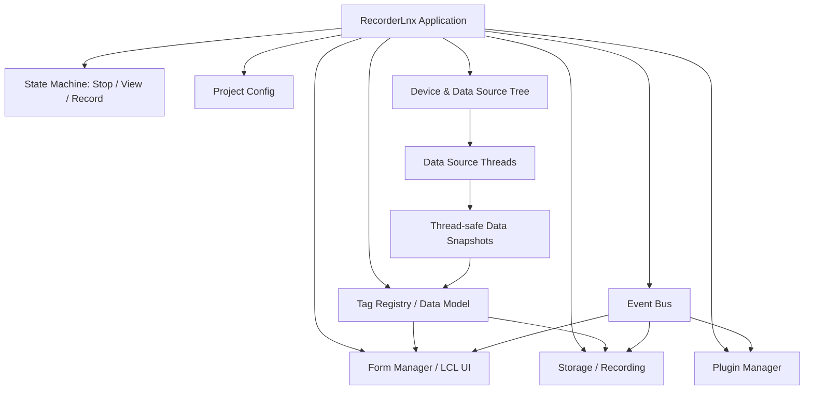
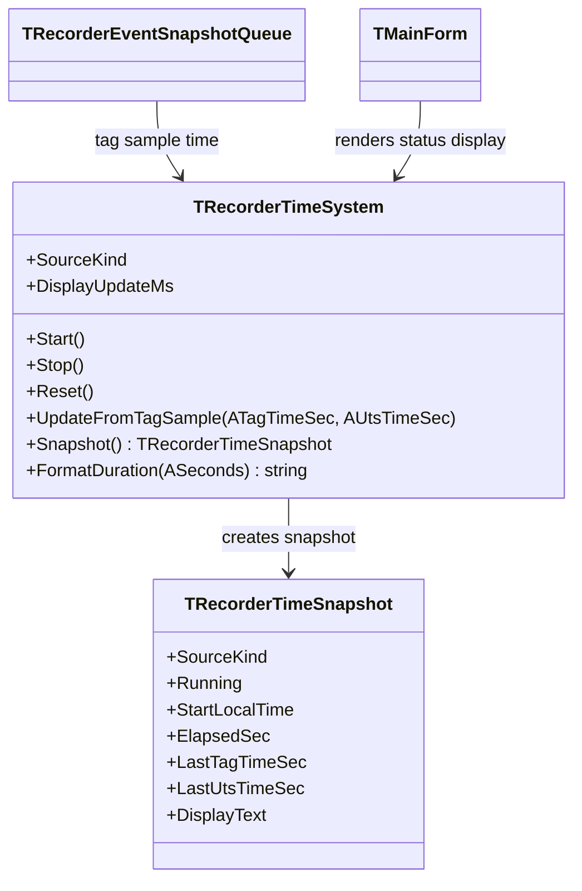

# RecorderLnx: архитектура приложения

## Архитектурный принцип

RecorderLnx строится вокруг явных слоёв: ядро состояния, модель данных, источники данных, UI-формуляры, запись, плагины и сервисы. Слои общаются через типизированные интерфейсы и событийную шину. UI не владеет сбором данных, потоки сбора не трогают визуальные компоненты.

## Диаграмма текущих core-классов

Эта диаграмма фиксирует уже реализованные классы RecorderLnx, чтобы при дальнейшей разработке не дублировать существующие роли.

```mermaid
classDiagram
    direction LR

    class TRecorderEventBus {
        +Subscribe(AHandler) Integer
        +Unsubscribe(AToken) Boolean
        +Publish(AEvent)
        +MakeEvent(...) TRecorderEvent
    }

    class TRecorderEventSnapshotQueue {
        +Attach(AEventBus)
        +Detach()
        +Pop() TRecorderEventSnapshot
        +Clear()
        +Count
    }

    class TRecorderActionRegistry {
        +RegisterAction(AAction)
        +AddAction(...) TRecorderAction
        +UnregisterAction(AId) Boolean
        +FindAction(AId) TRecorderAction
        +ExecuteAction(AId, AContext)
    }

    class TRecorderExtensionManager {
        +AddExtension(AExtension)
        +InitializeAll(AHost)
        +RegisterServicesAll()
        +StartAll()
        +StopAll()
        +CloseAll()
    }

    class TRecorderStateMachine {
        +RequestPreview()
        +RequestRecord()
        +Trigger()
        +Stop()
    }

    class TRecorderRunControlSettings {
        +LoadFromFile(AFileName)
        +SaveToFile(AFileName)
    }

    class TRecorderSignalBuffer {
        +AddSample(ATimeSec, AValue)
        +Snapshot() TRecorderSignalSnapshot
        +Clear()
    }

    class TRecorderTag {
        +AddSample(ATimeSec, AValue)
        +Snapshot() TRecorderSignalSnapshot
    }

    class TRecorderTagRegistry {
        +CreateTag(AName, ACapacity) TRecorderTag
        +AddTag(ATag) TRecorderTag
        +FindById(AId) TRecorderTag
        +FindByName(AName) TRecorderTag
        +PublishValue(ATagName, ATimeSec, AValue)
        +Clear()
    }

    class IRecorderDataSource {
        <<interface>>
        +ConfigureTags(ARegistry)
        +Start()
        +Stop()
        +Tick()
    }

    class TRecorderDataSourceBase {
        <<abstract>>
        +ConfigureTags(ARegistry)
        +Start()
        +Stop()
        +Tick()
        #DoCreateTags(ARegistry)
        #DoTick()
    }

    class TMockSineDataSource {
        +TagName
        +Amplitude
        +FrequencyHz
        +PhaseRad
    }

    class TRecorderDataSourceThread {
        +Start()
        +Terminate()
        +WaitFor()
        +TickCount
        +LastErrorMessage
    }

    class TRecorderDataSourceManager {
        +AddSource(ASource)
        +FindSource(ASourceId) IRecorderDataSource
        +ConfigureTagsAll(ARegistry)
        +StartAll()
        +StopAll()
        +Clear()
    }

    class TRecorderRecordFrameManager {
        +OpenNextFrame() string
        +WriteFrameInfo(AProjectName, AComment)
        +CloseFrame()
        +FindLastFrameNo() Integer
        +CurrentFrameName
    }

    class TRecorderCsvTagWriter {
        +Open(AFrameDir, AFileName)
        +WriteSample(ATagName, ATimeSec, AValue)
        +Flush()
        +Close()
    }

    class TRecorderFormManager {
        +AddPage(APage)
        +DeletePage(AIndex)
        +SetActivePage(AIndex)
    }

    class TRecorderFormPage {
        +AddComponent(AComponent)
        +DeleteComponent(AComponent)
    }

    class TRecorderComponentFactory {
        +RegisterFactory(AFactory)
        +CreateComponent(ATypeId) TRecorderVisualComponent
    }

    class TRecorderComponentFactoryBase {
        +CreateComponent() TRecorderVisualComponent
        +DeleteComponent(AComponent)
    }

    class TRecorderVisualComponent {
        +Bounds
        +TagName
    }

    TRecorderExtensionManager --> TRecorderEventBus : получает notify
    TRecorderExtensionManager --> TRecorderActionRegistry : регистрирует actions
    TRecorderTagRegistry --> TRecorderEventBus : публикует rceDataUpdated
    TRecorderEventSnapshotQueue --> TRecorderEventBus : подписывается и копирует события
    TRecorderTagRegistry o-- TRecorderTag : владеет
    TRecorderTag o-- TRecorderSignalBuffer : хранит сигнал

    IRecorderDataSource <|.. TRecorderDataSourceBase
    TRecorderDataSourceBase <|-- TMockSineDataSource
    TRecorderDataSourceBase --> TRecorderTagRegistry : пишет значения
    TRecorderDataSourceThread --> IRecorderDataSource : вызывает Tick
    TRecorderDataSourceManager o-- IRecorderDataSource : хранит источники
    TRecorderDataSourceManager o-- TRecorderDataSourceThread : управляет runner-ами
    TRecorderDataSourceManager --> TRecorderTagRegistry : ConfigureTagsAll
    TRecorderRecordFrameManager --> TRecorderCsvTagWriter : дает каталог кадра

    TRecorderFormManager o-- TRecorderFormPage : владеет страницами
    TRecorderFormPage o-- TRecorderVisualComponent : владеет компонентами
    TRecorderComponentFactory o-- TRecorderComponentFactoryBase : реестр фабрик
    TRecorderComponentFactoryBase --> TRecorderVisualComponent : создает/удаляет
```

## Машина состояний

Минимальные состояния первой версии:

- `rsStop` — конфигурация разрешена, потоки источников остановлены, запись закрыта.
- `rsView` — конфигурация заблокирована или ограничена, источники данных активны, запись не ведётся.
- `rsRecord` — источники активны, запись активна, UI работает как в `rsView`.

Переходы:

- `Stop -> View`: проверить конфигурацию, построить дерево источников, создать теги, стартовать потоки источников, запустить UI-таймер/обновления.
- `View -> Record`: открыть хранилище записи, отправить событие старта записи группам/тегам/плагинам, начать сохранение снимков.
- `Record -> View`: завершить запись, сбросить буферы, оставить сбор и отображение активными.
- `View -> Stop`: остановить потоки источников, дождаться завершения, разблокировать конфигурацию.
- `Record -> Stop`: сначала корректно завершить запись, затем остановить сбор.

Позже добавляются подрежимы: `Pause`, `Playback`, `Calibration`, `Fault`, `Warning`, `NeedDeviceReset`, `NeedConfigRefresh`.

## Дерево устройств и источников данных

Windows Recorder оперировал устройствами, модулями и аппаратными каналами. В RecorderLnx вводим общий термин `источник данных`:

- `TDeviceNode` — физическое или логическое устройство.
- `TDataSourceNode` — узел, который производит данные с периодом `UpdateTime`.
- `TChannelNode` / `TTagBinding` — привязка источника к измерительному каналу/тегу.

Источник данных должен иметь уникальный `SourceId`, человекочитаемое имя, тип источника, настройки подключения, `UpdateTime`, состояние связи и диагностики, список публикуемых каналов и метод запуска/остановки рабочего потока.

Первая реализация контракта источников данных находится в `D:\works\OburecGH\Lazarus\RecorderLnx\Core\uRecorderDataSources.pas`: `IRecorderDataSource`, `TRecorderDataSourceBase`, `TMockSineDataSource`, `TRecorderDataSourceThread`, `TRecorderDataSourceManager`. Источник можно проверять ручным `Tick`; для рабочего режима есть runner одного источника, который вызывает тот же контракт с периодом `UpdateTimeMs`, и manager группы источников, запускающий/останавливающий набор runner-ов. UI получает события через отдельный слой очереди снимков.

Очередь снимков событий находится в `D:\works\OburecGH\Lazarus\RecorderLnx\Core\uRecorderEventQueue.pas`: `TRecorderEventSnapshot`, `TRecorderEventSnapshotQueue`. Очередь подписывается на `TRecorderEventBus`, копирует поля события и данные `TRecorderTagUpdateEventData`, но не сохраняет ссылку на `AEvent.Data`. UI thread должен вычитывать очередь таймером/циклом обновления и уже из снимков обновлять формуляры.

Первая UI-интеграция очереди выполнена в `D:\works\OburecGH\Lazarus\RecorderLnx\UI\uMainForm.pas`: главная форма создает общие core-сервисы, запускает отладочный источник `debug.memtag -> MemTag` в режимах `View`/`Record`, а `TTimer` формы вычитывает `TRecorderEventSnapshotQueue` и обновляет цифровой формуляр/список тегов в UI thread.

## Модель данных

Базовая единица данных — тег/канал. В Windows-интерфейсах это `ITag`, связанный с `ISignal` и группами `ITagsGroup`.

В RecorderLnx разделяем:

- `TTag` — метаданные канала: имя, единицы, диапазон, источник, состояние, настройки записи.
- `TSignalBuffer` — буфер значений/времени для канала или блока каналов.
- `TDataFrame` — снимок данных от одного источника за один цикл обновления.
- `TTagRegistry` — единый реестр тегов с поиском по имени/id/source.

Данные между потоками передаются снимками или очередями. Нельзя отдавать UI прямую изменяемую ссылку на буфер рабочего потока.

## Теги как язык обмена данными

Стандартный язык передачи данных компонентам RecorderLnx - теги. Устройства и плагины публикуют значения, диагностику и служебные показатели в теги, а компоненты формуляров читают теги и отображают их по собственной логике в событиях Recorder/notify. UI-форма не должна сама вычислять или подменять реальные данные: она только показывает текущую модель, поступившую через реестр тегов и уведомления.

Пример: `MemTag` - отладочный тег, который может быть создан плагином для контроля потребления памяти прямо в интерфейсе Recorder. Пока модель тегов не реализована, такие данные допускаются только как тестовые заглушки в каталоге `Tests`.
## Потоки

Планируется минимум три класса потоковой активности:

- UI thread — LCL-формы, формуляры, команды пользователя, перерисовка.
- Data source threads — отдельные потоки источников с собственным `UpdateTime`.
- Processing/recording workers — обработка, запись, экспорт, тяжёлые вычисления.

Правила:

- Рабочие потоки не меняют LCL-компоненты напрямую.
- UI получает данные через очередь событий, `TThread.Queue/Synchronize` или безопасный диспетчер снимков.
- Каждый поток обязан поддерживать мягкую остановку через флаг завершения и ограниченное ожидание `WaitFor`.
- В Windows/Linux-проектах с потоками учитывать `cthreads` в ранней инициализации приложения.

## Событийная модель

В Windows Recorder плагины получали `PN_*` уведомления: старт/стоп, обновление данных, смена текущего тега, импорт/экспорт, сохранение конфигурации, события формуляров и т.д.

В RecorderLnx вводим типизированную шину событий: `OnBeforeStartView`, `OnStartView`, `OnBeforeStop`, `OnStop`, `OnBeforeRecord`, `OnStartRecord`, `OnStopRecord`, `OnDataUpdated`, `OnConfigChanged`, `OnCurrentTagChanged`, `OnFormChanged`, `OnAlarm`, `OnFault`.

Главное событие для плагинов обработки — `OnDataUpdated`. Оно вызывается с периодичностью обновления источника или агрегированного диспетчера и содержит список обновлённых источников/тегов.

## Формуляры отображения

Windows `IVForm` показывает нужную модель: формуляр имеет имя, инициализацию, подготовку, обновление, перерисовку, привязку к тегам, активацию, редактирование и уведомления.

В RecorderLnx формуляр — LCL-компонент/фрейм с интерфейсом: имя и тип, режим редактирования мнемосхемы, список привязанных тегов, `Prepare`, `UpdateData`, `RepaintView`, `Activate/Deactivate`, сериализация настроек формуляра.

Формуляров может быть много. Они перерисовываются только в UI-потоке и получают не сырые буферы потоков, а подготовленные снимки/модели.

### Фабрики компонентов формуляров

Модель формуляров следует базовой идее Recorder `ICustomFormsRegistrator` / `ICustomFormFactory` / `IVForm`, но без COM и без Windows-only объектов в core. В ядре есть менеджер фабрик компонентов и отдельные фабрики типов. Фабрика типа создает модельные компоненты, хранит список своих дочерних экземпляров и получает уведомление при удалении компонента или страницы.

Страница формуляра хранит состав компонентов и отвечает за порядок/размещение на странице, но освобождение компонента идет через фабрику-создателя, если она есть. Это нужно, чтобы будущие плагины и редактор мнемосхем могли безопасно добавлять/удалять дочерние окна, не оставляя устаревших ссылок у фабрик.

### Вкладки и плавающие формуляры

В UI RecorderLnx формуляры должны отображаться как вкладки `PageControl`, как в Recorder. Добавление новой мнемосхемы создает новую страницу модели и новую вкладку, а активная вкладка синхронизируется с активной страницей `TRecorderFormManager`.

Формуляр должен проектироваться как отдельная dockable/view сущность: он может быть вкладкой главного окна, но позже должен уметь отцепляться в плавающее окно, переноситься на второй монитор и разворачиваться на весь экран. Поэтому редактор мнемосхемы нельзя жестко привязывать к координатам главной формы; ему нужен слой-хост, который сможет жить и внутри tab sheet, и внутри отдельного `TForm`.

## Плагины без COM

В Linux нет COM как естественной платформенной опоры. Возможные варианты расширяемости без пересборки основного приложения:

1. Динамические библиотеки `.so` с C ABI и экспортированными функциями.
2. FPC packages/plugins, если удастся обеспечить стабильность ABI и версий компилятора.
3. Внешние процессы-плагины через IPC: pipes, sockets, gRPC-like протокол, shared memory.
4. Скриптовые плагины через встроенный интерпретатор только если исходники и лицензия под контролем.

Базовое решение для первой архитектуры: начать со статически подключаемых модулей Lazarus/FPC, но сразу проектировать их через тот же lifecycle, который позже сможет выйти на `.dll/.so` с минимальным C ABI. Внутри внешнего плагина может быть код FPC/Lazarus, но граница между ядром и плагином должна быть стабильной и не передавать управляемые строки/объекты FPC напрямую без строгого соглашения.

Минимальный будущий контракт внешнего плагина: `RecorderPlugin_GetApiVersion`, `RecorderPlugin_GetInfo`, `RecorderPlugin_Create`, `RecorderPlugin_Destroy`, `RecorderPlugin_Register`, `RecorderPlugin_Notify`.

Для первой итерации допускается начать с статически подключаемых модулей, но проектировать интерфейсы так, чтобы позже вынести их в `.so`.

## Расширяемость по идеям оригинального Recorder

Маркер: `RLNX_EXTENSION_ARCHITECTURE_2026_05_26`.

После анализа исходников `D:\works\windev-v3.9` фиксируем принцип: архитектуру Recorder не копируем, но сохраняем знакомую разработчикам механику `Register/Unregister`, `Factory`, `Notify`, `Start/Stop`, `ReadSettings/WriteSettings`.

В оригинальном Recorder расширяемость была распределена по нескольким реестрам:

- `CPluginsMan` загружает DLL-плагины, вызывает `create/config/execute/notify/close`, ведет контекст плагина и автозагрузку.
- `CVisualizationManager` регистрирует `IVForm`, ведет активный формуляр, умеет attach/detach в плавающее окно.
- `ICustomButtonsToolBar` и `CustomButtonsToolBar` позволяют плагинам добавлять кнопки, режимы кнопок и получать события клика.
- `IProcessingManager` регистрирует фабрики обработчиков данных и страницы настройки обработок.
- `DataFolderTemplate` регистрирует фабрики элементов шаблона пути и генерирует каталог кадра записи.
- `ISettingsStorage` задает общий способ сохранять именованные настройки и subnodes.

Для RecorderLnx это превращается в набор переносимых сервисов:

- `TRecorderExtensionManager` — менеджер расширений и их контекстов.
- `TRecorderEventBus` — типизированные события вместо числовых `PN_*`.
- `TRecorderActionRegistry` — команды модулей для кнопок, меню и hotkeys.
- `TRecorderToolbarRegistry` — размещение команд в toolbar-ах.
- `TRecorderVisualFactoryRegistry` — фабрики компонентов мнемосхемы.
- `TRecorderFormRegistry` — фабрики формуляров/страниц.
- `TRecorderConfigRegistry` — страницы настройки и сериализаторы модулей.
- `TRecorderProcessingRegistry` — обработчики данных, вызываемые на `DataUpdated`.
- `TRecorderDataSourceRegistry` — источники данных.
- `TRecorderStorageRegistry` — writers/readers файлов данных.

Внутренние модули первой версии могут быть обычными классами Lazarus/FPC. Для внешних `.dll/.so` позже вводится C ABI без передачи FPC-строк, объектов и managed types через границу библиотеки: `RecorderPlugin_GetApiVersion`, `RecorderPlugin_GetInfo`, `RecorderPlugin_Create`, `RecorderPlugin_Destroy`, `RecorderPlugin_Register`, `RecorderPlugin_Notify`.

Слой `TRecorderHostApi` должен отдавать плагинам не весь core-объект, а набор узких сервисов: `Tags`, `Events`, `Actions`, `Forms`, `Config`, `Storage`, `Log`, `DataSources`, `Processing`.

## Кадр записи

Запись RecorderLnx ведется не в один файл, а в каталог кадра записи. На диске кадр записи - это каталог с автоматически инкрементируемым номером `0001`, `0002`, `0003` и т.д. Внутри каталога лежат файлы данных, записанные Recorder-ом для текущего замера/кадра.

Переход `Record -> Preview` разрешен. При таком переходе верхний слой записи должен корректно завершить запись текущего каталога кадра, закрыть/flush-нуть файлы данных и оставить сбор/просмотр активным. Следующая команда `Record` создает следующий каталог кадра записи с новым номером.

## Запись данных

Подсистема записи должна быть отделена от источников и UI: принимает `TDataFrame` / `TSignalBuffer`, знает текущий кадр/измерение, ведёт метаданные проекта и конфигурации, поддерживает flush и корректное закрытие при остановке, не блокирует поток источника на долгую запись.

Формат файлов пока открыт. Решение фиксируется отдельно после анализа требований к совместимости с существующими данными Recorder/MERA.

Первая реализация ядра записи находится в `D:\works\OburecGH\Lazarus\RecorderLnx\Core\uRecorderDataStorage.pas`: `TRecorderRecordFrameManager` и `TRecorderCsvTagWriter`. Manager создает каталог кадра записи с автоинкрементом `0001`, `0002`, ... и пишет минимальный `frame.ini`. CSV-writer пишет временный файл `tags.csv` с колонками `TagName;TimeSec;Value`. Этот CSV считается проверочным форматом, а не финальным форматом RecorderLnx.

## Система времени RecorderLnx

Маркер: `RLNX_TIME_SYSTEM_2026_05_26`.

В оригинальном Recorder время не является простой строкой в UI. В интерфейсах встречаются `RCPROP_TIME`, `RCPROP_STARTTIME`, `RCPROP_VIEWTIME`, `RCPROP_TIMERTICPERIOD`, `RCPROP_TIME_MASHINE_PROPS`, `RCPROP_EXTERNAL_TIME_MASHINE`, а также `ITimeMashine.h` с режимами времени по значению канала, timestamp канала и UTS. Для RecorderLnx это отдельный core-сервис времени, а не код формы.

Первый реализованный слой: `D:\works\OburecGH\Lazarus\RecorderLnx\Core\uRecorderTimeSystem.pas`.

Принято:
- `TRecorderTimeSystem` хранит выбранный источник отображения времени: PC time, elapsed time, tag/channel time, UTS time.
- `TRecorderEventSnapshot.TimeSec` пока используется как аппаратное/канальное время тега для первого слоя.
- Транспарант состояния берет `DisplayText` из `TRecorderTimeSystem.Snapshot`, а не формирует `00:00:00` вручную.
- Период обновления отображения вынесен в `DisplayUpdateMs`; сейчас UI использует LCL `TTimer`, позже этот же период должен перейти в отдельный поток отображения.
- Падение при переходе в просмотр исправлено: список последних значений тегов в `UI\uMainForm.pas` больше не `Sorted`, потому что запись через `TStringList.Values[...]` запрещена для sorted-list в FPC/Lazarus.

Ограничение текущего шага: отдельный display-thread еще не реализован. Сейчас подготовлена модель времени и UI-подключение, чтобы следующий шаг можно было делать без переписывания формы.

## Relationships

- [Summary](../Summary.md)
- [Правила разработки](../../../../../../OburecGH/Lazarus/RecorderLnx/Docs/development-rules.md)
- [Карта интерфейсов Windows Recorder](./03_Карта_Интерфейсов.md)
- [Карта исходников оригинального Recorder](./08_Карта_Исходников_Оригинального_Recorder.md)

## Уточнение по режимам из руководства Recorder

Режим Preview соответствует пользовательскому режиму просмотра: запуск F3, отображение сигналов в реальном времени без записи на диск, проверка системы перед записью. Режим Record запускается F2 и пишет выбранный кадр/замер в рабочий каталог. Для обоих режимов в будущем нужны условия старта: по клавише, по уровню, по внешнему цифровому сигналу/TTL; для записи также условия остановки: ESC, по уровню, по времени.

UI-слой должен постепенно прийти к трем основным панелям Recorder: панель сигналов, панель управления, панель списка каналов. Формуляры отображения являются отдельными объектами/окнами/страницами и не должны смешиваться с ядром сбора данных.
