# RecorderLnx

## Руководство пользователя

Редакция для текущей версии RecorderLnx, 2026 г.

---

## Содержание

1. [Термины и определения](#1-термины-и-определения)
2. [Назначение и состав RecorderLnx](#2-назначение-и-состав-recorderlnx)
3. [Путь измерительных данных](#3-путь-измерительных-данных)
4. [Быстрый старт](#4-быстрый-старт)
5. [Интерфейс пользователя](#5-интерфейс-пользователя)
6. [Настройка RecorderLnx](#6-настройка-recorderlnx)
7. [Источники данных и приборы](#7-источники-данных-и-приборы)
8. [Каналы и теги](#8-каналы-и-теги)
9. [Градуировочные характеристики](#9-градуировочные-характеристики)
10. [Формуляры, мнемосхемы и компоненты](#10-формуляры-мнемосхемы-и-компоненты)
11. [SQL БД и исторические тренды](#11-sql-бд-и-исторические-тренды)
12. [Графики](#12-графики)
13. [Диагностика](#13-диагностика)
14. [Автоматическое обновление снимков](#14-автоматическое-обновление-снимков)
15. [Сохранность данных](#15-сохранность-данных)

## 1. Термины и определения

| Термин | Определение и связь с другими объектами |
|---|---|
| Проект | Набор конфигурационных файлов RecorderLnx: источники, теги, формуляры, компоненты, параметры записи и SQL. Имя каталога проекта показывается в заголовке главного окна. |
| Источник данных | Поставщик исходных отсчётов: физический прибор MIC-140, MIC183/185, модуль MCbus либо программный источник. Один источник создаёт один или несколько аппаратных каналов. |
| Канал устройства | Физический измерительный вход. Его диапазон, коммутация, питание датчика и аппаратная ГХ задаются в настройках конкретного прибора. |
| Тег | Именованная точка данных RecorderLnx. Тег связывает адрес канала с частотой опроса, единицами, диапазоном, ГХ и уставками. Формуляры и SQL работают с тегами, а не напрямую с драйверами. |
| Аппаратная ГХ | Преобразование, определяемое режимом источника/устройства. Например, MIC-185 может выдавать мВ, Ом или мкстрн. При автоматических единицах результат аппаратной ГХ задаёт входные единицы следующего узла. |
| Канальная ГХ | Одна или несколько пользовательских характеристик тега, применяемых после аппаратной ГХ. Порядок ГХ влияет на результат и конечные физические единицы. |
| Оценка | Производная величина сигнала, например текущее значение, Mean, RMS или Max. Компонент отображения и SQL-запись могут использовать разные оценки одного тега. |
| Формуляр | Страница отображения. Может содержать цифровые индикаторы, осциллограммы, тренды, картинки, кнопки и измерительные сечения. |
| Preview | Просмотр данных без основной записи измерительного файла. Используется для проверки связи, единиц, диапазонов и отображения. |
| Record | Сбор с записью по настроенным правилам. Может дополнительно записывать выбранные оценки в SQL БД. |

## 2. Назначение и состав RecorderLnx

RecorderLnx предназначен для подготовки измерительной системы, оперативного
просмотра, регистрации сигналов и последующего анализа. Настройки разделены по
уровням, потому что каждый уровень отвечает за свою часть тракта:

| Раздел настройки | Что находится в разделе | На что влияет |
|---|---|---|
| Настройка регистратора | Частота обновления интерфейса, длина отображаемого буфера, испытание, изделие, каталоги, предыстория, условия старта и останова | Общий цикл просмотра и записи всего проекта; не изменяет электрический режим отдельного входа |
| Источники данных | Состав приборов, сетевые адреса, включение источника, сброс, автопоиск, свойства устройства | Подключение, жизненный цикл и перечень доступных аппаратных каналов |
| Каналы устройств | Диапазон, коммутация, питание, фильтры, аппаратный баланс, режим мВ/Ом/мкстрн | То, какие исходные значения и единицы выдаёт устройство |
| Каналы/теги | Имя, адрес, частота, единицы, диапазон, аппаратная и канальные ГХ, уставки | Представление канала внутри RecorderLnx и данные для всех компонентов/записи |
| Формуляры | Страницы, фон и размещение компонентов | Только представление; не должны менять режим физического прибора |
| Компоненты | Привязка к тегу и оценке, подписи, шрифты, оси, цвета | Способ показа уже сформированных данных тега |
| SQL БД | Подключение, период, управляющий тег, перечень оценок | Параллельную долговременную запись и исторические SQL-тренды |

Главное правило: сначала настраивается источник и его физический канал, затем
тег и цепочка ГХ, после этого - компонент отображения и запись. Изменение
компонента не должно перепрограммировать прибор; изменение аппаратного режима,
наоборот, может изменить доступный диапазон и автоматические единицы тега.

## 3. Путь измерительных данных

```text
Прибор или программный источник
  -> аппаратный канал и аппаратная ГХ
  -> тег RecorderLnx
  -> канальная ГХ1 -> ... -> канальная ГХn
  -> оценки (текущее, Mean, RMS, Max и др.)
  -> формуляр / осциллограмма / тренд / файл записи / SQL БД
```

Если у тега включены автоматические единицы, они берутся с конечного узла этой
цепочки. Если аппаратная ГХ включена одна, тег получает единицы, выбранные в
устройстве. При ручных единицах RecorderLnx показывает введённую пользователем
строку и не заменяет её при переключении ГХ.

## 4. Быстрый старт

1. Запустите RecorderLnx и проверьте в заголовке каталог проекта.
2. Откройте **Настройка -> Аппаратные свойства** и проверьте состав источников.
3. Для сетевого прибора проверьте IP, порт и связь; при необходимости выполните автопоиск.
4. Откройте свойства каналов прибора и задайте электрический режим, диапазон и коммутацию.
5. Откройте настройку тегов и проверьте адрес, частоту, единицы и ГХ.
6. Перейдите в **Preview**. Проверьте значения, единицы, диапазоны графиков и отсутствие аппаратных ошибок.
7. При необходимости настройте формуляры и SQL-запись.
8. Перейдите в **Record**. Перед отключением прибора или изменением аппаратных свойств вернитесь в **Stop**.

Основные состояния: **Stop** - сбор остановлен; **Preview** - данные отображаются
без основной записи; **Record** - выполняется запись. Жёлтый фон состояния
соответствует просмотру/подготовке, зелёный - записи, серый - останову.

## 5. Интерфейс пользователя

### Общая логика работы

Главное окно делится на три рабочие области: страницы отображения, панель
состояния/команд и журнал. Страницы не управляют прибором напрямую: они только
показывают уже подготовленные теги и их оценки. Команды **Preview**, **Record**
и **Stop** управляют жизненным циклом сбора, а настройки источников и тегов
задают, какие данные вообще доступны для отображения.

В таблицах ниже колонка **Характерные действия** описывает только действия,
которые важны именно для этого элемента RecorderLnx: например обратный zoom
мышью у графика, двойной щелчок по компоненту, drag-and-drop или опасное
удаление. Обычные системные переходы между полями клавишами не перечисляются.

Номера на снимках нанесены только в копию изображения и не изменяют интерфейс
программы.

### 5.1. Главное рабочее окно

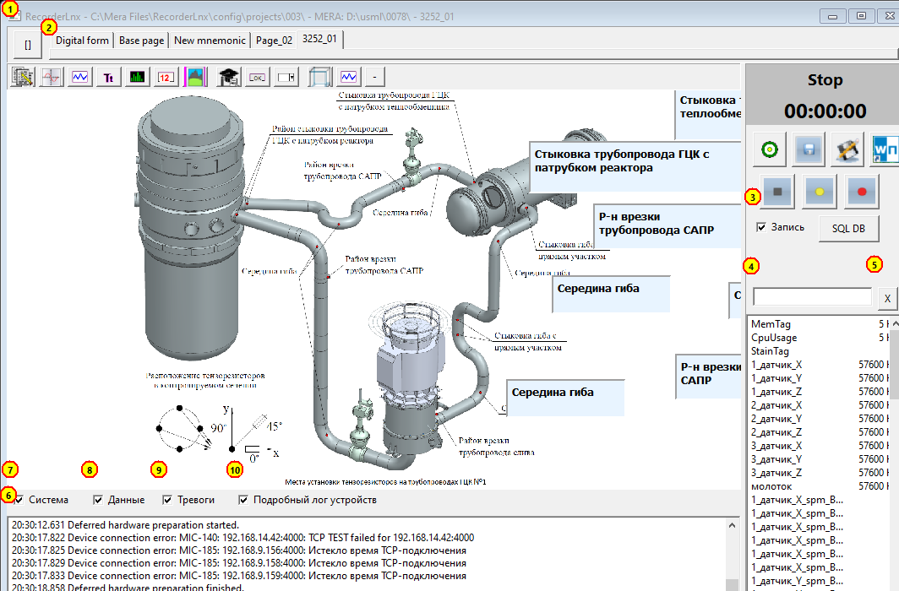

### Главная форма RecorderLnx

| № элемента | Элемент | Как работает | Характерные действия |
|---:|---|---|---|
| 1 | Кнопка **Формуляры** | Открывает управление пользовательскими страницами и мнемосхемами проекта. Добавленная страница сохраняется в GUI-конфигурации и становится контейнером компонентов отображения. | Создание, удаление, переименование и открепление страницы выполняются в открытом диалоге формуляров. |
| 2 | Вкладки страниц проекта | Переключают цифровую форму, базовую страницу и пользовательские мнемосхемы. Переключение не останавливает сбор и не меняет привязки тегов. | Выбор вкладки меняет только видимое представление. |
| 3 | Чекбокс **Запись в SQL** | Разрешает менеджеру SQL принимать выбранные оценки тегов. Работает только при корректном подключении, назначенном управляющем теге и включённой записи RecorderLnx. | Включать перед записью, если нужны исторические SQL-точки. |
| 4 | Поле **Поиск тегов** | Фильтрует правый перечень по имени или адресу. Фильтр влияет только на список и не отключает скрытые теги. | Вводите часть имени, адреса или группы тега. |
| 5 | Кнопка **Очистка поиска** | Удаляет текст фильтра и возвращает полный перечень тегов. | — |
| 6 | Область **Журнал** | Показывает сообщения запуска проекта, переходов состояния, источников, данных, SQL и ошибок. Запись в журнал не является измерительной записью. | При отладке включайте нужные чекбоксы категорий ниже журнала. |
| 7 | Чекбокс **Система** | Показывает сообщения жизненного цикла приложения и конфигурации. | Используется при проверке запуска, загрузки проекта и переходов состояний. |
| 8 | Чекбокс **Данные** | Показывает сообщения источников, тегов и потока измерений. | Включайте при поиске проблем с поступлением данных. |
| 9 | Чекбокс **Тревоги** | Показывает предупреждения, уставки и ошибки, требующие внимания оператора. | Включайте при наладке аварийных порогов и состояния каналов. |
| 10 | Чекбокс **Подробный лог устройств** | Включает диагностические сообщения протокола и жизненного цикла приборов; используется при поиске неисправности и может заметно увеличить объём журнала. | Включайте временно, только на время диагностики прибора. |

Рабочий порядок: откройте **Preview**, проверьте сигналы, затем включите **Record**. При остановке текущие линии оперативных трендов очищаются и новый сеанс рисуется заново.

#### Базовая страница и просмотр сигналов

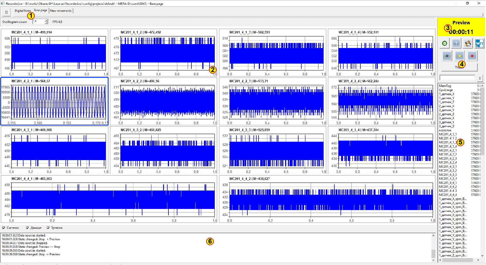

| № элемента | Элемент | Как работает | Характерные действия |
|---:|---|---|---|
| 1 | Вкладки страниц | Переключают цифровую форму, базовую страницу и мнемосхемы без останова сбора. | Выбор вкладки меняет только отображение. |
| 2 | Осциллограммы | Показывают живые блоки выбранных каналов; каждая панель использует назначенную ось Y. | Прямой zoom рамкой, обратный zoom рамкой, двойной щелчок для полного масштаба. |
| 3 | Состояние | Показывает режим `Stop`, `Preview` или `Record` и длительность текущего сеанса. | — |
| 4 | Кнопки команд сбора | Запускают просмотр/запись, останавливают сеанс и открывают SQL БД. | **Preview** проверяет данные без основной записи; **Record** пишет сеанс. |
| 5 | Список тегов | Показывает текущие значения; строка поиска сокращает список, но не отключает каналы. | Выбор тега используется для просмотра текущего значения и диагностики. |
| 6 | Журнал | Содержит сообщения источников, переходов состояния, данных и ошибок. | Используйте фильтры категорий журнала. |

#### Цифровая форма

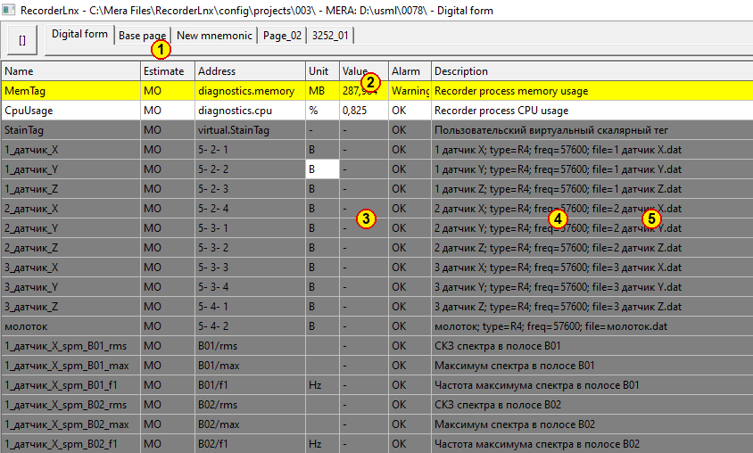

| № элемента | Элемент | Как работает | Характерные действия |
|---:|---|---|---|
| 1 | Вкладки страниц | Переключают формуляры проекта. | Выбор вкладки меняет только видимый экран. |
| 2 | Заголовки | Определяют смысл столбцов: имя, оценка, адрес, единицы, значение, тревога и описание. | — |
| 3 | Текущие значения | Показывают результат тега после аппаратной и канальных ГХ и выбранной оценки. | — |
| 4 | Состояние тревоги | Показывает нормальное состояние либо активную уставку канала. | — |
| 5 | Описание | Помогает сопоставить тег с физическим каналом и его назначением. | — |

## 6. Настройка RecorderLnx

Окно **Настройка** открывается кнопкой с инструментом на главной панели. Оно
является верхней точкой настройки проекта и разделено на вкладки:

- **Рекордер** - общие параметры просмотра, записи, каталогов и автоматики;
- **Аппаратные свойства** - дерево источников данных и приборов;
- **Каналы** - точка перехода к настройкам тегов проекта;
- **Плагины** - расширения источников и обработки, когда они зарегистрированы.

Параметры вкладки **Рекордер** применяются ко всему проекту. Электрические
режимы отдельных каналов находятся в свойствах приборов, а единицы и ГХ - в
настройке тегов. Это разделение предотвращает случайное перепрограммирование
оборудования при изменении отображения.

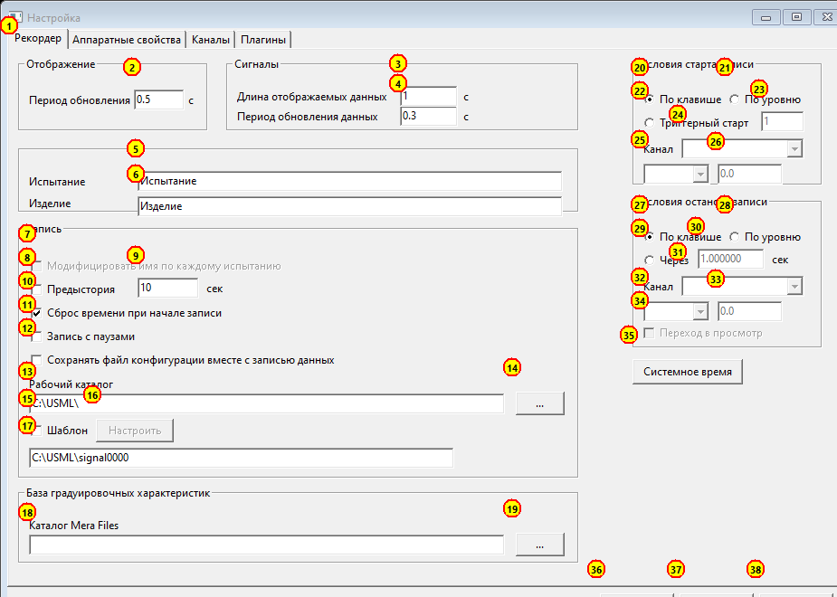

### Настройка RecorderLnx

| № элемента | Элемент | Как работает | Характерные действия |
|---:|---|---|---|
| 1 | Вкладки настройки | Переключает уровни **Рекордер**, **Аппаратные свойства**, **Каналы**, **Плагины**. Смена вкладки сама по себе ничего не применяет. | — |
| 2 | Период обновления экрана, с | Определяет, как часто UI перечитывает готовые значения. Меньшее значение делает индикацию плавнее, но повышает нагрузку CPU; частоту опроса прибора не меняет. | — |
| 3 | Длина отображаемых данных, с | Задаёт временное окно оперативных осциллограмм и объём данных, удерживаемый для показа. Влияет на память и доступный полный масштаб X, но не на длительность файла записи. | — |
| 4 | Период обновления данных, с | Определяет период передачи накопленных значений в компоненты UI. Связан с отзывчивостью трендов и вычислением текущих оценок. | — |
| 5 | Испытание | Человекочитаемое имя текущего испытания. Используется в метаданных и при формировании имени/каталога записи. | — |
| 6 | Изделие | Имя исследуемого изделия или объекта. Сохраняется вместе с конфигурацией/данными и помогает идентифицировать запись. | — |
| 7 | Модифицировать имя | Предназначено для автоматического изменения имени каждого испытания. Если элемент недоступен, функция в текущей конфигурации не используется. | — |
| 8 | Предыстория | Разрешает при старте Record дописать данные, накопленные до команды записи. Требует достаточного буфера и увеличивает потребление памяти. | — |
| 9 | Длина предыстории, с | Определяет, сколько секунд накопленного Preview попадёт в начало записи. Имеет смысл только при включённой предыстории. | — |
| 10 | Сброс времени при начале записи | Начинает относительное время испытания заново при переходе в Record. Не изменяет системное/астрономическое время компьютера. | — |
| 11 | Запись с паузами | Разрешает формировать запись с управляемыми паузами, сохраняя логику одного испытания. | — |
| 12 | Сохранять конфигурацию с данными | Копирует актуальную конфигурацию рядом с измерительными данными, чтобы позднее восстановить теги, ГХ и формуляры именно этого сеанса. | — |
| 13 | Рабочий каталог | Корневой каталог новых измерительных записей. Изменение не переносит уже созданные данные. | На Linux выбор каталога открывается от каталога Mera Files, если он задан. |
| 14 | Выбор рабочего каталога | Открывает системный выбор каталога и записывает результат в поле 13. | — |
| 15 | Шаблон | Разрешает использование шаблона структуры/имени записи. Зависимые поля активны только при поддерживаемой модели шаблона. | — |
| 16 | Настроить шаблон | Открывает параметры выбранного шаблона. Недоступная кнопка означает, что модель шаблона не подключена. | — |
| 17 | Каталог кадра | Базовое имя или каталог создаваемого кадра/сеанса. Связан с рабочим каталогом и именованием файла измерений. | — |
| 18 | Каталог Mera Files | Общий корень ресурсов MERA, включая SDB и базы ГХ. Неверный путь приводит к отсутствию шкал и ресурсов, но не меняет настройки прибора. | — |
| 19 | Выбор Mera Files | Выбирает корневой каталог и сразу синхронизирует путь, используемый подсистемой ГХ/SDB. | — |
| 20 | Старт по клавише | Record начинается только по команде оператора. Канал и порог для этого режима не используются. | — |
| 21 | Старт по уровню | Система ждёт пересечения выбранным тегом порога. Требует живых данных выбранного канала. | — |
| 22 | Триггерный старт | Использует внешний/логический номер триггера из поля 23. | — |
| 23 | Номер триггера | Идентификатор триггерного условия. Активен только для триггерного старта. | — |
| 24 | Канал старта | Тег, значение которого контролируется автоматом записи. Переименование/удаление тега требует повторной проверки настройки. | — |
| 25 | Направление старта | Выбирает направление пересечения порога: ниже/выше в поддерживаемой конфигурации. Работает совместно с полями 24 и 26. | — |
| 26 | Порог старта | Значение в конечных единицах выбранного тега после всех ГХ. При смене единиц или ГХ порог необходимо проверить. | — |
| 27 | Останов по клавише | Запись останавливается только командой оператора. | — |
| 28 | Останов по уровню | Автоматически останавливает Record при пересечении порога выбранным тегом. | — |
| 29 | Останов через время | Завершает запись по истечении длительности из поля 30. | — |
| 30 | Длительность, с | Время записи для режима останова **Через**. Отсчёт связан со временем сеанса RecorderLnx. | — |
| 31 | Канал останова | Тег, контролируемый условием останова по уровню. | — |
| 32 | Направление останова | Направление пересечения порога останова. | — |
| 33 | Порог останова | Значение в конечных единицах тега из поля 31. После изменения ГХ/единиц должно быть перепроверено. | — |
| 34 | Переход в просмотр | После останова возвращает систему в Preview вместо полного Stop, если режим поддержан текущей конфигурацией. | — |
| 35 | Системное время | Переход к источнику времени RecorderLnx. Влияет на временные метки файлов и SQL, поэтому изменение требует проверки синхронизации. | — |
| 36 | OK | Проверяет и сохраняет все изменённые разделы, затем закрывает окно. | — |
| 37 | Закрыть | Закрывает окно без применения изменений после последнего сохранения. | — |
| 38 | Применить | Проверяет и сохраняет изменения, оставляя окно открытым; удобно для последовательной настройки источников и тегов. | — |

### Автоматическое подключение к Coordinator/rcPanel

RecorderLnx и Coordinator/rcPanel могут найти друг друга автоматически, если
они запущены на разных компьютерах одного broadcast-домена. Обнаружение выполняется
через UDP Broadcast, после чего регистрация RecorderLnx, передача состояния и
команд продолжаются через штатный HTTP API Coordinator. Через broadcast не
передаются команды управления, токены доступа и пути к файлам измерений.

Типовой сценарий:

- Запустите Coordinator/rcPanel и включите его HTTP-сервис.
- Запустите RecorderLnx на одном или нескольких компьютерах той же локальной
  сети.
- Дождитесь появления RecorderLnx в списке хостов rcPanel. Опрос выполняется
  периодически, поэтому появление может занять несколько секунд. Дополнительный
  ручной ввод адреса при разрешённом broadcast не требуется.
- Перед групповым запуском проверьте состояние и имя каждого найденного хоста.

Если в RecorderLnx уже сохранён адрес Coordinator, сначала проверяется именно
он. Рабочий ручной адрес не заменяется результатом автопоиска. Переход на
найденный адрес происходит только тогда, когда настроенный HTTP endpoint не
отвечает. Это позволяет сохранить предсказуемое подключение в сети с несколькими
экземплярами rcPanel.

| Назначение | Протокол и порт | Где разрешить входящее подключение |
|---|---|---|
| Поиск Coordinator/rcPanel | UDP `38765` | На компьютере с rcPanel |
| Поиск RecorderLnx | UDP `38766` | На каждом компьютере с RecorderLnx |
| Дальнейшее управление | TCP `8765` либо порт из настройки rcPanel | На компьютере с rcPanel |

Установщик RecorderLnx для Windows создаёт правило для UDP `38766` в профилях
**Частная** и **Доменная** сеть. Для вручную установленного rcPanel разрешите
приложение `RecorderCoordinator.exe` в Windows Firewall либо создайте входящее
правило для UDP `38765`. В Linux разрешите те же UDP-порты и настроенный TCP-порт
в используемом системном брандмауэре. Профиль Windows **Общедоступная сеть**
установщиком не открывается. HTTP-сервис rcPanel должен слушать сетевой интерфейс,
доступный другим компьютерам; для всех интерфейсов обычно задают адрес `0.0.0.0`.

Broadcast обычно не проходит через маршрутизаторы, VPN и изолированные VLAN.
Если программы находятся в разных подсетях, задайте адрес Coordinator вручную
либо настройте сетевую инфраструктуру для прохождения discovery-трафика.

## 7. Устройства

Источники данных настраиваются на вкладке **Аппаратные свойства** общего окна.
Дерево отражает не формуляры, а реальные/программные поставщики данных. Контекстное
меню позволяет включить или выключить источник, перечитать его теги, открыть
свойства, сбросить состояние либо удалить источник из проекта. Отключённый
источник не создаёт runtime-сбор и его теги не получают новые значения.

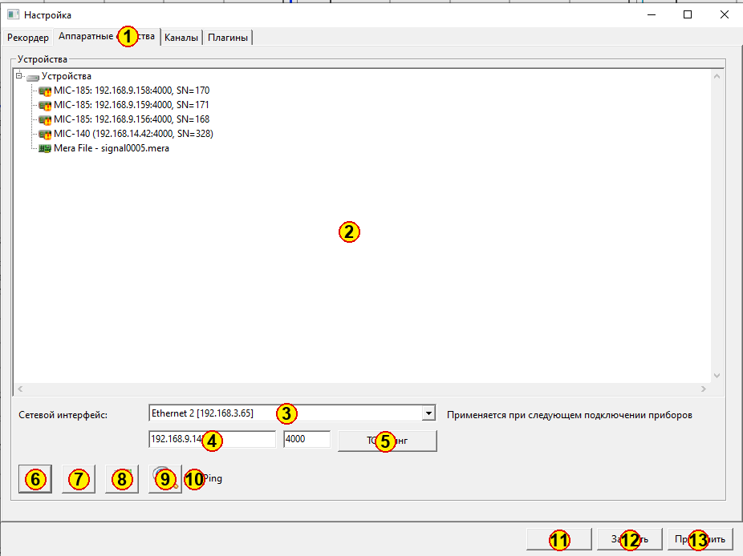

### Аппаратные свойства проекта

| № элемента | Элемент | Как работает | Характерные действия |
|---:|---|---|---|
| 1 | Раздел аппаратуры | Открывает состав источников данных проекта. | — |
| 2 | Дерево устройств | Показывает MIC-140, MIC-185 и программный источник Mera File; двойной щелчок открывает свойства. | Двойной щелчок открывает свойства выбранного объекта. |
| 3 | Сетевой интерфейс | Выбирает локальный адаптер, через который выполняются поиск и соединение. | — |
| 4 | Адрес и порт | Задают конкретный сетевой узел для проверки или добавления. | — |
| 5 | Проверка TCP | Проверяет доступность узла без запуска измерительного сеанса. | — |
| 6–10 | Команды источников | Добавляют, удаляют и настраивают источник, запускают автопоиск и проверку связи. | Удаление выбранной строки/объекта выполняется явно выбранной командой. |
| 11–13 | Завершение | Сохраняет, закрывает или применяет изменения аппаратуры. | — |

**Mera File** является программным источником: для воспроизведения файла физические MIC-приборы не требуются. Источник должен быть включён в дереве и иметь доступный файл; его теги проходят тот же общий pipeline, что и аппаратные каналы.

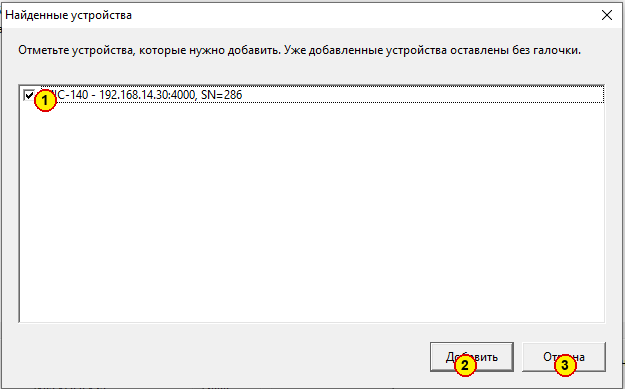

### Найденные устройства

| № элемента | Элемент | Как работает | Характерные действия |
|---:|---|---|---|
| 1 | Список найденных устройств | Показывает результаты discovery всех поддерживаемых семейств. Флажок определяет, будет ли источник добавлен в проект; уже настроенные устройства по умолчанию не выбираются повторно. | Уже добавленные устройства помечаются и не выбираются повторно. |
| 2 | Добавить | Создаёт источники и теги для отмеченных устройств. После добавления требуется проверить свойства каналов и выполнить Preview. | — |
| 3 | Отмена | Закрывает результаты поиска без изменения состава проекта. | — |

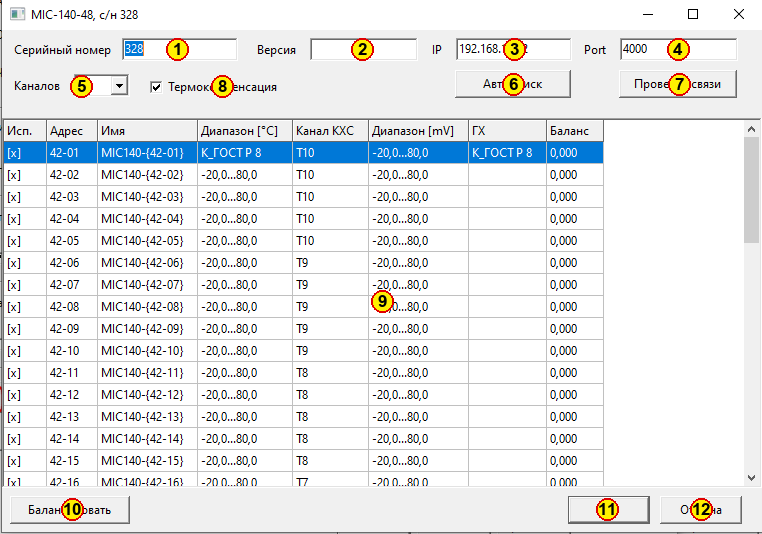

### MIC-140

| № элемента | Элемент | Как работает | Характерные действия |
|---:|---|---|---|
| 1 | Серийный номер | Идентифицирует физический прибор. Обычно читается с устройства и используется для проверки, что конфигурация относится к нужному экземпляру. | — |
| 2 | Версия | Показывает версию устройства/прошивки; от неё могут зависеть доступные режимы и число каналов. | — |
| 3 | Хост | IP-адрес MIC-140. Вместе с портом образует устойчивый идентификатор источника и адрес TCP-соединения. | IP-адрес |
| 4 | Порт | TCP-порт протокола MIC-140, обычно 4000. Изменение приводит к переподключению источника. | — |
| 5 | Число каналов | Ограничивает состав создаваемых каналов согласно модификации прибора. Изменение требует проверки привязок существующих тегов. | — |
| 6 | Автопоиск | Ищет MIC-140 через выбранный сетевой адаптер и подставляет найденный адрес; конфигурация канала не применяется автоматически. | — |
| 7 | Проверка связи | Выполняет безопасный тест доступности без запуска длительного сбора. Ошибка указывает на сеть, адрес, порт или протокол. | — |
| 8 | Термокомпенсация | Включает вычисления температурной компенсации там, где настроены соответствующие каналы/датчики. Влияет на итоговые значения тегов. | — |
| 9 | Таблица каналов | Показывает активность и аппаратные свойства входов. Двойной щелчок открывает форму конкретного канала. | Двойной щелчок открывает свойства выбранного объекта. |
| 10 | Балансировать | Выполняет баланс выбранных каналов устройства. Полученное смещение отображается в единицах текущего режима канала. | — |
| 11 | OK | Сохраняет устройство и каналы, при необходимости применяя изменившуюся аппаратную конфигурацию. | — |
| 12 | Отмена | Отбрасывает текущие изменения формы. | — |

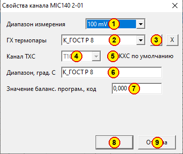

### Свойства канала MIC-140

| № элемента | Элемент | Как работает | Характерные действия |
|---:|---|---|---|
| 1 | Диапазон | Выбирает электрический диапазон входа. Он определяет аппаратный масштаб и допустимые исходные единицы тега. | — |
| 2 | Термопара | Выбирает тип термопары/шкалу преобразования для температурного режима. | — |
| 3 | Выбрать термопару | Открывает SDB/реестр для выбора характеристики термопары. | — |
| 4 | Очистить термопару | Снимает выбранную шкалу; температурное преобразование необходимо проверить. | — |
| 5 | Канал КХС | Назначает канал компенсации холодного спая. Его данные участвуют в расчёте температурного тега. | — |
| 6 | КХС по умолчанию | Использует стандартный источник/значение КХС вместо явно выбранного канала. | — |
| 7 | Температурный диапазон | Ограничивает ожидаемый диапазон после преобразования и влияет на автоматический масштаб тега. | — |
| 8 | Программный баланс | Дополнительное смещение после аппаратного измерения; показывается и вводится в единицах текущего режима. | — |
| 9 | OK | Применяет свойства канала; связанные автоединицы/автодиапазон тега обновляются по источнику. | — |
| 10 | Отмена | Закрывает без применения. | — |

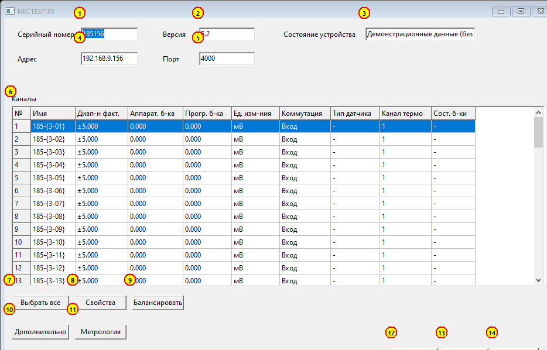

### MIC183/185

| № элемента | Элемент | Как работает | Характерные действия |
|---:|---|---|---|
| 1 | Серийный номер | Идентификатор физического MIC183/185, прочитанный при связи. | — |
| 2 | Версия | Версия прибора/прошивки, определяющая поддерживаемые свойства. | — |
| 3 | Состояние | Текущее состояние жизненного цикла: доступность, инициализация, настройка или ошибка. | Только чтение |
| 4 | Адрес | IP-адрес источника. Изменение корректно переименовывает источник и перепривязывает его теги. | IP-адрес |
| 5 | Порт | TCP-порт Mebius, обычно 4000. | — |
| 6 | Таблица каналов | Показывает фактический диапазон, аппаратную/программную балансировку, единицы, коммутацию и связь. Выбранные строки используются пакетными командами. | Двойной щелчок открывает свойства выбранного объекта. |
| 7 | Выбрать все | Выделяет все каналы для пакетной настройки или балансировки. | — |
| 8 | Свойства | Открывает аппаратные свойства выбранного канала. | — |
| 9 | Балансировать | Запускает баланс выбранных входов и возвращает результат в текущих единицах режима мВ/Ом/мкстрн. | — |
| 10 | Дополнительно | Открывает общие временные и диагностические параметры прибора. | — |
| 11 | Метрология | Переходит к метрологическим операциям, если они поддержаны устройством. | — |
| 12 | OK | Применяет изменения и закрывает форму. | — |
| 13 | Закрыть | Закрывает без новых изменений. | — |
| 14 | Применить | Передаёт изменившуюся аппаратную конфигурацию устройству без закрытия формы. | — |

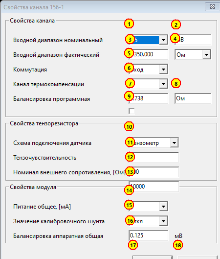

### Свойства канала MIC183/185

| № элемента | Элемент | Как работает | Характерные действия |
|---:|---|---|---|
| 1–8 | Диапазон и баланс | Номинальный/фактический диапазон, коммутация, термоканал и баланс в выбранных единицах | — |
| 9–15 | Тензоканал | Шунт, схема датчика, чувствительность, сопротивления, питание | Настройки тензодатчика участвуют в аппаратной ГХ и автоматических единицах тега. |
| 16 | Аппаратный баланс | Значение аппаратной балансировки | — |
| 17–18 | Завершение | Применить либо отменить | — |

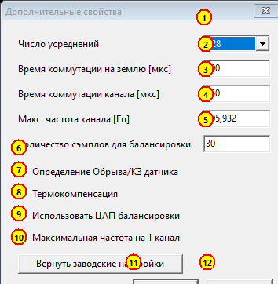

### Дополнительные свойства MIC183/185

| № элемента | Элемент | Как работает | Характерные действия |
|---:|---|---|---|
| 1–5 | Временные параметры | Усреднение, коммутация, максимальная частота, число отсчётов баланса | Изменение этих параметров требует применения аппаратной конфигурации прибора. |
| 6–9 | Режимы | Контроль обрыва, термокомпенсация, ЦАП баланса, максимальная частота | — |
| 10 | Заводские настройки | Возвращает значения устройства по умолчанию | — |
| 11–12 | Завершение | Применить либо отменить | — |

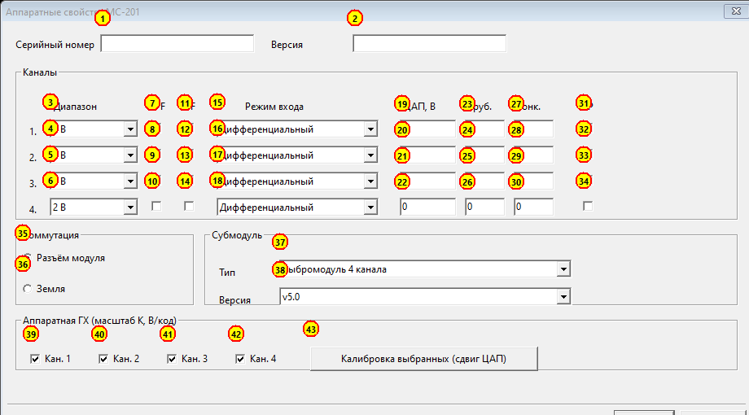

### Аппаратные свойства MC-201

| № элемента | Элемент | Как работает | Характерные действия |
|---:|---|---|---|
| 1–2 | Идентификация | Серийный номер и версия. | Только чтение после связи с модулем. |
| 3–18 | Каналы | Диапазоны, фильтры и входы четырёх каналов. | Изменение канальных режимов относится к аппаратной конфигурации. |
| 19–34 | ЦАП/ICP | Напряжения, пределы и ICP-питание каналов. Груб./Тонк. - коды подстройки ЦАП, пересчитываемые из значения поля ЦАП. | Используется при наладке входа и балансировке. |
| 35–38 | Модуль | Точка привязки, подмодуль и ревизия. | Проверяется при сопоставлении физического слота и настроек проекта. |
| 39–43 | Калибровка | Выбор каналов и запуск сдвига ЦАП. | Применяется только к выбранным каналам. |

## 8. Каналы и теги

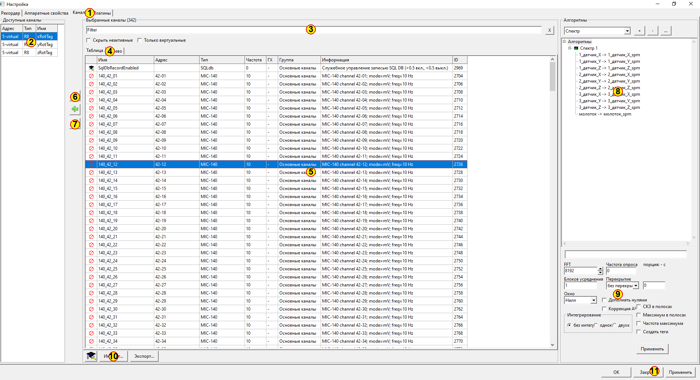

### Состав каналов

| № элемента | Элемент | Как работает | Характерные действия |
|---:|---|---|---|
| 1 | Вкладка **Каналы** | Открывает состав тегов и вычислительных алгоритмов. | — |
| 2 | Список **Доступные каналы** | Показывает каналы источников, ещё не включённые в рабочий состав. | Кнопка добавления переносит выбранные каналы в теги проекта. |
| 3 | Поле **Фильтр** | Ищет выбранные каналы по имени и адресу. | Фильтр работает и для таблицы, и для дерева. |
| 4 | Переключатель **Таблица/Дерево** | Переключает плоское и иерархическое представление тегов. | В дереве теги можно группировать по пользовательским узлам. |
| 5 | Таблица **Выбранные каналы** | Показывает теги проекта, их адреса, Fs, группы и описание. | Двойной щелчок открывает свойства выбранного тега. |
| 6–7 | Кнопки состава и свойств | Добавляют/удаляют каналы и открывают настройку выбранного тега. | Удаление выбранных тегов выполняется явной командой. |
| 8–9 | Панель **Алгоритмы** | Настраивает вычислительные связи, FFT, окно и спектральные результаты. | Команда **Применить** создаёт или обновляет выбранные алгоритмические теги. |
| 10 | Кнопки **Импорт/Экспорт** | Загружают или сохраняют табличное описание каналов в ODS. | При импорте столбцы ищутся по имени, поэтому пользовательские столбцы можно оставлять в таблице. |
| 11 | Завершение | Сохраняет либо отменяет изменения состава. | — |

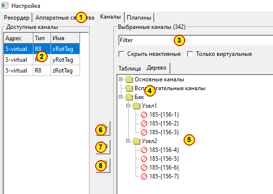

В режиме дерева каналы объединяются по источникам и группам. Кнопки добавления, удаления и свойств действуют на текущий выделенный узел; фильтр меняет только видимость строк и не изменяет рабочий состав.

Тег является границей между аппаратурой и остальной программой. Один раз
правильно настроенный тег используется одновременно цифровым индикатором,
графиками, условиями старта/останова, уставками, файлом записи и SQL. Поэтому
изменение имени, единиц, диапазона или ГХ необходимо оценивать по всем этим
потребителям.

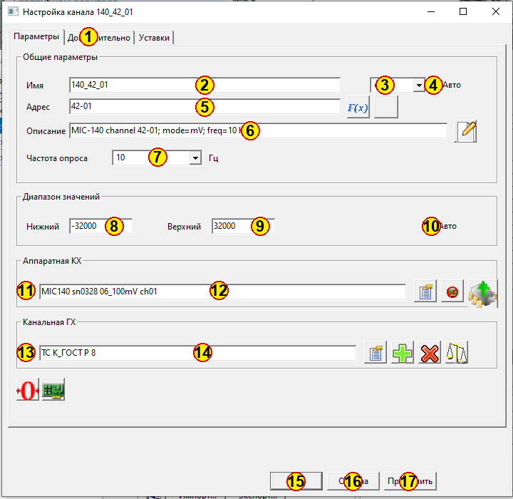

### Настройка канала

| № элемента | Элемент | Как работает | Характерные действия |
|---:|---|---|---|
| 1 | Вкладки | **Параметры** задают идентификацию и преобразование; **Дополнительно** - специализированные свойства источника; **Уставки** - пороги событий. Изменения всех вкладок применяются одной командой. | — |
| 2 | Поле **Имя тега** | Уникальное имя, по которому тег находят компоненты, условия записи и SQL. Переименование должно обновлять привязки через реестр, а не создавать новый независимый канал. | — |
| 3 | Список **Физическая единица** | В ручном режиме задаёт показываемую единицу. В авто режиме отражает выход конечной ГХ и вручную не является источником истины. | При включённом авто режиме значение берётся из цепочки ГХ. |
| 4 | Чекбокс **Авто** единиц | При включении вычисляет единицы по цепочке источник -> аппаратная ГХ -> канальные ГХ. При выключении сохраняется введённая пользователем строка. | Переключение меняет единицы для всех потребителей тега. |
| 5 | Поле **Адрес** | Связывает тег с каналом источника. Изменение адреса переводит тег на другой поток данных и требует проверки диапазона, единиц и ГХ. | Адрес канала хранится отдельно от имени тега. |
| 6 | Поле **Описание** | Пояснение назначения канала; используется оператором и может попадать в экспорт/метаданные. На вычисления не влияет. | Пользовательское описание не должно перезаписываться аппаратной настройкой. |
| 7 | Список **Частота опроса Fs** | Желаемая частота получения/обработки тега. Фактическая доступность зависит от источника и числа активных каналов. Не следует задавать выше возможностей устройства. | Для MIC-185 изменение частоты применяется ко всему прибору. |
| 8 | Поле **Нижняя граница** | Минимум рабочего диапазона тега после применённых ГХ. Используется автоосями, валидацией и первоначальным масштабом компонентов. | — |
| 9 | Поле **Верхняя граница** | Максимум рабочего диапазона. Должен быть больше нижней границы и соответствовать конечным единицам тега. | — |
| 10 | Чекбокс **Авто** диапазона | Получает границы из источника и цепочки ГХ. При ручном режиме используются поля 8 и 9. | При смене диапазона прибора автодиапазон перечитывается заново. |
| 11 | Чекбокс **Использовать аппаратную ГХ** | Включает преобразование, определённое текущим режимом устройства. Например, выбранный в MIC-185 режим мВ/Ом/мкстрн определяет конкретную аппаратную ГХ и её выходные единицы. | Снятый чекбокс показывает исходные коды/единицы до аппаратной ГХ. |
| 12 | Поле **Аппаратная ГХ** | Показывает/выбирает характеристику источника. Не следует подменять её случайно сохранёнными единицами тега: выбор определяется настройкой устройства. | Кнопка выбора открывает назначенную характеристику. |
| 13 | Чекбокс **Использовать канальную ГХ** | Включает пользовательскую цепочку преобразований после аппаратной ГХ. Отключение меняет значения, диапазон и автоматические единицы всех потребителей тега. | Пустая канальная ГХ не должна оставлять чекбокс включённым. |
| 14 | Поле **Канальная ГХ** | Открывает упорядоченный список ГХ. Выход одной характеристики является входом следующей; переименование ГХ должно обновляться в реестре и привязке тега. | — |
| 15 | OK | Проверяет данные, применяет их к тегу и закрывает окно. Аппаратное перепрограммирование выполняется только если изменилась аппаратная сигнатура. | — |
| 16 | Отмена | Закрывает форму без применения текущих правок. | — |
| 17 | Применить | Сохраняет изменения без закрытия и обновляет связанные представления тега. | — |

При включённых **Авто** единицах тег получает единицы конечного узла pipeline:
аппаратная ГХ -> канальные ГХ. В ручном режиме сохраняется единица пользователя.
Порог старта/останова, уставки и оси компонентов задаются в конечных единицах,
поэтому после изменения ГХ их необходимо проверить.

#### Дополнительные параметры тега

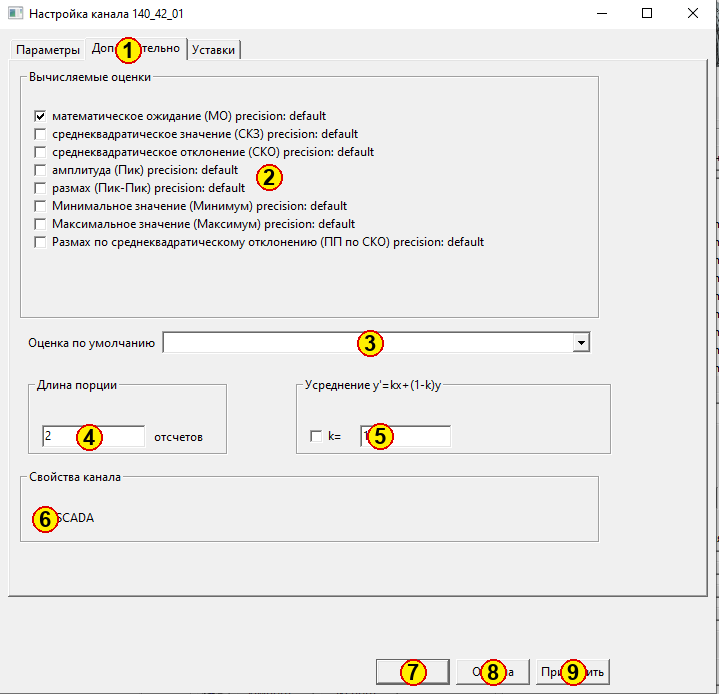

| № элемента | Элемент | Как работает | Характерные действия |
|---:|---|---|---|
| 1 | Вкладка | Переключает основные параметры, дополнительные расчёты и уставки одного тега. | — |
| 2 | Вычисляемые оценки | Включает Mean, RMS, максимум и другие результаты, доступные компонентам и SQL. | — |
| 3 | Оценка по умолчанию | Определяет значение, которое компонент показывает без отдельного выбора оценки. | — |
| 4–5 | Порция и усреднение | Задают окно расчёта и экспоненциальное сглаживание; влияют на задержку и шум результата. | Чем больше окно, тем стабильнее оценка и тем больше задержка. |
| 6 | SCADA | Разрешает использование тега внешними механизмами обмена. | — |
| 7–9 | Завершение | Сохраняет, отменяет или применяет изменения. | — |

#### Уставки тега

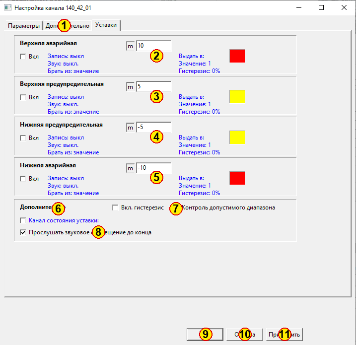

| № элемента | Элемент | Как работает | Характерные действия |
|---:|---|---|---|
| 1 | Вкладка «Уставки» | Открывает пороговые состояния выбранного тега. | — |
| 2–5 | Пороговые уровни | Включают верхние/нижние аварийные и предупредительные уровни, их цвет, звук и задержку. | Порог задаётся в конечных единицах тега после ГХ. |
| 6 | Дополнительные режимы | Включает дополнительные условия контроля. | — |
| 7 | Гистерезис/диапазон | Настраивает гистерезис и контроль допустимого диапазона, чтобы состояние не дребезжало около порога. | Используется для устойчивой индикации тревог около границы. |
| 8 | Звук до завершения | Продолжает звуковую сигнализацию до подтверждения или завершения состояния. | — |
| 9–11 | Завершение | Сохраняет, отменяет или применяет уставки. | — |

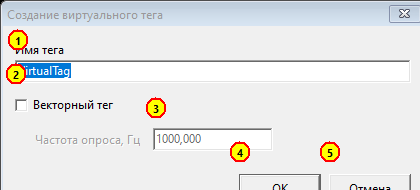

### Создание виртуального тега

| № элемента | Элемент | Как работает | Характерные действия |
|---:|---|---|---|
| 1 | Имя | Уникальное имя программного тега. После создания он появляется в общем реестре и доступен компонентам наравне с аппаратным. | — |
| 2 | Векторный тег | Выбирает между одиночным значением и массивом отсчётов. От типа зависит перечень допустимых оценок и компонентов. | — |
| 3 | Частота | Периодичность расчёта/обновления виртуального значения; должна соответствовать алгоритму-поставщику. | Стрелки, число |
| 4 | OK | Создаёт тег в реестре проекта. | — |
| 5 | Отмена | Отменяет создание без изменения реестра. | — |

## 9. Градуировочные характеристики

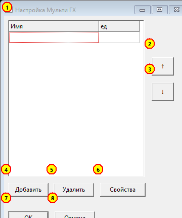

### Настройка Мульти ГХ

| № элемента | Элемент | Как работает | Характерные действия |
|---:|---|---|---|
| 1 | Реестр | Показывает имя и выходную единицу ГХ | Двойной щелчок открывает свойства выбранного объекта. |
| 2–3 | Порядок | Меняет порядок применения канальных ГХ | — |
| 4–6 | Управление | Добавляет, удаляет или открывает свойства ГХ | Удаление выбранной строки/объекта выполняется явно выбранной командой. |
| 7–8 | Завершение | Сохраняет список либо отменяет | — |

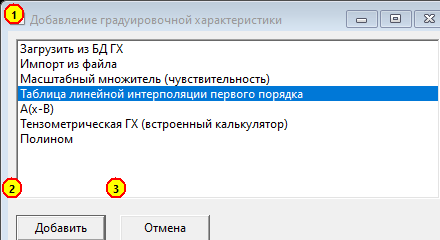

### Добавление градуировочной характеристики

| № элемента | Элемент | Как работает | Характерные действия |
|---:|---|---|---|
| 1 | Тип ГХ | Выбирает поддерживаемый тип преобразования | — |
| 2–3 | Завершение | Создаёт ГХ либо отменяет | — |

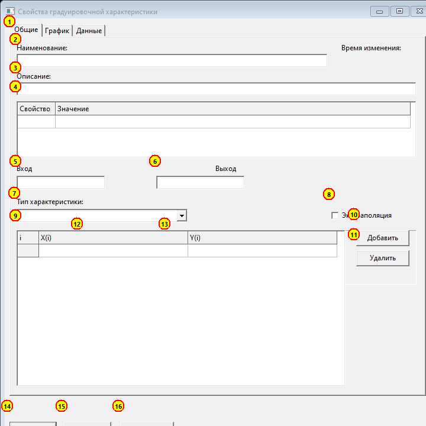

### Свойства градуировочной характеристики

| № элемента | Элемент | Как работает | Характерные действия |
|---:|---|---|---|
| 1–8 | Общие свойства | Имя, описание, единицы, тип и экстраполяция; имя можно изменять | Единицы входа и выхода определяют совместимость ГХ с тегом. |
| 9–11 | Таблица | Редактирует точки преобразования | Точки задают зависимость; порядок и монотонность надо проверять по графику. |
| 12–13 | Масштаб | Прямой и обратный коэффициенты | — |
| 14–16 | Завершение | Сохранить, отменить или применить | — |

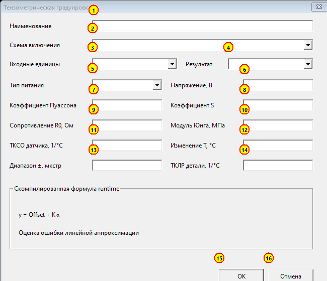

### Тензометрическая градуировка

| № элемента | Элемент | Как работает | Характерные действия |
|---:|---|---|---|
| 1 | Имя | Задаёт имя тензометрической ГХ | — |
| 2–5 | Режим | Схема, входные/выходные единицы и тип возбуждения | — |
| 6–14 | Коэффициенты | Возбуждение, Пуассон, тензочувствительность, сопротивление, модуль Юнга и температурные параметры | Для каналов с аппаратным возбуждением RecorderLnx подставляет ток/напряжение из свойств источника. |
| 15–16 | Завершение | Сохранить либо отменить | — |

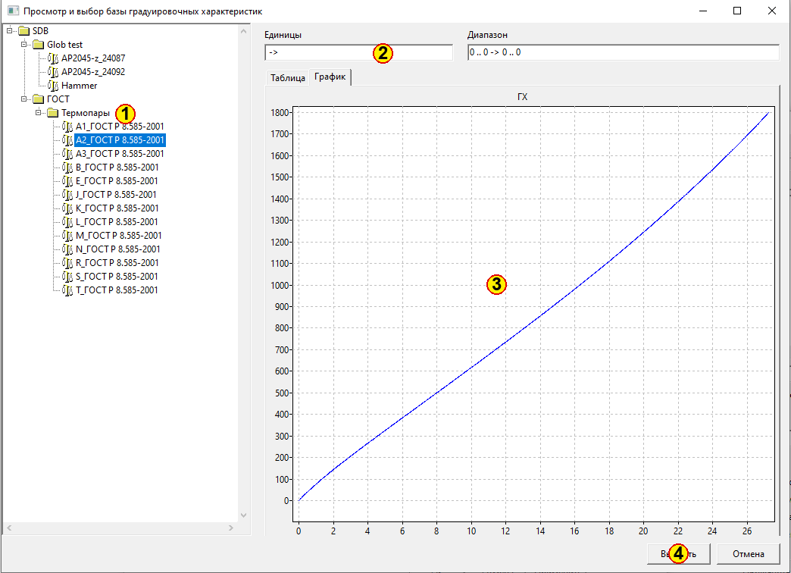

### Просмотр и выбор базы градуировочных характеристик

| № элемента | Элемент | Как работает | Характерные действия |
|---:|---|---|---|
| 1 | Дерево ГХ | Навигация по разделам и характеристикам общей базы Mera Files. | Двойной щелчок открывает свойства выбранного объекта. |
| 2 | Единицы и диапазон | Показывает входные/выходные единицы и допустимый диапазон выбранной ГХ. | — |
| 3 | График ГХ | Позволяет визуально проверить зависимость выхода от входной величины до назначения тегу. | Прямой и обратный zoom мышью. |
| 4 | Выбрать/Отмена | Назначает текущую ГХ либо закрывает окно без изменения. | — |

## 10. Формуляры, мнемосхемы и компоненты

Формуляр - это пользовательская страница отображения. Он не является источником
данных и не программирует прибор: формуляр только размещает компоненты, которые
читают уже существующие теги, оценки и исторические данные. Поэтому порядок
работы такой: сначала настроить источник и теги, затем открыть Preview и
проверить значения, после этого раскладывать компоненты по мнемосхемам.

Пользовательские страницы можно создавать, удалять, переименовывать и
отцеплять в отдельное окно. Отцепленное окно удобно для второго монитора:
положение, размер и состояние окна сохраняются в GUI-конфигурации проекта.
Если страница удалена, её компоненты удаляются из GUI-конфигурации, но сами
теги и измерительные данные не удаляются.

### 10.1. Работа с мнемосхемой

Мнемосхема редактируется в режиме конструктора. В этом режиме доступен тулбар
с типами компонентов; выбранный тип кладётся на рабочее поле, затем его можно
переместить, изменить размер и открыть настройки. Фон страницы задаётся
отдельно: можно выбрать картинку, режим растяжения/обрезки/сохранения
пропорций и цвет фона. Фон помогает привязать индикаторы к реальному объекту,
но не участвует в расчётах.

| Действие | Что делает | Важно помнить |
|---|---|---|
| Создать страницу | Добавляет новую пользовательскую мнемосхему в проект | Страница сохраняется в GUI-конфигурации, а не в файле измерений |
| Переименовать страницу | Меняет подпись вкладки/окна | Привязки тегов внутри компонентов не меняются |
| Удалить страницу | Удаляет компоненты этой страницы | Теги проекта и записанные данные остаются |
| Отцепить страницу | Открывает мнемосхему в отдельном окне | Удобно для второго монитора; положение окна сохраняется |
| Выбрать фон | Назначает картинку или цвет мнемосхемы | Для схем объекта обычно включают сохранение пропорций |
| Переместить компонент | Меняет положение на странице | Это только визуальная настройка, прибор не перепрограммируется |
| Изменить размер | Меняет область отображения компонента | Для графиков размер влияет на читаемость осей и легенды |
| Открыть свойства | Открывает настройку выбранного компонента | В свойствах выбираются тег, оценка, цвета, оси и подписи |

### 10.2. Типы компонентов тулбара

Компоненты выбираются с тулбара редактора мнемосхемы. Иконки берутся из общего
`ImageList` главной формы; в руководстве ниже показан смысл типов, а конкретный
вид кнопки смотрите на тулбаре текущей сборки RecorderLnx.

| Тип компонента | Что показывает или делает | Характерные действия |
|---|---|---|
| Цифровой индикатор | Текущее значение тега или выбранной оценки | Настройка тега, оценки, подписи, шрифта и цветов тревог |
| Осциллограмма | Быстрый блок отсчётов векторного тега | Прямой zoom рамкой, обратный zoom рамкой, двойной щелчок для полного масштаба |
| Оперативный тренд | Изменение оценок тегов в текущем сеансе | Настройка линий, осей, цветов; zoom по X/Y |
| Спектр | Частотное представление выбранных векторных тегов | Настройка полос, осей, шкал и спектральных оценок |
| SQL-тренд | Исторические точки из SQL БД | Чтение каналов БД, отображения, оси, удаление выбранного интервала |
| Кнопка | Запись значения в виртуальный управляющий тег | Режим фиксации/импульса, значения нажатия и отпускания, картинки состояний |
| Картинка | Отображение изображения или изображения по значению тега | Таблица соответствия значения тега и файла картинки |
| Измерительное сечение | Таблица тензорозеток, деформаций и расчётных напряжений | Назначение каналов `e1/e2/e3/t`, импорт/экспорт ODS, обновление балансировки |

### 10.3. Настройка компонентов

Настройки компонента определяют, что именно он читает и как это показывает.
Они не должны менять аппаратный режим прибора. Если компонент показывает
неверные единицы или диапазон, проверьте сначала тег и его ГХ, а уже затем
оформление компонента.

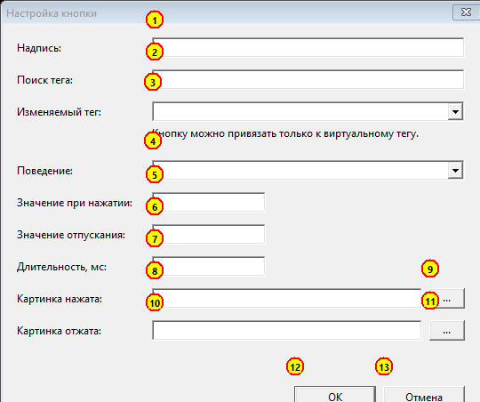

### Настройка кнопки

| № элемента | Элемент | Как работает | Характерные действия |
|---:|---|---|---|
| 1–4 | Привязка | Подпись, поиск тега, изменяемый виртуальный тег и режим кнопки. Кнопка не должна напрямую писать в аппаратный канал. | Для режима фиксации повторное нажатие переключает тег между значением нажатия и отпускания. |
| 5–7 | Значения | Значения нажатия/отпускания и длительность импульса | — |
| 8–11 | Изображения | Файлы для нажатого и отпущенного состояния | Если картинки не заданы, логика кнопки всё равно должна работать по значениям. |
| 12–13 | Завершение | Сохранить либо отменить | — |

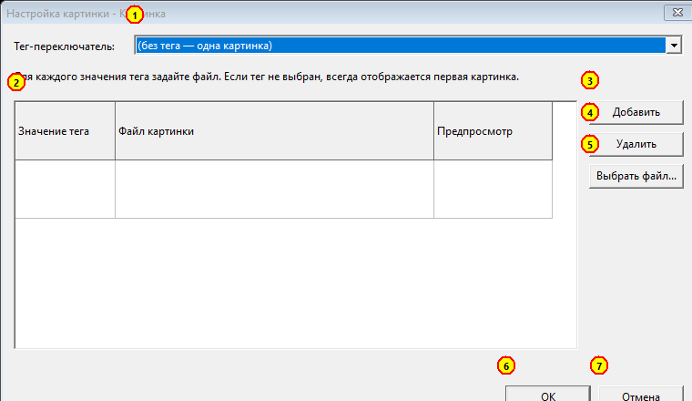

### Настройка картинки

| № элемента | Элемент | Как работает | Характерные действия |
|---:|---|---|---|
| 1 | Тег | Привязывает выбор картинки к значению тега | — |
| 2 | Таблица | Сопоставляет значения и файлы изображений | Двойной щелчок открывает строку соответствия. |
| 3–5 | Строки/файл | Добавляет, удаляет строку или выбирает файл | — |
| 6–7 | Завершение | Сохранить либо отменить | — |

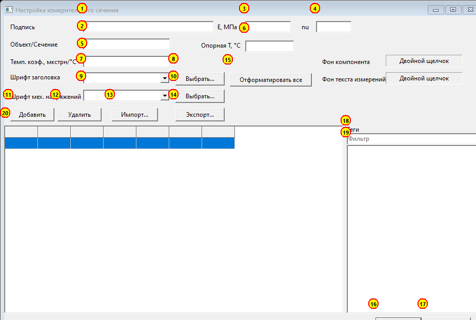

### Настройка измерительного сечения

| № элемента | Элемент | Как работает | Характерные действия |
|---:|---|---|---|
| 1–6 | Параметры | Подпись, идентификатор объекта/сечения, модуль Юнга, Пуассон и температурные параметры | Эти параметры участвуют в расчёте напряжений, а не только в оформлении. |
| 7–10 | Шрифты | Выбирает общий именованный шрифт заголовка и напряжений | Форматирование можно применить ко всем сечениям фабрики одной командой. |
| 11–14 | Точки | Добавляет/удаляет строки, импортирует/экспортирует ODS | Удаление выбранной строки/объекта выполняется явно выбранной командой. |
| 15 | Форматировать все | Назначает выбранные шрифты всем компонентам сечения фабрики | — |
| 16–17 | Завершение | Сохранить либо отменить | — |
| 18–20 | Теги | Поиск и назначение тегов ролям `e1`, `e2`, `e3`, `t` | Теги можно перетаскивать из списка в нужную роль точки. |

## 11. SQL БД и исторические тренды

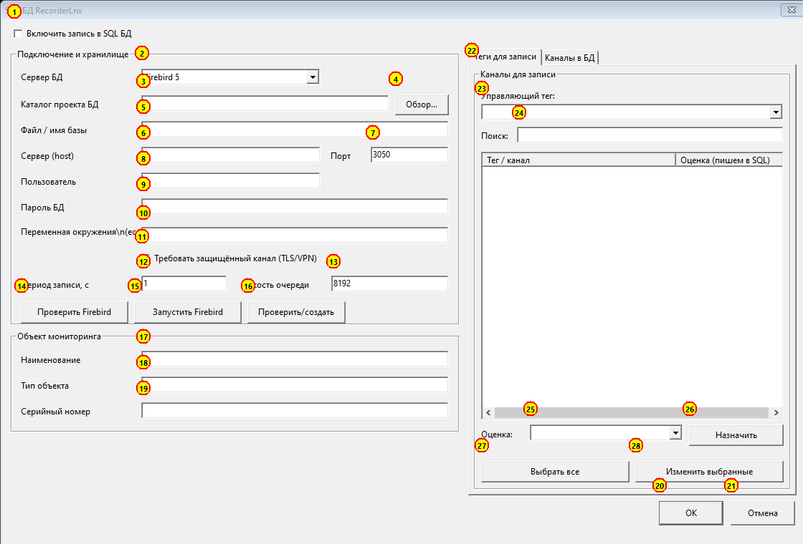

### SQL БД RecorderLnx

| № элемента | Элемент | Как работает | Характерные действия |
|---:|---|---|---|
| 1 | Включить запись в SQL | Разрешает фоновому SQL-менеджеру принимать оценки тегов. Не заменяет основную файловую запись и не исправляет неработающее подключение. | — |
| 2 | Сервер БД | Выбирает поддерживаемый backend/версию Firebird и тем самым формат подключения и допустимую схему. | — |
| 3 | Каталог проекта БД | Каталог хранения локальной базы либо базовый путь на стороне сервера. Для сетевого Firebird путь трактуется сервером, а не Linux-клиентом. | — |
| 4 | Обзор каталога | Выбирает локальный каталог. Для удалённого сервера путь обычно вводится согласно файловой системе сервера. | — |
| 5 | Файл базы | Имя `.fdb`. Совместно с каталогом, хостом и портом образует адрес базы RecorderLnx. | — |
| 6 | Хост | Пустое значение/`localhost` означает локальный сервер. Из виртуальной Linux-машины для Windows Firebird требуется сетевой IP Windows-хоста. | — |
| 7 | Порт | TCP-порт Firebird, обычно 3050. Должен быть открыт на сервере и доступен из сети клиента. | — |
| 8 | Пользователь | Учётная запись Firebird, например `SYSDBA`. Применяется вместе с паролем 9. | — |
| 9 | Пароль | Пароль БД. Хранится в конфигурации RecorderLnx согласно текущей политике проекта; его изменение не меняет пароль на сервере. | — |
| 10 | Переменная окружения | Имя переменной, из которой можно получить пароль при развёртывании. Используется как альтернативный источник секрета. | — |
| 11 | TLS/VPN | Требует защищённый транспорт. Флажок не создаёт VPN автоматически: канал должен быть предварительно настроен в ОС/сети. | — |
| 12 | Период записи, с | Период формирования SQL-точек. Он задаёт частоту обновления исторического тренда в режиме **Текущая дата**, но не Fs исходного тега. | — |
| 13 | Ёмкость очереди | Максимальный запас SQL-записей при временной задержке сервера. Большая очередь повышает устойчивость, но использует больше памяти. | — |
| 14 | Проверить Firebird | Проверяет наличие клиентской библиотеки и доступность сервиса. На Linux требуется `libfbclient.so`. | — |
| 15 | Запустить Firebird | Пытается запустить локальный сервис. Для удалённого сервера кнопка не запускает службу на другом компьютере. | — |
| 16 | Проверить/создать | Подключается, проверяет версию схемы и создаёт недостающую БД/схему в допустимом случае. Более новую схему не следует понижать вручную. | — |
| 17 | Наименование объекта | Человекочитаемое имя контролируемого объекта, записываемое в метаданные SQL. | — |
| 18 | Тип объекта | Классификация объекта мониторинга для последующего поиска/анализа. | — |
| 19 | Серийный номер | Идентификатор конкретного объекта или установки. | — |
| 20 | OK | Проверяет и сохраняет подключение, метаданные и назначения тегов. | — |
| 21 | Отмена | Закрывает форму без применения текущих изменений. | — |
| 22 | Вкладки | Переключает **Теги для записи** и **Каналы в БД**. Первая задаёт поток записи, вторая показывает структуру уже доступных каналов. | — |
| 23 | Управляющий тег | Логический тег, разрешающий запись. Его значение дополняет общий флажок SQL и состояние RecorderLnx. | — |
| 24 | Поиск сигналов | Фильтрует список назначаемых тегов без изменения уже выбранных каналов. | — |
| 25 | Оценка | Выбирает Mean/RMS/Max или другую оценку, записываемую для выделенных тегов. Оценка определяет смысл SQL-значения. | — |
| 26 | Назначить | Применяет выбранную оценку к выделенным строкам. | — |
| 27 | Выбрать все | Выделяет все видимые теги для пакетного назначения. | — |
| 28 | Изменить выбранные | Пакетно меняет состояние/оценку выбранных каналов согласно текущему действию формы. | — |

Для удалённой БД в поле хоста укажите сетевой IP сервера, а не `localhost`. Пароль берётся из конфигурации RecorderLnx или заданной переменной окружения. На Linux необходим доступный `libfbclient.so`.

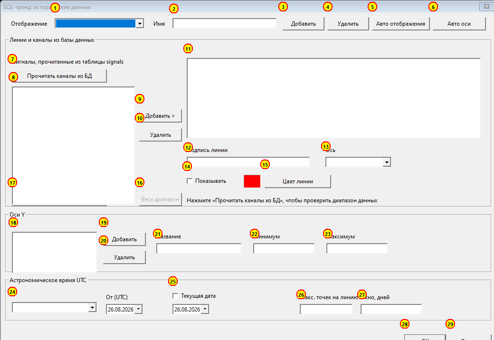

### SQL-тренд: исторические данные

| № элемента | Элемент | Как работает | Характерные действия |
|---:|---|---|---|
| 1 | Отображение | Выбирает независимый набор линий и осей внутри одного SQL-компонента. | — |
| 2 | Имя отображения | Подпись выбранного набора, показываемая пользователю. | — |
| 3 | Добавить отображение | Создаёт новый набор, не копируя автоматически линии текущего. | — |
| 4 | Удалить отображение | Удаляет выбранное представление из компонента, но не данные из БД. | Удаление выбранной строки/объекта выполняется явно выбранной командой. |
| 5 | Авто отображения | Создаёт типовой набор представлений по прочитанным каналам БД. | — |
| 6 | Авто оси | Группирует/создаёт оси по единицам и диапазонам линий. Ручные масштабы следует проверить после операции. | — |
| 7 | Прочитать каналы из БД | Обновляет список сигналов по таблице `signals`; требует рабочего подключения и совместимой схемы. | — |
| 8 | Сигналы БД | Список доступных исторических каналов. Выбор здесь ещё не добавляет линию. | — |
| 9 | Добавить линию | Добавляет выбранный сигнал в текущее отображение. | — |
| 10 | Удалить линию | Удаляет только линию из представления; SQL-данные остаются. | Данные в БД удаляются отдельной командой. |
| 11 | Линии отображения | Выбирает редактируемую линию. В легенде рабочего графика выбор линии также активирует связанную ось Y. | Двойной щелчок открывает свойства выбранного объекта. |
| 12 | Подпись линии | Имя линии в легенде; не переименовывает исходный тег/канал БД. | — |
| 13 | Ось | Назначает линию одной из осей Y. Единицы и диапазон линии должны соответствовать оси. | — |
| 14 | Показывать | Скрывает/показывает линию без удаления настройки. | — |
| 15 | Цвет линии | Задаёт цвет кривой и маркера легенды. | — |
| 16 | Весь диапазон | Устанавливает X по минимальной и максимальной временной метке доступных данных. | — |
| 17 | Удалить интервал в БД | Необратимо удаляет исторические точки выбранного интервала. Перед действием нужна резервная копия. | — |
| 18 | Оси Y | Выбирает ось для редактирования и масштабирования. | — |
| 19 | Добавить ось | Создаёт новую независимую шкалу Y. | — |
| 20 | Удалить ось | Удаляет ось; связанные линии необходимо предварительно переназначить. | Нельзя удалить ось, пока на неё ссылаются линии. |
| 21 | Название оси | Подпись шкалы, обычно физическая величина или единица. | — |
| 22 | Минимум | Нижняя граница ручного масштаба выбранной оси. | — |
| 23 | Максимум | Верхняя граница; должна быть больше минимума. Двойной щелчок по линии может автоматически вписать её данные. | — |
| 24 | Режим времени | Выбирает фиксированный интервал или астрономическое окно. | — |
| 25 | Текущая дата | Привязывает правую границу X к текущему времени и включает периодическое дочитывание новых SQL-точек. | — |
| 26 | Макс. точек на линию | Ограничивает число отображаемых точек и тем самым память/время отрисовки; данные БД не удаляются. | — |
| 27 | Окно, дней | Ширина скользящего окна в режиме текущей даты. При обновлении сдвигается X, а ручной Y сохраняется. | — |
| 28 | OK | Сохраняет отображения, линии, оси и временной режим. | — |
| 29 | Отмена | Закрывает окно без применения текущих изменений. | — |

В режиме **Текущая дата** правая граница X следует за текущим временем, обновление выполняется с периодом SQL-записи, а масштаб Y пользователя сохраняется. Выбор линии в легенде выбирает её ось; двойной щелчок вписывает выбранный сигнал по Y. Масштаб X не прокручивается дальше текущего времени.

## 12. Графики

Графические компоненты используют теги и их оценки, но предназначены для
разных задач. Осциллограмма показывает форму быстрого сигнала, оперативный
тренд - изменение текущих оценок во время сеанса, SQL-тренд - исторические
точки из базы. Поэтому одинаковый жест может иметь разные ограничения по X.

### 12.1. Общие обозначения и действия графиков

| Элемент/действие | Назначение | Описание как работает |
|---|---|---|
| Заголовок линии | Идентификация сигнала | Показывает имя тега, выбранную оценку и вспомогательные значения компонента. Цвет соответствует линии/легенде. |
| Ось Y | Масштаб величины | Каждая линия назначается оси. Несколько линий можно объединять только при совместимых величинах и единицах. |
| `dY` | Текущий размах | Показывает `Ymax - Ymin` выбранной оси, то есть видимый размах, а не амплитуду конкретного сигнала. Меняется при zoom/антизуме. |
| Протаскивание вправо и вниз | Прямой zoom | Рамка определяет новый видимый диапазон X и Y. Жест внутри области построения масштабирует обе оси. |
| Протаскивание в обратном направлении | Антизум | Расширяет текущий диапазон относительно рамки. Компонент ограничивает результат доступными данными/полной шкалой. |
| Жест ниже оси X | Только X | Zoom или антизум изменяет временную ось, сохраняя ручной масштаб Y. |
| Жест слева от оси Y | Только Y | Zoom или антизум изменяет выбранную ось Y, не сдвигая временной интервал. |

### 12.2. Осциллограмма

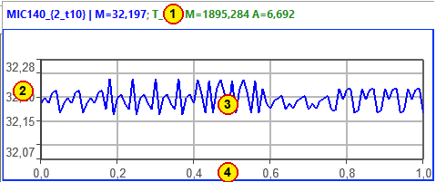

Осциллограмма предназначена для векторного тега и показывает последовательность
отсчётов текущего блока. Она нужна для оценки формы сигнала, выбросов, смещения
и быстрого процесса, а не для долговременной истории.

| Действие пользователя | Результат | Ограничения и взаимосвязи |
|---|---|---|
| Выбор основного тега в настройке | Назначает временную сетку и основной сигнал осциллограммы | Частота и размер блока берутся из тега/источника; смена Fs меняет шкалу X |
| Добавление линий | Накладывает связанные сигналы на тот же временной интервал | Линии должны иметь согласованное время; ось/единицы задаются настройкой компонента |
| Двойной щелчок по графику | Нормализует вид: полный доступный X и данные по Y с запасом 20% | Это единственное действие двойного щелчка; предустановленный максимальный Y через секунду не восстанавливается |
| Прямой zoom рамкой | Увеличивает выбранный фрагмент сигнала | По X нельзя выйти за полный диапазон текущего блока |
| Обратный zoom | Возвращает более широкий диапазон | X ограничивается началом и концом доступной осциллограммы, пустые области не добавляются |
| Переход Stop -> Preview/Record | Начинает новый сеанс отображения | Старые линии и индексы очищаются, чтобы точки предыдущего запуска не соединялись с новым блоком |

### 12.3. Оперативный тренд

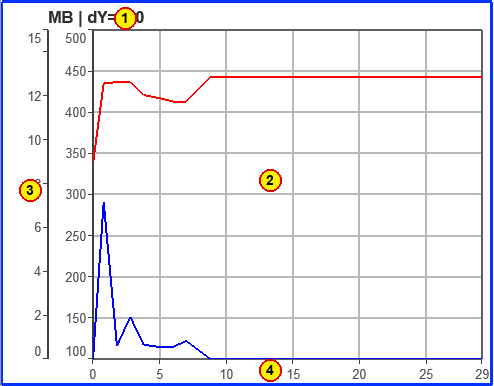

Оперативный тренд строится по текущим оценкам тегов во время Preview или Record.
Например, вместо всех высокочастотных отсчётов он может показывать Mean, RMS или
Max с периодом обновления данных.

| Действие пользователя | Результат | Ограничения и взаимосвязи |
|---|---|---|
| Выбор тега и оценки | Создаёт линию текущей оценки | Доступные оценки определяются типом тега и его настройками расчёта |
| Выбор оси Y | Делает ось активной для zoom и `dY` | Линия должна быть назначена этой оси в настройке тренда |
| Zoom/антизум рамкой | Меняет видимый интервал и масштаб выбранной оси | Жест ниже X или слева Y ограничивает действие одной осью |
| Многократный Preview/Record | Каждый запуск рисуется с начала | При `StopToView` и `StopToRecord` точки, линии и текущие индексы очищаются |
| Автопрокрутка | Сдвигает X вслед за новыми точками | Ручной масштаб Y пользователя не должен сбрасываться при добавлении точки |

### 12.4. SQL-тренд

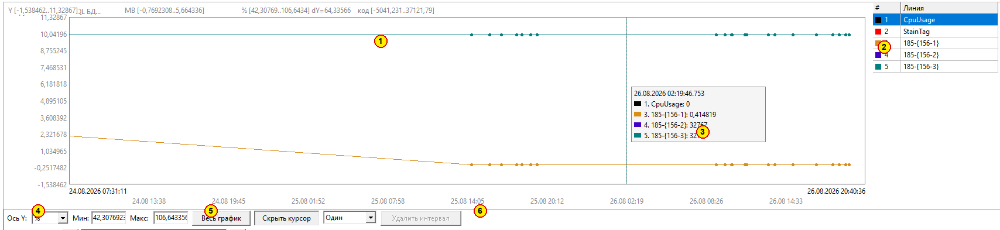

SQL-тренд читает сохранённые оценки из БД и не зависит от наличия текущего
высокочастотного блока. Его линии, отображения и оси задаются в форме
**SQL-тренд: исторические данные**.

| Действие пользователя | Результат | Ограничения и взаимосвязи |
|---|---|---|
| Выбор линии в легенде | Выбирает линию и автоматически активирует назначенную ей ось Y | Последующие Y-zoom и `dY` относятся к этой оси |
| Двойной щелчок по сигналу легенды | Выставляет Y выбранной оси так, чтобы данные линии целиком поместились | Масштабируются данные текущего временного окна, X не меняется |
| Прямой zoom рамкой | Сужает исторический диапазон | Внутри поля меняются X/Y; ниже X - только время; слева Y - только выбранная ось |
| Обратный zoom | Расширяет диапазон | Правая граница X не может перейти за текущую дату/время; левая ограничена доступной историей |
| Флажок **Текущая дата** | Делает правую границу равной текущему времени | Тренд дочитывает БД с периодом SQL-записи и продвигает только X |
| Поступление новой SQL-точки | Добавляет точку и сдвигает временное окно | Пользовательский Y не сбрасывается; число точек ограничено настройкой компонента |
| **Весь диапазон** | Показывает интервал от первой до последней доступной записи | Может загрузить большой период, но количество отрисовываемых точек ограничивается `Макс. точек на линию` |
| **Удалить интервал в БД** | Удаляет точки выбранного времени | Операция необратима и относится к данным БД, а не только к линии компонента |

### 12.5. Спектр

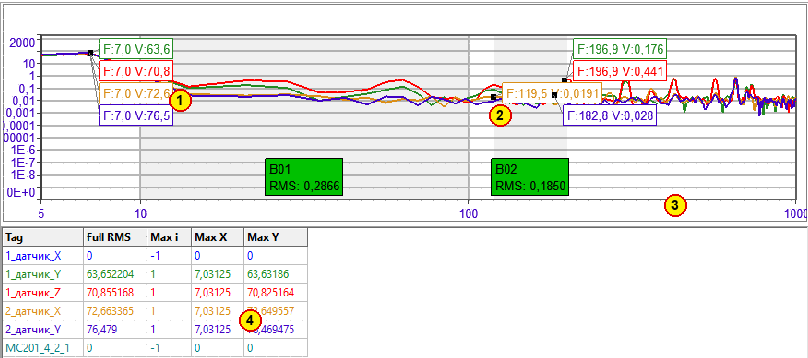

Спектральный компонент рассчитывает частотное представление выбранных векторных
тегов. Диапазон X означает частоту, а Y - амплитуду выбранного результата.

| Действие/настройка | Результат | Ограничения и взаимосвязи |
|---|---|---|
| Выбор тегов | Добавляет сигналы в спектральный расчёт | Fs и длина входного блока определяют доступный частотный диапазон и разрешение |
| Диапазон X/Y | Ограничивает видимую область спектра | Логарифмическая шкала требует положительных значений соответствующей оси |
| Тип результата | Выбирает амплитуду, мощность или поддерживаемую спектральную оценку | Меняет физический смысл и единицы Y |
| Тахоканал | Связывает спектр с частотой вращения для порядкового анализа | Требует корректного тега оборотов/импульсов |
| Тревоги, предупреждения, профиль | Накладывает контрольные границы и эталон | Эти данные не изменяют измеренный спектр, а только помогают оценить состояние |

## 13. Диагностика и типовые ошибки

| Сообщение/симптом | Причина | Действие |
|---|---|---|
| `Can not load ... libfbclient` | Нет клиентской библиотеки Firebird | Установить комплект Firebird RecorderLnx либо добавить каталог библиотеки в путь запуска |
| `user name and password are not defined` | Не переданы учётные данные Firebird | Проверить пользователя/пароль в конфигурации SQL RecorderLnx |
| `Database schema ... is newer` | Программа старее схемы БД | Использовать сборку с поддержкой этой версии схемы; не понижать БД вручную |
| Нет устройства | Прибор отключён или недоступен по сети | Проверить питание, IP/порт, сеть и выполнить проверку связи |
| RecorderLnx не появился в rcPanel автоматически | UDP Broadcast заблокирован брандмауэром, компьютеры находятся в разных подсетях либо HTTP-сервис rcPanel остановлен | Проверить, что сервис rcPanel запущен; разрешить UDP `38765` на rcPanel, UDP `38766` на RecorderLnx и TCP-порт HTTP API; для разных подсетей задать адрес вручную |
| RecorderLnx продолжает подключаться по старому адресу rcPanel | Сохранённый ручной HTTP endpoint доступен и имеет приоритет над автопоиском | Оставить адрес как есть либо изменить сохранённую настройку Coordinator; автопоиск заменяет её только после ошибки связи |
| Неверные единицы | Ручной режим либо неверная конечная ГХ | Проверить `Авто`, аппаратную и канальные ГХ |
| График пуст | Нет данных, линия скрыта или неверная ось | Проверить состояние Preview/Record, тег, видимость и диапазон оси |

## 14. Автоматическое обновление снимков

Режим предназначен для разработчика документации и не включается при обычном запуске:

```text
RecorderLnx.exe --capture-user-guide "--guide-output=D:\works\OburecGH\Lazarus\RecorderLnx\Docs\Руководство пользователя\screens"
```

RecorderLnx последовательно создаёт пользовательские формы, наносит номера активных элементов только на PNG, сохраняет `*.elements.md` с картой элементов и завершает работу. Общий результат находится в [индексе снимков](screens/index.md).

Для снимков, сделанных оператором вручную, используется отдельный безопасный процесс:

1. Положить заполненные оригиналы в `screens/юзер`; эти файлы считаются исходниками и не редактируются.
2. Запустить `Tools/annotate_manual_user_screens.py` из корня проекта.
3. Получить подписанные копии и карты элементов в `screens/user-annotated`.
4. Проверить `source-sha256.txt`: скрипт сравнивает SHA-256 до и после обработки и останавливается, если изменился хотя бы один оригинал.
5. В Markdown и Word включать PNG из `user-annotated`, а назначение номеров брать из одноимённых `*.elements.md`.

При добавлении новой формы сначала дополните словарь `SCREENS` в скрипте: задайте имя исходника, имя копии, координаты маркеров, назначение, взаимосвязи и клавиши. Нумерация изображения и таблицы является единым контрактом и должна проверяться вместе.

## 15. Сохранность данных

Перед изменением проекта сохраните резервную копию каталога конфигурации. Не удаляйте интервалы SQL БД без резервной копии: эта операция изменяет исторические данные. После изменения устройства или ГХ обязательно проверьте единицы и диапазоны в Preview до запуска записи.
