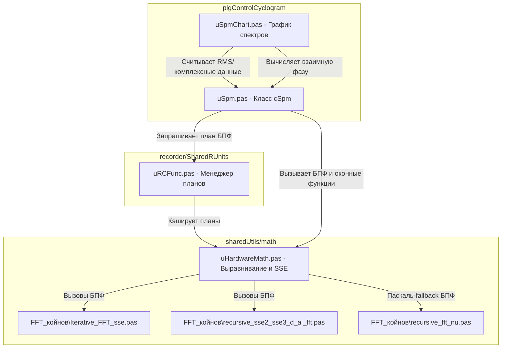

# Архитектура и перенос спектрального анализа в Lazarus

Этот документ содержит подробный анализ реализации спектрального анализа в Delphi-плагине `plgControlCyclogram` и библиотеке `sharedUtils`, а также руководство по его интеграции в Lazarus-проект с архитектурными улучшениями.

---

## 1. Текущая структура и взаимосвязи в Delphi

В Delphi-проекте расчет и отображение спектров распределены между несколькими модулями, находящимися в плагине и общей библиотеке `sharedUtils`.



### Ключевые компоненты:
1. **`cSpm` (модуль `uSpm.pas`)**: 
   Класс-наследник алгоритма источника (`cSrcAlg`). Накапливает историю во внутреннем выровненном буфере `m_EvalBlock` до размера, кратного размеру БПФ (`fOutSize`). Вызывает оконную функцию, выполняет БПФ, производит усреднение комплексных спектров во времени и вычисляет итоговый амплитудный спектр `m_rms` (RMS). Дополнительно считает интегрированные спектры (`m_magI1`, `m_magI2`).
2. **`uHardwareMath.pas`**:
   Предоставляет низкоуровневые математические структуры:
   - `TAlignDarray` / `TAlignDCmpx` — записи для хранения выровненных по границе 16 байт массивов double и комплексных чисел.
   - `TFFTProp` — структура плана БПФ (экспоненциальные множители и массив индексов переупорядочивания).
   - `fft_al_d_sse` / `ifft_al_d_sse` — процедуры прямого и обратного БПФ с поддержкой векторизации и оконного сглаживания.
   - `EvalSpmMag` — процедура расчета амплитуды спектра из комплексных чисел на ассемблере SSE.
3. **`GetFFTPlan` (модуль `uRCFunc.pas`)**:
   Глобальный менеджер планов БПФ. Хранит список уже построенных планов в динамическом массиве `g_FFTPlanList`. Если план для заданного размера `fftCount` отсутствует, менеджер выделяет выровненную память для таблицы экспонент, рассчитывает индексы переупорядочивания `GetArrayIndex` и кэширует план.
4. **`TSpmChart` (модуль `uSpmChart.pas`)**:
   Визуальный компонент отображения спектров. Напрямую обращается к внутренним массивам `cSpm` для извлечения амплитудного спектра. Также содержит код расчета взаимной фазы между исследуемым каналом и опорным тахо-каналом (`m_tahoSpm`).

---

## 2. Проблемы переноса в Lazarus (FPC) и пути их решения

При переносе данного кода в Lazarus-проект (Free Pascal) под 32-битную и 64-битную платформы (Windows/Linux) возникают критические проблемы совместимости.

### Проблема 1: Ассемблерные вставки x86 (SSE)
Модули `uHardwareMath.pas`, `Iterative_FFT_sse.pas` и `recursive_sse2_sse3_d_al_fft.pas` активно используют ассемблер x86 (команды `pushad`, `popad`, работу с 32-битными регистрами общего назначения). При компиляции проекта под x86_64 в Lazarus этот код вызовет ошибки компиляции, так как соглашение вызовов и доступные регистры в 64-битной архитектуре принципиально отличаются.

> [!WARNING]
> Использование старого x86 ассемблера в 64-битном Lazarus недопустимо и приведет к падениям компилятора или Access Violation.

**Решение**:
1. **Использование кроссплатформенного Pascal-кода**: 
   В проекте уже есть чистые паскалевские реализации БПФ: `recursive_fft_nu.pas` и `Iterative_fft_nu.pas`. Их необходимо вынести во главу угла и использовать по умолчанию. FPC при сборке с оптимизацией `-O3` / `-O4` и флагами векторизации (`-CfAVX2` или `-CfSSE3`) генерирует высокопроизводительный машинный код, сопоставимый с ручным ассемблером.
2. **Условная компиляция**:
   Разделить низкоуровневые процедуры через директивы компилятора:
   ```pascal
   {$IFDEF CPUX86}
     // Исходный SSE-ассемблер для 32-битных систем
   {$ELSE}
     // Оптимизированный чистый Pascal-код для 64-битных систем
   {$ENDIF}
   ```

### Проблема 2: Эмуляция динамических массивов Delphi через смещения указателей
В `uHardwareMath.pas` функции выделения памяти `GetMemAlignedArray_d` при отсутствии FastMM принудительно эмулируют внутренний заголовок динамического массива Delphi:
```pascal
I := integer(DstAligned) - 4;
pint := pinteger(I);
pint^ := round(SrcSize / sizeof(double)); // Установка длины
```
В 64-битном FPC (Free Pascal) внутреннее представление динамического массива имеет другой заголовок (размер 16 байт на x64: счетчик ссылок и длина занимают по 8 байт). Запись по жесткому смещению `-4` приведет к повреждению памяти кучи.

> [!CAUTION]
> Ручная эмуляция заголовков динамических массивов Delphi в FPC x64 является опасным хаком и гарантирует разрушение кучи!

**Решение**:
Отказаться от эмуляции динамических массивов. Для выровненных вычислений использовать строго типизированные указатели (`PDouble` / `PComplex`) или безопасные обертки объектов, хранящие два указателя: исходный (для вызова `FreeMem`) и выровненный (для расчетов).
Пример безопасного выравнивания в Lazarus:
```pascal
type
  TAlignedDoubleBuffer = class
  private
    FOriginPtr: Pointer;
    FAlignedPtr: PDouble;
    FSize: Integer;
  public
    constructor Create(ASize: Integer; AAlignment: Integer = 32);
    destructor Destroy; override;
    property AlignedPtr: PDouble read FAlignedPtr;
    property Size: Integer read FSize;
  end;
```

---

## 3. Предлагаемые архитектурные улучшения

Вместо механического переноса старой схемы предлагается объединить расчеты спектральных характеристик на уровне ядра алгоритмов ("единым фронтом"), что позволит улучшить инкапсуляцию и повысить производительность.

### Новая концепция: Объединенный расчет спектра

Текущая реализация разделяет расчет амплитуды (внутри `cSpm`), интегрированных спектров (в цикле после БПФ) и фазового спектра / взаимных фаз (на уровне GUI графика). 
Предлагается создать единую структуру результатов и выполнять расчет за один проход в классе алгоритма:

```pascal
type
  // Полный набор спектральных характеристик канала
  TSpectrumResult = record
    FFTSize: Integer;
    dx: Double;
    ReIm: array of TComplex_d;         // Комплексный спектр (Re/Im)
    AmpRMS: array of Double;           // Амплитудный спектр (RMS)
    Phase: array of Double;            // Спектр фаз (в градусах)
    Integrated1: array of Double;      // Интегрированный спектр 1-го порядка (скорость)
    Integrated2: array of Double;      // Интегрированный спектр 2-го порядка (перемещение)
    OverallRMS: Double;                // Общая среднеквадратичная оценка
    TahoFreq: Double;                  // Оценка частоты вращения по спектру
  end;
```

### Преимущества нового подхода:
1. **Инкапсуляция математики**: Компонент отображения (`TSpmChart`) больше не считает взаимные фазы и не обращается к приватным буферам. Он получает готовую структуру `TSpectrumResult` и просто отправляет её в OpenGL-буфер тренда.
2. **Расчет взаимных фаз на уровне ядра**:
   Взаимный спектр (Cross-Spectrum) рассчитывается в специализированном классе алгоритма:
   ```pascal
   procedure CalculateCrossSpectrum(const ChanA, ChanB: TSpectrumResult; var CrossPhase, Coherence: array of Double);
   ```
3. **Эффективность памяти**: Исключаются лишние циклы копирования и выделения памяти. Все характеристики формируются за один проход по результатам комплексного БПФ.

---

## 4. План реализации в Lazarus-проекте

Перенос и модернизацию кода предлагается разделить на 4 контролируемых этапа:

### Этап 1: Подготовка кроссплатформенной математики
- [ ] Скопировать модули БПФ `recursive_fft_nu.pas` и `Iterative_fft_nu.pas` в общий каталог `sharedUtils/math`.
- [ ] Очистить `uHardwareMath.pas` от хаков с заголовками динамических массивов Delphi (`SetLength` эмуляция). Внедрить кроссплатформенный класс `TAlignedDoubleBuffer`.
- [ ] Добавить условную компиляцию для ассемблерных функций SSE, заменив их на чистый Pascal в x64 сборках.

### Этап 2: Создание нового ядра расчетов (`uSpectrumCalculator.pas`)
- [ ] Реализовать структуру `TSpectrumResult`.
- [ ] Создать класс `TSpectrumCalculator`, объединяющий:
  - Применение оконной функции (Hann, Hamming, Blackman, Flattop).
  - Вызов БПФ (`recursive_fft_nu`).
  - Расчет амплитуды (RMS), фазы и Re/Im.
  - Интегрирование спектров (деление на $2\pi f$ и $(2\pi f)^2$).
  - Вычисление общей RMS-оценки в полосе частот.
  - Поиск тахо-частоты по доминирующему пику.
- [ ] Написать юнит-тесты в проекте тестов (`tests/TestAlgLib`), проверяющие корректность расчетов (амплитуд, фаз и интегралов) относительно эталонных данных.

### Этап 3: Рефакторинг алгоритмов плагина (`uSpm.pas`)
- [ ] Переписать класс `cSpm` в плагине под использование нового `TSpectrumCalculator`.
- [ ] Внедрить расчет взаимных спектров и фаз непосредственно в ядро алгоритмов (класс `cCrossSpmAlg` или аналогичный), исключив расчеты из GUI.

### Этап 4: Разработка визуальной части в Lazarus LCL
- [ ] Перевести визуальную форму графика `uSpmChart.pas` на Lazarus LCL с использованием формы `.lfm`.
- [ ] Подключить отрисовку спектральных трендов через оптимизированный класс графика OpenGL (`TOglChart`), используя подготовленные массивы из `TSpectrumResult`.
